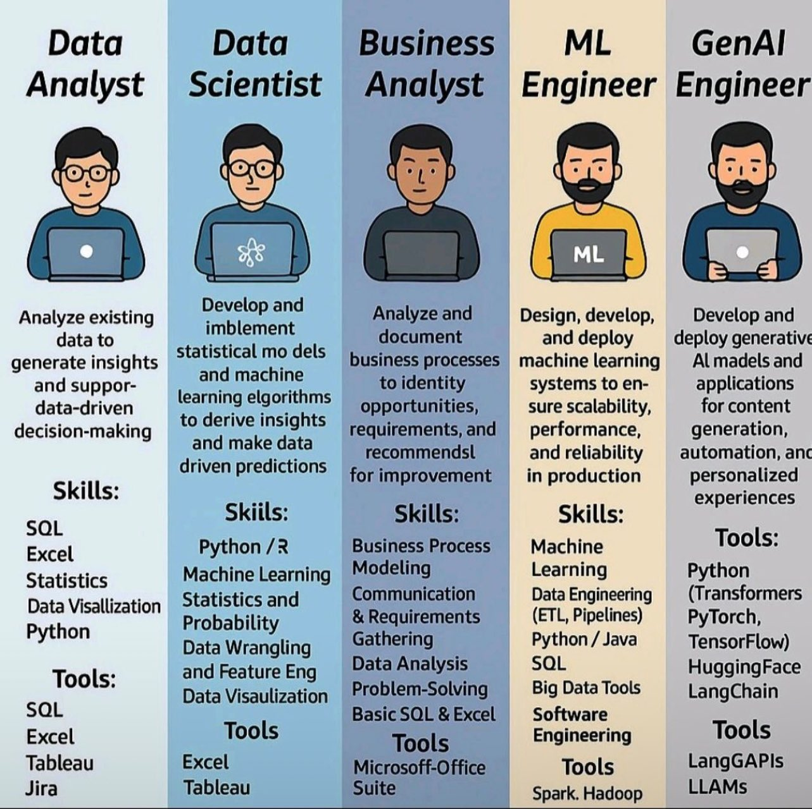

**Source:** [https://twitter.com/i/web/status/1919335714036077033](https://twitter.com/i/web/status/1919335714036077033)
**Original Post Date:** 2025-05-27 16:19:24

# Comparative Analysis: Roles in Data & AI Domain - From Analyst to GenAI Engineer

## Introduction
Understanding the distinct roles within data science and artificial intelligence is crucial for both career development and team composition. This knowledge base examines five key positions - Data Analyst, Data Scientist, Business Analyst, ML Engineer, and GenAI Engineer - highlighting their unique contributions, overlapping skills, and technological requirements. By analyzing these roles, professionals can better navigate career paths while organizations can optimize their technical teams.

## Role Progression Analysis

The progression from Data Analyst to GenAI Engineer represents an increasing complexity in both technical skill and system responsibility. This evolution follows a clear path of specialization, starting with basic data analysis and moving toward advanced generative AI implementations.

1. Data Analyst: Focuses on descriptive analytics using SQL and Excel
1. Data Scientist: Develops predictive models using Python and statistical methods
1. Business Analyst: Bridges technical insights with business requirements
1. ML Engineer: Ensures scalable deployment of machine learning systems
1. GenAI Engineer: Specializes in generative AI applications and deployments

> **Note/Tip:** Progression often requires additional technical skills beyond initial role requirements

## Skill Overlap Analysis

Despite their distinct focus areas, these roles share significant skill overlaps in core competencies such as SQL, Python, and data visualization. This common ground facilitates collaboration but also requires specialization to differentiate expertise.

- SQL is a foundational skill across all five roles
- Python proficiency becomes increasingly important in higher complexity roles
- Data visualization tools are essential for communication and insight sharing

## Tool Ecosystem Comparison

The toolset required varies significantly based on role specialization, with foundational tools like SQL and Excel being universally present while advanced roles require specialized frameworks like TensorFlow or HuggingFace.

1. Basic Tools: SQL, Excel, Tableau - Present across all roles
1. Intermediate Tools: Python, R, Spark - Required for Data Science and ML Engineering
1. Advanced Tools: TensorFlow, PyTorch, HuggingFace - Essential for GenAI Engineers

> **Note/Tip:** Tool proficiency often serves as a key differentiator between roles at similar experience levels

## Key Takeaways

- Role progression follows increasing complexity from descriptive analytics to generative AI systems
- Skill overlap creates opportunities for cross-functional collaboration but requires specialization for advancement
- Tool ecosystem evolution reflects the role's focus area and technical depth requirements

## Conclusion
Understanding these roles' distinctions and overlaps is essential for both individual career planning and organizational structuring. The progression from Data Analyst to GenAI Engineer represents not just a change in tools and skills, but a fundamental shift in how value is delivered within the data and AI ecosystem.

## External References

- [HuggingFace Documentation](https://huggingface.co/docs)
- [PyTorch Official Site](https://pytorch.org/)

## Media

**Image Description:** The image is an infographic that compares five different roles in the data and AI domain: **Data Analyst**, **Data Scientist**, **Business Analyst**, **Machine Learning (ML) Engineer**, and **Generative AI (GenAI) Engineer**. Each role is represented by a cartoon figure sitting at a laptop, with distinct background colors and associated responsibilities, skills, and tools. Below is a detailed breakdown of each section:

---

### **1. Data Analyst**
- **Background Color**: Light blue
- **Role Description**:  
  - Analyze existing data to generate insights and support data-driven decision-making.
- **Skills**:  
  - SQL
  - Excel
  - Statistics
  - Data Visualization
- **Tools**:  
  - SQL
  - Excel
  - Tableau
  - Jira

---

### **2. Data Scientist**
- **Background Color**: Medium blue
- **Role Description**:  
  - Develop and implement statistical and machine learning models to derive insights and make data-driven predictions.
- **Skills**:  
  - Python / R
  - Machine Learning Modeling
  - Statistics and Probability
  - Data Wrangling and Feature Engineering
- **Tools**:  
  - SQL
  - Excel
  - Tableau
  - Python

---

### **3. Business Analyst**
- **Background Color**: Dark blue
- **Role Description**:  
  - Analyze and document business processes to identify opportunities, requirements, and recommendations for improvement.
- **Skills**:  
  - Business Process Communication & Requirements
  - Data Analysis
  - Problem-Solving
- **Tools**:  
  - Basic SQL & Excel
  - Microsoft Office Suite

---

### **4. Machine Learning (ML) Engineer**
- **Background Color**: Yellow
- **Role Description**:  
  - Design, develop, and deploy machine learning systems to ensure scalability, performance, and reliability in production.
- **Skills**:  
  - Machine Learning
  - Data Engineering (ETL, Pipelines)
  - Python / Java
- **Tools**:  
  - SQL
  - Java
  - PyTorch
  - TensorFlow
  - Big Data Tools (Spark, Hadoop)

---

### **5. Generative AI (GenAI) Engineer**
- **Background Color**: Gray
- **Role Description**:  
  - Develop and deploy generative AI models and applications for content generation, automation, and personalized experiences.
- **Skills**:  
  - Python
  - Data Engineering
  - Software Engineering
- **Tools**:  
  - Python
  - HuggingFace
  - LangChain
  - LangGAPIs
  - LLAMAs

---

### **Key Observations:**
1. **Progression in Complexity**:  
   - The roles progress from data analysis (Data Analyst) to advanced modeling (Data Scientist) to business process optimization (Business Analyst) to system deployment (ML Engineer) and finally to cutting-edge generative AI (GenAI Engineer).

2. **Skill Overlap**:  
   - There is significant overlap in skills and tools across the roles, particularly in areas like SQL, Python, and data visualization.

3. **Specialization**:  
   - Each role has a distinct focus:
     - Data Analyst: Focuses on data analysis and reporting.
     - Data Scientist: Focuses on statistical modeling and machine learning.
     - Business Analyst: Focuses on business process analysis and optimization.
     - ML Engineer: Focuses on deploying scalable machine learning systems.
     - GenAI Engineer: Focuses on developing and deploying generative AI models.

4. **Tools and Technologies**:  
   - The tools used reflect the technical requirements of each role. For example:
     - Data Analyst and Data Scientist use SQL and Excel.
     - ML Engineer and GenAI Engineer use advanced tools like PyTorch, TensorFlow, and HuggingFace.

---

### **Visual Design:**
- Each role is represented by a cartoon figure with a laptop, emphasizing the technical nature of the work.
- The background colors are distinct for each role, making it easy to differentiate between them.
- The text is organized into clear sections: **Role Description**, **Skills**, and **Tools**.

This infographic provides a concise and visually appealing comparison of the responsibilities, skills, and tools required for each role in the data and AI domain.
