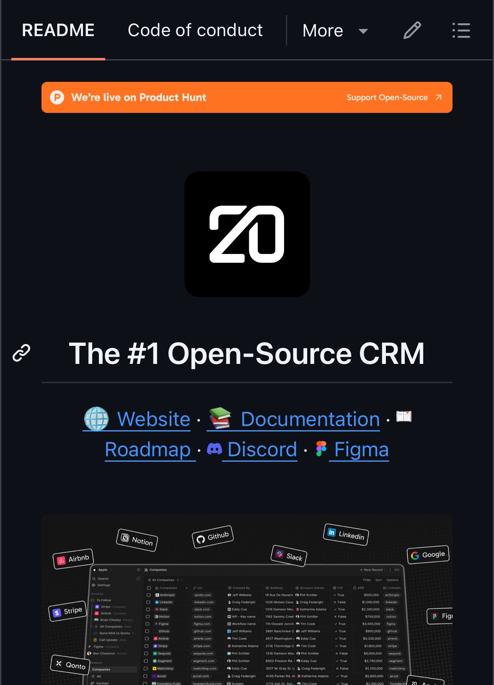

**Source:** [https://twitter.com/i/web/status/1938206638160121887](https://twitter.com/i/web/status/1938206638160121887)
**Original Post Date:** 2025-07-14 21:06:46

# Open Source CRM Project Analysis: GitHub Repository Insights

## Introduction
The image showcases a GitHub repository for an open-source Customer Relationship Management (CRM) tool. This project is positioned as the '#1 Open Source CRM' and offers various resources for users to engage with the project. The interface screenshot reveals a robust table-based application with integrations for popular platforms, emphasizing usability and community collaboration.

## Header Section Analysis

The header section of the GitHub repository page includes navigation tabs labeled 'README', 'Code of Conduct', and 'More'. The 'README' tab is currently selected, indicating it as the primary source of information for users.

An orange banner at the top announces that the project is live on Product Hunt, with a call-to-action button prompting users to support open-source development.

- Navigation tabs: README (selected), Code of Conduct, More (with dropdown).
- Orange banner announcing live status on Product Hunt with a 'Support Open-Source' call-to-action button.

## Main Content and Logo

The main content section features a prominent black square logo with the stylized number '20', likely representing the project's name or version.

Below the logo, the heading 'The #1 Open Source CRM' clearly states the project's focus on providing an open-source CRM solution.

- Logo: Black square with white stylized number '20'.
- Title: 'The #1 Open Source CRM' indicating the project's primary offering.

## Links Section Analysis

Below the title, several links represented by icons and text provide access to additional resources. These include the project's website, documentation, roadmap, Discord community, and Figma design resources.

These links suggest a well-rounded ecosystem for users to engage with the project beyond just the code.

- Website: Link to the project's main website.
- Documentation: Access to comprehensive documentation.
- Roadmap: Project development roadmap.
- Discord: Community engagement and support platform.
- Figma: Design resources and collaboration tools.

## CRM Interface Screenshot Analysis

The screenshot of the CRM interface reveals a table-based application with multiple columns, including 'Apps', 'Companies', 'Follow', 'Company Name', 'Contact Person', and more.

The interface includes various company logos such as Airbnb, Notion, GitHub, LinkedIn, Slack, Google, Stripe, and Qonto, indicating robust integration capabilities.

- Columns: Apps, Companies, Follow, Company Name, Contact Person, Key Name, Key Value, API Key, Workflow, Workflows, Status, Notes, Actions.
- Company Logos: Airbnb, Notion, GitHub, LinkedIn, Slack, Google, Stripe, Qonto.

> **Note/Tip:** The presence of multiple company logos suggests a high level of integration with popular platforms, enhancing the CRM's versatility and appeal to users who need to manage relationships across various services.

## Technical Details

The project is explicitly described as open-source, indicating that the source code is freely available for use, modification, and distribution.

The emphasis on being the '#1 Open Source CRM' suggests a focus on becoming a leading solution in the open-source CRM space.

- Open-source: Freely available source code for use, modification, and distribution.
- Focus: Positioning as the '#1 Open Source CRM'.

## Community and Collaboration

The inclusion of links to Discord and Figma suggests active community engagement and collaboration. Discord is likely used for communication and support, while Figma is used for design and wireframing.

These tools facilitate a collaborative environment where users can contribute to the project's development and improvement.

- Discord: Community engagement and support platform.
- Figma: Design resources and collaboration tools.

## Integration Capabilities

The presence of multiple company logos in the interface indicates that the CRM supports integrations with popular platforms like Airbnb, Notion, GitHub, LinkedIn, Slack, Google, Stripe, and Qonto.

This highlights the project's versatility and appeal to users who need to manage relationships across various platforms.

- Integrations: Airbnb, Notion, GitHub, LinkedIn, Slack, Google, Stripe, Qonto.
- Versatility: Supports multiple integrations for managing relationships across various platforms.

## Design and Layout

The overall design uses a dark mode theme with a black background and white text/icons, which is common in modern software interfaces for readability and aesthetic appeal.

The layout is clean and minimalistic, focusing on essential information and links without unnecessary clutter.

- Dark Mode: Black background with white text/icons for readability.
- Minimalist Design: Clean layout focusing on essential information.

## Conclusion

The image showcases a GitHub repository for an open-source CRM project. The project emphasizes its status as the '#1 Open Source CRM' and provides links to its website, documentation, roadmap, community (Discord), and design resources (Figma).

The interface screenshot demonstrates a robust and user-friendly CRM tool with integrations for various popular platforms. The design is modern, clean, and focused on usability and community engagement.

## Key Takeaways

- The project is positioned as the '#1 Open Source CRM', emphasizing its focus on providing an open-source CRM solution.
- The GitHub repository includes navigation tabs for easy access to different sections of the project, with a prominent 'README' tab.
- The interface screenshot reveals a table-based application with multiple columns and integrations for popular platforms like Airbnb, Notion, and Slack.
- Community engagement is facilitated through Discord and Figma, indicating active collaboration and support.
- The design is modern, clean, and minimalistic, focusing on usability and essential information.

## External References

- [GitHub Open Source Guide](https://opensource.guide/)
- [Product Hunt](https://www.producthunt.com/)

## Media

**Image Description:** The image appears to be a screenshot of a GitHub repository page for an open-source project. Below is a detailed description of the image, focusing on the main subject and relevant technical details:

### **Header Section**
1. **Tabs:**
   - The top of the page has navigation tabs labeled:
     - **README**
     - **Code of Conduct**
     - **More** (with a dropdown arrow)
   - The **README** tab is currently selected, as indicated by the orange underline beneath it.

2. **Banner:**
   - There is an orange banner with the text:
     - **"We're live on Product Hunt"**
     - On the right side of the banner, there is a call-to-action button labeled:
       - **"Support Open-Source"** with a right-pointing arrow (indicating a link).

### **Main Content**
1. **Logo:**
   - A prominent black square with a white logo in the center. The logo consists of the number **"20"** in a stylized, modern font. This is likely the logo of the project.

2. **Title:**
   - Below the logo, there is a heading that reads:
     - **"The #1 Open Source CRM"**
   - The text is bold and emphasizes the project's focus on being an open-source Customer Relationship Management (CRM) tool.

### **Links Section**
1. **Icons and Links:**
   - Below the title, there are several links represented by icons and text:
     - **Website:** A globe icon followed by the text "Website."
     - **Documentation:** A book icon followed by the text "Documentation."
     - **Roadmap:** A road icon followed by the text "Roadmap."
     - **Discord:** A Discord icon followed by the text "Discord."
     - **Figma:** A Figma icon followed by the text "Figma."
   - These links suggest resources and platforms where users can find more information about the project.

### **Image of the CRM Interface**
1. **Screenshot of the CRM:**
   - Below the links, there is a screenshot of the CRM interface. The interface appears to be a table-based application with the following features:
     - **Columns:** The table has multiple columns, including:
       - **Apps**
       - **Companies**
       - **Follow**
       - **Company Name**
       - **Contact Person**
       - **Key Name**
       - **Key Value**
       - **API Key**
       - **Workflow**
       - **Workflows**
       - **Status**
       - **Notes**
       - **Actions**
     - **Rows:** The table contains rows with data entries, including company names, contact persons, and other relevant details.
     - **Icons:** Various company logos are displayed in the interface, indicating integrations or supported platforms. Some visible logos include:
       - **Airbnb**
       - **Notion**
       - **GitHub**
       - **LinkedIn**
       - **Slack**
       - **Google**
       - **Stripe**
       - **Qonto**
     - **Search and Filters:** The interface includes a search bar and filter options, suggesting a user-friendly and customizable experience.

### **Technical Details**
1. **Open-Source Focus:**
   - The project is explicitly described as **open-source**, indicating that the source code is freely available for use, modification, and distribution.
   - The emphasis on "The #1 Open Source CRM" suggests that the project aims to be a leading solution in the open-source CRM space.

2. **Community and Collaboration:**
   - The inclusion of links to **Discord** and **Figma** suggests active community engagement and collaboration. Discord is likely used for communication and support, while Figma is used for design and wireframing.

3. **Integration Capabilities:**
   - The presence of multiple company logos in the interface indicates that the CRM supports integrations with popular platforms like Airbnb, Notion, GitHub, LinkedIn, Slack, Google, Stripe, and Qonto. This highlights the project's versatility and appeal to users who need to manage relationships across various platforms.

### **Design and Layout**
1. **Dark Mode:**
   - The overall design uses a dark mode theme, with a black background and white text/icons, which is common in modern software interfaces for readability and aesthetic appeal.
2. **Minimalist Design:**
   - The layout is clean and minimalistic, focusing on essential information and links without unnecessary clutter.

### **Conclusion**
The image showcases a GitHub repository for an open-source CRM project. The project emphasizes its status as the "#1 Open Source CRM" and provides links to its website, documentation, roadmap, community (Discord), and design resources (Figma). The interface screenshot demonstrates a robust and user-friendly CRM tool with integrations for various popular platforms. The design is modern, clean, and focused on usability and community engagement.
