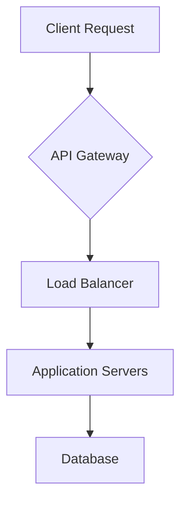

## Introduction
Development tools are essential for efficient software development, improving productivity, code quality, and security. This guide covers various categories of dev tools and best practices.

## Development Environment
### IDEs and Code Editors
Popular options include:
- VSCode (open-source, extensible)
- IntelliJ IDEA (powerful Java IDE)
- PyCharm (Python-focused IDE)

#### Example: VSCode Setup
```json
{
  "editor.formatOnSave": true,
  "editor.defaultFormatter": "esbenp.prettier-vscode",
  "javascript.implicitProjectConfig.checkJs": true
}
```

## Diagramming Tools
### Flowcharts and Architecture
Tools like DrawIO, Mermaid, and PlantUML help visualize system architecture.

#### Example: Mermaid Code for System Flow


## AI-Powered Development Tools
### Code Generation and Assistance
- GitHub Copilot
- Tabnine
- ChatGPT

#### Example: Using ChatGPT for Documentation
```python
def generate_documentation(func):
    """
    Decorator that uses ChatGPT to generate documentation
    """
    import openai
    
    def wrapper(*args, **kwargs):
        # Generate docstring using ChatGPT
        response = openai.Completion.create(
            engine="text-davinci-003",
            prompt=f"Write a docstring for this function:\n{func.__code__}",
            max_tokens=150
        )
        
        func.__doc__ = response.choices[0].text.strip()
        return func(*args, **kwargs)
    
    return wrapper

@generate_documentation
def example_function(x):
    return x * 2
```

## Deployment and Hosting
### Cloud Platforms
Popular options include:
- AWS (Amazon Web Services)
- Cloudflare
- Digital Ocean

#### Example: Docker Compose Configuration
```yaml
version: '3'
services:
  web:
    build: .
    ports:
      - "8000:8000"
    depends_on:
      - db
  db:
    image: postgres
    environment:
      POSTGRES_DB: myapp
      POSTGRES_USER: user
      POSTGRES_PASSWORD: password
```

## Code Quality Tools
### Testing and Linting
- Jest (JavaScript testing)
- ESLint (code style enforcement)

#### Example: ESLint Configuration
```json
{
  "extends": "eslint:recommended",
  "env": {
    "browser": true,
    "es2021": true
  },
  "rules": {
    "no-console": "warn",
    "semi": ["error", "always"]
  }
}
```

## Security Tools
### Authentication and Authorization
- OWASP (security testing)
- Snyk (dependency scanning)

#### Example: Security Headers Configuration
```javascript
app.use(helmet({
  contentSecurityPolicy: {
    directives: {
      defaultSrc: ["'self'"],
      scriptSrc: ["'self'", "'unsafe-inline'"],
      styleSrc: ["'self'", "'unsafe-inline'"]
    }
  }
}));
```

## Note-taking Tools
### Knowledge Management
- Notion
- Obsidian

#### Example: Markdown Template for Documentation
```markdown
# Project Documentation

## Overview
[Project description]

## Getting Started
1. Clone repository
2. Install dependencies
3. Run development server

## API Reference
### Endpoints
- GET /api/users
- POST /api/users

## Contributing
Please read CONTRIBUTING.md for details
```

## Design Tools
### UI/UX Development
- Figma (collaborative design)
- Adobe XD

#### Example: Figma Component Structure
```json
{
  "type": "COMPONENT",
  "name": "Button",
  "children": [
    {
      "type": "RECTANGLE",
      "name": "Background",
      "style": {
        "backgroundColor": "#007AFF"
      }
    },
    {
      "type": "TEXT",
      "name": "Label",
      "style": {
        "fontSize": 16,
        "color": "#FFFFFF"
      }
    }
  ]
}
```

## Key Takeaways
1. Choose tools that integrate well with your workflow
2. Automate repetitive tasks using AI and automation tools
3. Prioritize code quality and security from the start
4. Document your systems and decisions thoroughly
5. Stay updated with new tooling and best practices

## References
- [VSCode Documentation](https://code.visualstudio.com/docs)
- [GitHub Copilot Documentation](https://github.com/github/copilot)
- [OWASP Security Guidelines](https://owasp.org/www-project-top-ten/)
- [Docker Documentation](https://docs.docker.com/)

---
**Source**: [Original Tweet](https://twitter.com/i/web/status/1881934073058431112)