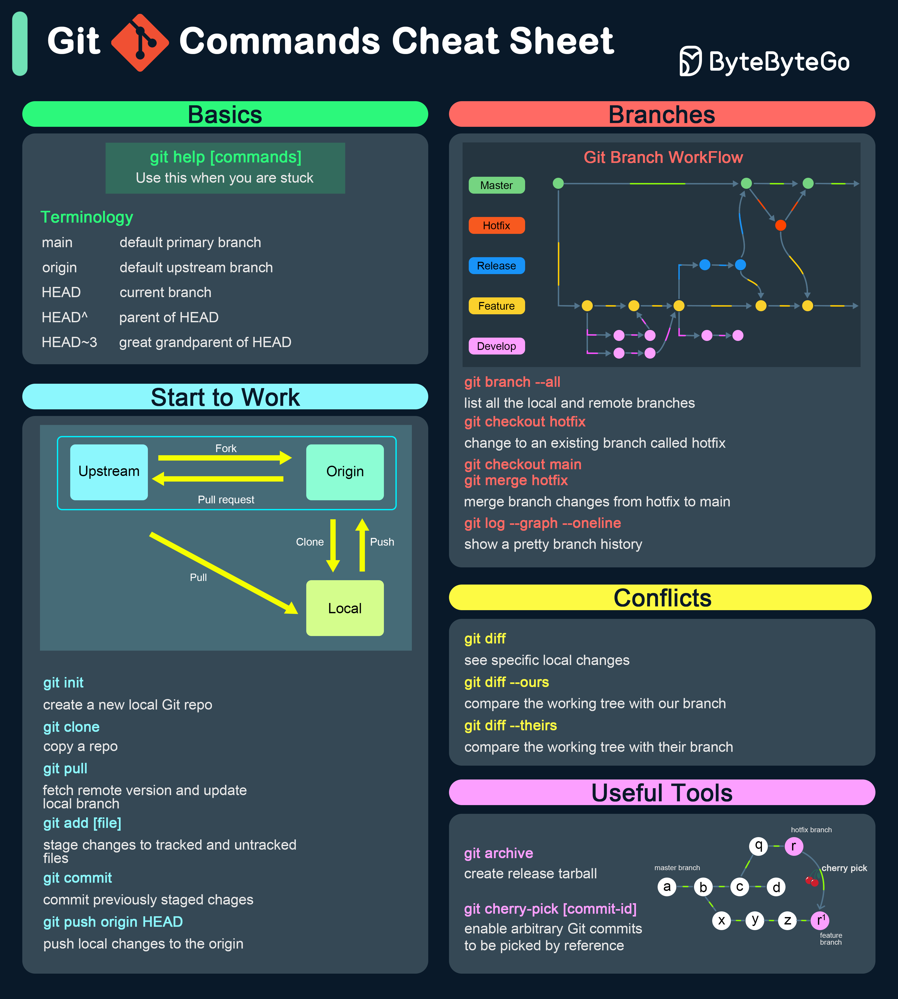

**Source:** [https://twitter.com/i/web/status/1914703256548454470](https://twitter.com/i/web/status/1914703256548454470)
**Original Post Date:** 2025-05-27 20:03:31

# Essential Git Commands and Workflows: A Comprehensive Cheat Sheet

## Introduction
Git is a critical version control system in modern software development, enabling collaborative code management across teams. This cheat sheet serves as a practical guide to mastering fundamental Git operations, from basic initialization through advanced workflow patterns. It covers key commands, branching strategies, conflict resolution techniques, and useful utilities that form the backbone of effective repository management.

## Git Fundamentals

Understanding core terminology is crucial for effective Git usage:

The main branch serves as the default primary branch (replacing 'master'), while origin represents the upstream remote repository. HEAD refers to your current working state, whether on a specific branch or commit.

Version references like HEAD^ and HEAD~3 allow navigation through commit history.

```bash
# Navigate commit history
HEAD^  # Parent commit
HEAD~3  # Great-grandparent commit
```

- git help [command] - Get detailed documentation for any Git command
- main - Default primary branch in modern repositories
- origin - Upstream remote repository reference
- HEAD - Current working position in history

## Getting Started with Git Workflows

The typical workflow begins with forking a repository and establishing local development branches. Changes are tracked, committed locally, then synchronized with remote repositories.

```bash
# Initialize new repo
$ git init

# Clone existing repo
$ git clone [URL]

# Stage and commit changes
$ git add .
$ git commit -m 'Commit message'

# Synchronize with remote
$ git pull origin main
$ git push origin HEAD
```

```bash
# Track upstream repository
$ git remote add upstream [URL]

# Fetch changes from upstream
$ git fetch upstream
```

## Advanced Branching and Merging

Branches enable parallel development. Common strategies include feature branches, hotfix branches for urgent issues, and release branches for version preparation.

```bash
# List all branches
$ git branch --all

# Create and switch to new branch
$ git checkout -b feature/new-feature

# Merge changes
$ git merge main hotfix
```

## Resolving Conflicts and Advanced Operations

Conflict resolution requires understanding differences between working tree, staged files, and commit history.

Cherry-picking allows selective application of specific commits across branches.

```bash
# Compare changes
$ git diff --ours
$ git diff --theirs

# Cherry-pick specific commit
$ git cherry-pick [commit-id]
```

## Essential Utilities and Tools

Git offers powerful utilities for package management, backup, and history analysis.

```bash
# Create release archive
$ git archive --format=zip HEAD -o release.zip

# View branch structure
$ git log --graph --oneline
```

## Key Takeaways

- Mastering basic commands forms the foundation for effective version control
- Branch strategies enable organized parallel development and feature management
- Proper conflict resolution is crucial for maintaining code integrity
- Advanced utilities enhance productivity in larger projects

## Conclusion
This cheat sheet provides a structured reference for essential Git operations. Regular practice with these commands will improve your workflow efficiency and collaboration capabilities.

## External References

- [Official Git Documentation](https://git-scm.com/doc)
- [Pro Git Book](https://git-scm.com/book/en/v2)


## Media

**Image Description:** This image is a comprehensive **Git Commands Cheat Sheet** designed to provide a quick reference for Git commands and workflows. The sheet is organized into several sections, each covering different aspects of Git usage. Below is a detailed breakdown of the image:

---

### **1. Basics**
- **Title:** "Basics"
- **Content:**
  - **git help [commands]:** A command to get help with Git commands when stuck.
  - **Terminology:**
    - **main:** Default primary branch (commonly used instead of `master`).
    - **origin:** Default upstream branch (remote repository).
    - **HEAD:** Current branch or commit.
    - **HEAD^:** Parent of the current commit (`HEAD`).
    - **HEAD~3:** Great-grandparent of the current commit (`HEAD`).

---

### **2. Start to Work**
- **Title:** "Start to Work"
- **Diagram:**
  - A flowchart illustrating the basic Git workflow:
    - **Upstream:** The original repository.
    - **Fork:** Creating a fork of the upstream repository.
    - **Origin:** The forked repository (local or remote).
    - **Clone:** Cloning the repository to the local machine.
    - **Pull Request:** Creating a pull request to merge changes back to the upstream repository.
    - **Local:** The local working directory.
    - **Push:** Pushing changes from the local repository to the remote repository.
    - **Pull:** Fetching and merging changes from the remote repository to the local repository.

- **Commands:**
  - **git init:** Initializes a new local Git repository.
  - **git clone [URL]:** Clones a repository from a remote URL.
  - **git pull:** Fetches and merges changes from the remote repository.
  - **git add [file]:** Stages changes in the specified file(s) for the next commit.
  - **git commit:** Commits the staged changes with a message.
  - **git push origin HEAD:** Pushes the local changes to the remote repository.

---

### **3. Branches**
- **Title:** "Branches"
- **Diagram:**
  - A detailed workflow diagram illustrating Git branching and merging:
    - **Master:** The main branch.
    - **Hotfix:** A branch for urgent fixes.
    - **Release:** A branch for preparing releases.
    - **Feature:** Branches for developing new features.
    - **Develop:** A branch for ongoing development.
  - The diagram shows how branches are created, merged, and how conflicts can arise.

- **Commands:**
  - **git branch --all:** Lists all local and remote branches.
  - **git checkout hotfix:** Switches to an existing branch named `hotfix`.
  - **git checkout -b hotfix:** Creates and switches to a new branch named `hotfix`.
  - **git checkout merge main hotfix:** Merges changes from the `hotfix` branch into the `main` branch.
  - **git log --graph --oneline:** Displays a graphical history of branches in a concise format.

---

### **4. Conflicts**
- **Title:** "Conflicts"
- **Commands:**
  - **git diff:** Shows differences between the working directory and the index/staged changes.
  - **git diff --ours:** Compares the working tree with the current branch.
  - **git diff --theirs:** Compares the working tree with another branch or commit.
  - **git cherry-pick [commit-id]:** Applies the changes from a specific commit to the current branch.

---

### **5. Useful Tools**
- **Title:** "Useful Tools"
- **Commands:**
  - **git archive:** Creates a release tarball or zip file of the repository.
  - **git cherry-pick [commit-id]:** Picks and applies a specific commit from another branch or commit.

- **Diagram:**
  - A small diagram illustrating the concept of cherry-picking a commit (`r'`) from one branch to another.

---

### **Design and Layout**
- **Color Coding:**
  - Different sections are color-coded for easy navigation:
    - **Green:** Basics.
    - **Blue:** Start to Work.
    - **Red:** Branches.
    - **Yellow:** Conflicts.
    - **Pink:** Useful Tools.
- **Icons and Logos:**
  - The Git logo is prominently displayed at the top left.
  - The "ByteByteGo" logo is present at the top right, indicating the source or creator of the cheat sheet.
- **Typography:**
  - Clear and concise text with a mix of bold and regular fonts for emphasis.
  - Commands are highlighted in boxes for easy identification.

---

### **Overall Purpose**
This cheat sheet serves as a quick reference guide for Git users, covering fundamental commands, branching strategies, conflict resolution, and useful tools. It is particularly helpful for developers who need to work efficiently with Git repositories, whether for personal projects or collaborative workflows. The inclusion of diagrams and terminology explanations makes it accessible for both beginners and intermediate users.
