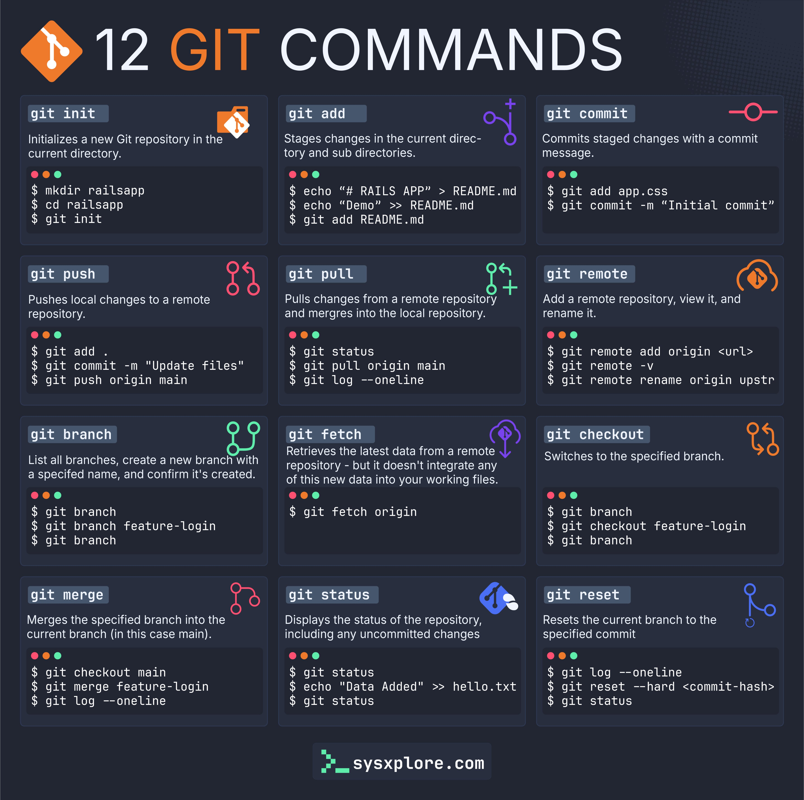

**Source:** [https://twitter.com/i/web/status/1883353197198422207](https://twitter.com/i/web/status/1883353197198422207)
**Original Post Date:** 2025-05-27 22:39:28

# Essential Git Commands: From Repository Setup to Branch Management

## Introduction
Version control is fundamental in modern software development. This knowledge base item provides an in-depth exploration of the twelve most essential Git commands that power collaborative development workflows. Each command is presented with practical examples and use cases, enabling developers to efficiently manage their codebases.

## Repository Initialization and Local Operations

The foundation of any Git workflow begins with repository initialization. The `git init` command creates a new local repository, setting up the necessary hidden `.git` directory for version tracking.

Staging changes is a critical step in the commit process. The `git add` command prepares modified files for inclusion in the next commit, allowing selective file addition.

```bash
$ git init
$ echo '# Project' > README.md
$ git add .
$ git commit -m 'Initial setup'
```

## Remote Repository Management

Git's power lies in its distributed nature. The `git remote` command manages connections to external repositories, while `git push` and `git pull` facilitate bi-directional synchronization.

The `git fetch` command retrieves updates without merging them into the working directory, providing a safer way to inspect changes before integration.

```bash
$ git remote add origin https://github.com/user/repo.git
$ git push -u origin main
$ git fetch --all
```

## Branching and Merging Workflows

Git's branching model enables parallel development. The `git branch` command creates isolated environments for feature development, while `git checkout` navigates between branches.

Merging changes requires careful consideration. The `git merge` command integrates a specified branch into the current context, resolving conflicts when necessary.

```bash
$ git branch feature
$ git checkout -b hotfix
$ git merge feature --no-ff
```

## Repository Inspection and State Management

Understanding repository state is crucial for effective version control. The `git status` command provides visibility into current changes, while `git log` offers a historical view.

The `git reset` command allows precise manipulation of the commit history, though it should be used carefully to avoid data loss.

```bash
$ git status
$ git reset HEAD^ --hard
```

## Key Takeaways

- Repository initialization and local operations form the basis of Git workflows
- Remote repository management enables collaborative development through push/pull/fetch operations
- Branching and merging provide structured parallel development capabilities
- Proper state inspection and history management are essential for maintaining code integrity

## Conclusion
Mastery of these twelve Git commands provides a solid foundation for effective version control. Understanding their proper usage enables developers to efficiently manage complex codebases, collaborate effectively with teams, and maintain clean commit histories.

## External References

- [Git Documentation](https://git-scm.com/doc)
- [Original Cheat Sheet Source](http://sysxplore.com/git-commands-cheatsheet)


## Media

**Image Description:** The image is a comprehensive cheat sheet or reference guide for **12 Git commands**, presented in a clean, organized, and visually appealing format. The main subject of the image is the explanation and usage of various Git commands, each accompanied by a brief description, example commands, and relevant icons. Below is a detailed breakdown:

### **Header**
- **Title**: "12 Git Commands"
- **Logo**: An orange Git logo (a stylized "G" with a branch-like design) is placed on the top left.
- **Background**: The background is dark (black or dark blue), which contrasts well with the white and orange text, making it visually striking and easy to read.

### **Layout**
The image is divided into a **3x4 grid**, with each cell representing a different Git command. Each cell contains:
1. **Command Name**: Highlighted in a gray box.
2. **Description**: A brief explanation of what the command does.
3. **Example Commands**: Real-world examples of how to use the command in a terminal.
4. **Icons**: Small, colorful icons (red, green, purple, blue, etc.) that visually represent the command's function or category.

### **Commands and Details**
#### **Row 1**
1. **`git init`**
   - **Description**: Initializes a new Git repository in the current directory.
   - **Example Commands**:
     ```
     $ mkdir railsapp
     $ cd railsapp
     $ git init
     ```
   - **Icon**: A red icon representing initialization.

2. **`git add`**
   - **Description**: Stages changes in the current directory and subdirectories.
   - **Example Commands**:
     ```
     $ echo "# RAILS APP" > README.md
     $ git add app.css
     $ git add README.md
     ```
   - **Icon**: A purple icon representing staging.

3. **`git commit`**
   - **Description**: Commits staged changes with a commit message.
   - **Example Commands**:
     ```
     $ echo "Demo" > README.md
     $ git commit -m "Initial commit"
     ```
   - **Icon**: A red icon representing committing.

#### **Row 2**
4. **`git push`**
   - **Description**: Pushes local changes to a remote repository.
   - **Example Commands**:
     ```
     $ git add .
     $ git commit -m "Update files"
     $ git push origin main
     ```
   - **Icon**: A red icon representing pushing.

5. **`git pull`**
   - **Description**: Pulls changes from a remote repository and merges them into the local repository.
   - **Example Commands**:
     ```
     $ git status
     $ git pull origin main
     $ git log --oneline
     ```
   - **Icon**: A green icon representing pulling.

6. **`git remote`**
   - **Description**: Adds, views, or renames a remote repository.
   - **Example Commands**:
     ```
     $ git remote -v
     $ git remote rename origin upstream
     ```
   - **Icon**: An orange icon representing remotes.

#### **Row 3**
7. **`git branch`**
   - **Description**: Lists all branches, creates a new branch, or confirms a branch's creation.
   - **Example Commands**:
     ```
     $ git branch
     $ git branch feature-login
     $ git branch
     ```
   - **Icon**: A green icon representing branching.

8. **`git fetch`**
   - **Description**: Retrieves the latest data from a remote repository without integrating it into the working files.
   - **Example Commands**:
     ```
     $ git fetch origin
     ```
   - **Icon**: A purple icon representing fetching.

9. **`git checkout`**
   - **Description**: Switches to a specified branch.
   - **Example Commands**:
     ```
     $ git branch
     $ git checkout feature-login
     ```
   - **Icon**: An orange icon representing checking out.

#### **Row 4**
10. **`git merge`**
    - **Description**: Merges a specified branch into the current branch.
    - **Example Commands**:
      ```
      $ git checkout main
      $ git merge feature-login
      $ git log --oneline
      ```
    - **Icon**: A red icon representing merging.

11. **`git status`**
    - **Description**: Displays the status of the repository, including uncommitted changes.
    - **Example Commands**:
      ```
      $ git status
      $ echo "Data Added" >> hello.txt
      $ git status
      ```
    - **Icon**: A blue icon representing status.

12. **`git reset`**
    - **Description**: Resets the current branch to a specified commit.
    - **Example Commands**:
      ```
      $ git log --oneline
      $ git reset --hard <commit-hash>
      $ git status
      ```
    - **Icon**: A blue icon representing resetting.

### **Footer**
- **Website**: At the bottom, there is a small text link to "sysxplore.com," indicating the source or creator of the cheat sheet.

### **Design Elements**
- **Color Coding**: Different commands are associated with different colored icons (red, green, purple, blue, orange), which helps in visually categorizing the commands.
- **Consistent Formatting**: Each command cell follows the same structure, making it easy to scan and understand.
- **Icons**: The icons are simple yet meaningful, representing the action of each command (e.g., a branch for `git branch`, a push/pull symbol for `git push`/`git pull`).

### **Purpose**
This image serves as an educational and reference tool for developers learning or using Git. It provides a quick overview of essential Git commands, their purposes, and practical examples, making it a valuable resource for both beginners and experienced users.

### **Overall Impression**
The image is well-organized, visually appealing, and highly informative, making it an effective tool for learning and quick reference. The use of icons and color coding enhances usability and comprehension.
