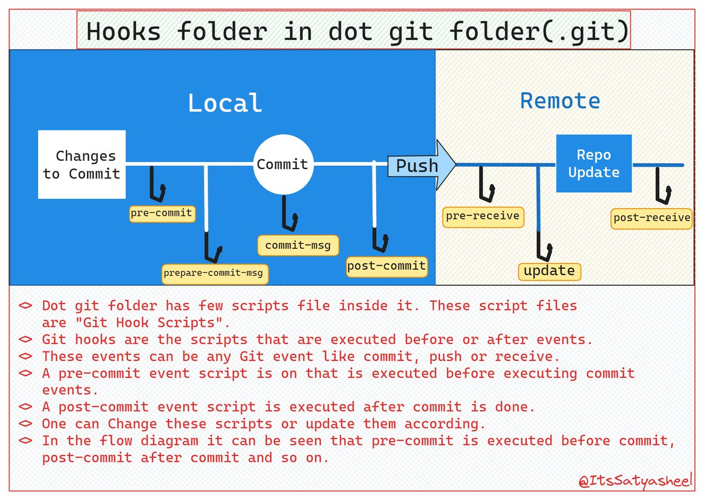

**Source:** [https://twitter.com/i/web/status/1869685269584392230](https://twitter.com/i/web/status/1869685269584392230)
**Original Post Date:** 2025-07-20 09:09:55

# Understanding Git Hooks: Local and Remote Workflow Automation in .git/hooks

## Introduction
Git hooks are powerful scripts that execute at various stages of the Git workflow. They reside in the `.git/hooks` directory and can be customized to automate tasks, enforce policies, or integrate with external systems. This article delves into the specifics of local and remote Git hooks, their execution points, and their practical applications.

## Introduction to Git Hooks

Git hooks are scripts that execute automatically at specific points in the Git workflow. They can be used for a variety of purposes, such as validating commits, enforcing coding standards, or triggering notifications.

Hooks are located in the `.git/hooks` directory within a Git repository. Each hook is associated with a specific event, such as committing changes, pushing to a remote repository, or receiving changes from another repository.

- Hooks are not part of the core Git functionality and must be manually set up.
- They can be written in any scripting language supported by the system (e.g., Bash, Python).

> **Note/Tip:** Customizing hooks requires understanding the specific needs of your project and workflow.

## Local Git Hooks

Local Git hooks are executed during the local commit process. They can be used to validate or modify changes before they are committed, enforce coding standards, or perform other pre-commit tasks.

The main types of local hooks include `pre-commit`, `commit-msg`, `prepare-commit-msg`, and `post-commit`. Each hook serves a specific purpose in the commit workflow.

- `pre-commit`: Executed before a commit is created. Can be used to validate or modify changes.
- `commit-msg`: Executed after the commit message is created but before the commit is finalized. Can be used to validate or modify the commit message.
- `prepare-commit-msg`: Executed before the commit message editor is opened. Can be used to pre-fill or modify the commit message.
- `post-commit`: Executed after a commit is successfully created. Can be used for post-commit actions, such as notifications.

## Remote Git Hooks

Remote Git hooks are executed on the remote repository during the push process. They can be used to validate incoming changes, enforce specific policies or permissions for updates, and perform post-update actions.

The main types of remote hooks include `pre-receive`, `update`, and `post-receive`. Each hook serves a specific purpose in the remote update workflow.

- `pre-receive`: Executed before any references (branches/tags) are updated on the remote repository. Can be used to validate incoming changes.
- `update`: Executed for each branch or tag reference that is being updated. Can be used to enforce specific policies or permissions for updates.
- `post-receive`: Executed after all references have been updated. Can be used for post-update actions, such as triggering notifications or deploying changes.

## Push Operation Hooks

The `pre-push` hook is executed before pushing changes to a remote repository. This hook can be used to validate the changes being pushed or perform additional checks before the push operation.

This hook is particularly useful for ensuring that only validated and approved changes are pushed to the remote repository.

- `pre-push`: Executed before pushing changes to a remote repository. Can be used to validate changes or perform additional checks.

## Visual Elements and Diagram Explanation

The diagram provided in the image effectively illustrates the Git workflow, highlighting the role of hooks at various stages. The local section is represented in blue, while the remote section is represented in beige.

Arrows indicate the flow of operations, showing the sequence of events from changes to commit, commit to push, and finally to the remote repository.

- The diagram uses circles and rectangles to highlight specific stages or hooks.
- Each hook is labeled with its name (e.g., `pre-commit`, `commit-msg`).

> **Note/Tip:** Understanding the visual representation of Git hooks can help in better comprehending their role and implementation.

## Conclusion

Git hooks are powerful tools for automating tasks, enforcing policies, and integrating with external systems during the Git workflow.

By customizing local and remote hooks, developers can significantly improve their development process, maintain code quality, and enhance collaboration within a team.

## Key Takeaways

- Git hooks are scripts that execute at specific points in the Git workflow to automate tasks and enforce policies.
- Local hooks (`pre-commit`, `commit-msg`, etc.) are executed during the local commit process, while remote hooks (`pre-receive`, `update`, etc.) are executed on the remote repository during the push process.
- Customizing Git hooks can streamline development processes, maintain code quality, and improve collaboration within a team.

## Conclusion
In summary, understanding and customizing Git hooks can significantly enhance your Git workflow. By leveraging these powerful scripts, you can automate repetitive tasks, enforce coding standards, and integrate with external systems to create a more efficient and collaborative development environment.

## External References

- [Git Hooks Documentation](https://git-scm.com/docs/githooks)
- [A Guide to Git Hooks](https://www.atlassian.com/git/tutorials/git-hooks)

## Media

**Image Description:** ### Image Description

The image is a diagram explaining the concept of **Git hooks** and their role in the Git workflow, particularly focusing on the `.git/hooks` folder. The diagram is divided into two main sections: **Local** and **Remote**, illustrating the flow of Git operations and the corresponding hooks that can be executed at various stages.

---

### **Main Components of the Diagram**

#### **1. Title**
- The title at the top reads:  
  **"Hooks folder folder in dot git git git folder folder (.git.git)"**  
  This is a slightly repetitive and informal way of referring to the `.git/hooks` directory in a Git repository.

---

#### **2. Local Section**
- **Changes to Commit**:  
  This represents the initial stage where changes are made locally in the working directory. These changes are prepared for committing.

- **Commit**:  
  This is the stage where the changes are committed to the local Git repository. The diagram shows several hooks associated with this stage:
  - **pre-commit**:  
    Executed before the commit is created. This hook can be used to validate or modify the changes before they are committed.
  - **commit-msg**:  
    Executed after the commit message is created but before the commit is finalized. This hook can be used to validate or modify the commit message.
  - **prepare-commit-msg**:  
    Executed before the commit message editor is opened. This hook can be used to pre-fill or modify the commit message.
  - **post-commit**:  
    Executed after the commit is successfully created. This hook can be used for post-commit actions, such as notifications or additional processing.

---

#### **3. Push Operation**
- **Push**:  
  This represents the action of pushing the committed changes from the local repository to a remote repository. The diagram shows that the `pre-push` hook can be executed before the push operation.

---

#### **4. Remote Section**
- **Repo**:  
  This represents the remote repository where the changes are pushed. Several hooks are associated with this stage:
  - **pre-receive**:  
    Executed before any references (branches/tags) are updated on the remote repository. This hook can be used to validate incoming changes before they are accepted.
  - **update**:  
    Executed for each branch or tag reference that is being updated. This hook can be used to enforce specific policies or permissions for updates.
  - **post-receive**:  
    Executed after all references have been updated. This hook can be used for post-update actions, such as triggering notifications or deploying changes.

---

### **Additional Text Explanation**
- The text below the diagram provides a detailed explanation of Git hooks:
  - **Dot git folder**:  
    The `.git` folder contains several scripts, collectively known as "Git hooks." These are scripts that can be executed before or after specific Git events.
  - **Git hooks**:  
    These are scripts that are executed at various stages of the Git workflow, such as before or after committing, pushing, or updating the remote repository.
  - **Events**:  
    The events can include committing, pushing, or receiving changes. For example:
    - **pre-commit**: Executed before a commit is created.
    - **post-commit**: Executed after a commit is created.
    - **pre-push**: Executed before pushing changes to a remote repository.
    - **pre-receive**: Executed before updates are made to the remote repository.
    - **update**: Executed for each reference update on the remote repository.
    - **post-receive**: Executed after all updates are completed on the remote repository.
  - **Customization**:  
    Users can modify these scripts to automate tasks, enforce policies, or integrate with other systems.

---

### **Visual Elements**
- **Colors and Shapes**:
  - **Blue**: Represents the **Local** section.
  - **Beige**: Represents the **Remote** section.
  - **Arrows**: Indicate the flow of operations (e.g., from "Changes to Commit" to "Commit," and from "Commit" to "Push").
  - **Circles and Rectangles**: Used to highlight specific stages or hooks.

- **Annotations**:
  - Each hook is labeled with its name (e.g., `pre-commit`, `commit-msg`, etc.).
  - The flow of operations is clearly marked with arrows, showing the sequence of events.

---

### **Key Takeaways**
1. **Local Hooks**:
   - `pre-commit`, `commit-msg`, `prepare-commit-msg`, `post-commit`
   - These hooks are executed during the local commit process.

2. **Remote Hooks**:
   - `pre-receive`, `update`, `post-receive`
   - These hooks are executed on the remote repository during the push process.

3. **Push Hook**:
   - `pre-push`
   - Executed before pushing changes to the remote repository.

4. **Customizability**:
   - Git hooks can be customized to automate tasks, enforce policies, or integrate with external systems.

---

### **Conclusion**
The image effectively illustrates the Git workflow, highlighting the role of hooks at various stages of the process. It emphasizes the `.git/hooks` directory and the scripts that can be executed before or after specific Git events, providing a clear visual and textual explanation of how Git hooks work in both local and remote contexts. The repetitive phrasing in the title and text is informal but does not detract from the overall clarity of the diagram.
