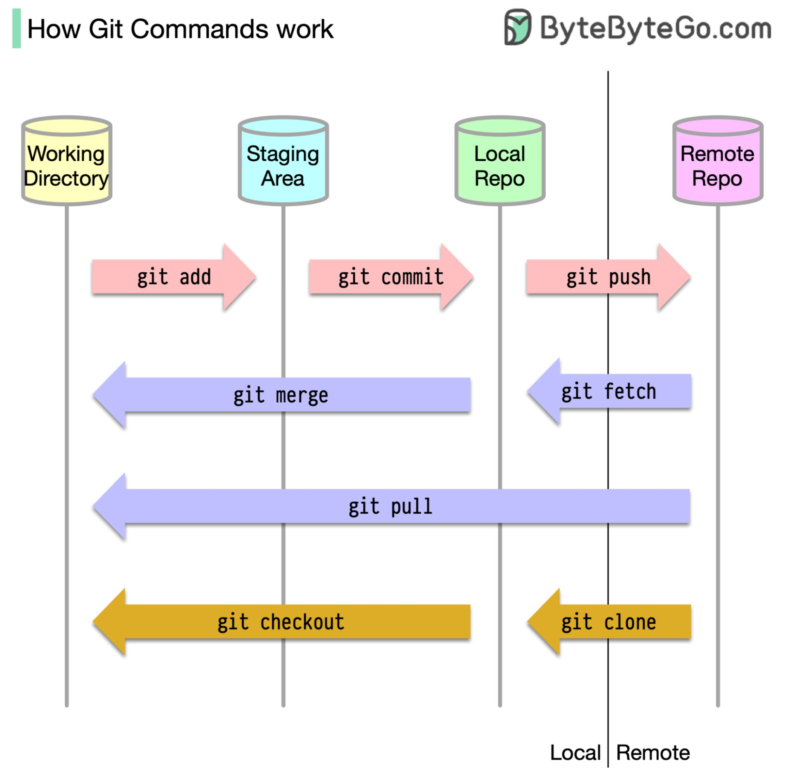

**Source:** [https://twitter.com/i/web/status/1871607691401203971](https://twitter.com/i/web/status/1871607691401203971)
**Original Post Date:** 2025-05-28 09:01:23

# Understanding Git Workflows: Core Components and Command Interactions

## Introduction
Git workflows form the backbone of modern collaborative development. Understanding how commands interact across different repository areas is crucial for efficient code management. This article explores the core components of a Git repository and their relationships through specific commands, providing a visual and technical framework for mastering version control.

## Core Repository Components

The Git workflow consists of four primary components: Working Directory (yellow cylinder), Staging Area (light blue cylinder), Local Repository (green cylinder), and Remote Repository (pink cylinder). Each serves a distinct purpose in the version control process.

Changes flow from the Working Directory through these areas, with each step representing a deliberate progression toward finalizing code changes.

- Working Directory: Local files for active development
- Staging Area: Pre-commit preparation zone
- Local Repository: Commited history storage
- Remote Repository: Shared project source

## Git Command Interactions and Flow

Commands move changes between components following a structured path. Each command has specific directionality indicated by color-coded arrows in the workflow diagram.

Forward-flow commands (pink arrows): git add, commit, push - Progressing from Working Directory to Remote Repository

Backward/retrieval commands (purple arrows): git pull, fetch, merge - Obtaining changes from upstream sources

_Standard forward-flow sequence demonstrating progression through components_

```bash
# Basic workflow sequence
$ git add .
$ git commit -m "Add feature X"
$ git push origin main
```

1. Use git add to stage changes
1. Commit with meaningful messages
1. Push frequently to share work
1. Pull before making local changes

## Advanced Workflow Concepts

Understanding command interactions enables effective branching strategies and conflict resolution. Key concepts include fetch/merge vs pull, checkout for branch switching, and clone for initial setup.

## Key Takeaways

- Changes flow sequentially from Working Directory through Staging Area to Local Repository before reaching Remote
- git add commits changes locally while git push synchronizes with remote repository
- Regular fetch/pull operations prevent merge conflicts in collaborative environments

## Conclusion
Mastering Git workflow components and command interactions is essential for efficient version control. By understanding the directional flow of commands between repository areas, developers can maintain clean history and collaborate effectively on projects.

## External References

- [Git Workflow Diagram Source](https://bytebytebytegogo.com/git-workflow)
- [Official Git Documentation](https://git-scm.com/doc)


## Media

**Image Description:** The image is a flowchart that illustrates the workflow of Git commands and their interactions between different areas of a Git repository. The main subject of the image is the Git workflow, which is depicted through a series of steps and transitions between various components of a Git repository. Below is a detailed description:

### **Main Components of the Workflow**
1. **Working Directory**:
   - This is the local copy of the repository where you make changes to files.
   - It is represented by a yellow cylinder on the left side of the diagram.

2. **Staging Area**:
   - This is a temporary area where changes are prepared for committing.
   - It is represented by a light blue cylinder in the middle of the diagram.

3. **Local Repository**:
   - This is the local Git repository where committed changes are stored.
   - It is represented by a green cylinder in the middle-right of the diagram.

4. **Remote Repository**:
   - This is the remote Git repository hosted on a server (e.g., GitHub, GitLab, etc.).
   - It is represented by a pink cylinder on the far right of the diagram.

### **Git Commands and Their Flow**
The diagram shows the flow of Git commands between these components. Here’s a breakdown of each command and its role:

#### **1. `git add`**
   - **Purpose**: Moves changes from the Working Directory to the Staging Area.
   - **Direction**: From the **Working Directory** to the **Staging Area**.
   - **Color**: Pink arrow.

#### **2. `git commit`**
   - **Purpose**: Commits changes from the Staging Area to the Local Repository.
   - **Direction**: From the **Staging Area** to the **Local Repository**.
   - **Color**: Pink arrow.

#### **3. `git push`**
   - **Purpose**: Pushes committed changes from the Local Repository to the Remote Repository.
   - **Direction**: From the **Local Repository** to the **Remote Repository**.
   - **Color**: Pink arrow.

#### **4. `git pull`**
   - **Purpose**: Fetches and merges changes from the Remote Repository into the Local Repository.
   - **Direction**: From the **Remote Repository** to the **Local Repository**.
   - **Color**: Purple arrow.

#### **5. `git fetch`**
   - **Purpose**: Fetches changes from the Remote Repository into the Local Repository without merging them.
   - **Direction**: From the **Remote Repository** to the **Local Repository**.
   - **Color**: Purple arrow.

#### **6. `git merge`**
   - **Purpose**: Merges changes from one branch into another.
   - **Direction**: Between the **Local Repository** and the **Staging Area**.
   - **Color**: Purple arrow.

#### **7. `git checkout`**
   - **Purpose**: Switches between branches or commits in the Local Repository.
   - **Direction**: Within the **Local Repository**.
   - **Color**: Yellow arrow.

#### **8. `git clone`**
   - **Purpose**: Creates a local copy of a Remote Repository.
   - **Direction**: From the **Remote Repository** to the **Local Repository**.
   - **Color**: Yellow arrow.

### **Visual Layout**
- The diagram is organized horizontally, with the **Working Directory** on the left and the **Remote Repository** on the right.
- Arrows indicate the direction of data flow between these components.
- Each Git command is labeled with its corresponding arrow, and the arrows are color-coded to differentiate between commands.

### **Additional Notes**
- The title at the top reads: **"How Git Commands Commands Commands work"**, which appears to be a repetition error.
- The website **"ByteByteByteGoGo.com"** is mentioned in the top-right corner, likely the source of the diagram.

### **Summary**
The image effectively visualizes the Git workflow by showing how changes move through the Working Directory, Staging Area, Local Repository, and Remote Repository using specific Git commands. The use of color-coded arrows helps distinguish between different commands and their directions, making the flowchart easy to follow. This diagram is a useful tool for understanding the sequence and purpose of Git commands in a collaborative development environment.
