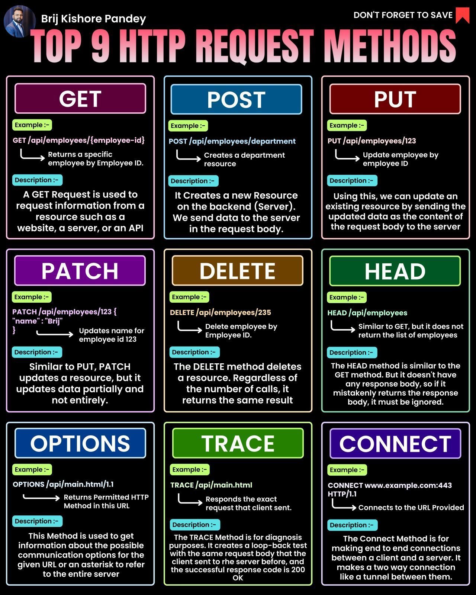

# Http Request Methods

## Description
Top 9 HTTP Request Methods...

## Content
Top 9 HTTP Request Methods

## Category Information

- Main Category: web_development
- Sub Category: apis
- Item Name: http_request_methods

## Source

- Original Tweet: [https://twitter.com/i/web/status/1876192002963829042](https://twitter.com/i/web/status/1876192002963829042)
- Date: 2025-02-20 15:36:34

## Media

### Media 1

**Description:** The infographic, titled "TOP 9 HTTP REQUEST METHODS" in pink text at the top, presents a comprehensive overview of the most common HTTP request methods used in web development. The title is accompanied by a circular photo of Brij Kishore Pandey and his name in white text to the left.

Below the title, nine colorful boxes are arranged in three rows of three, each containing information about one of the top 9 HTTP request methods:

• **GET**: A GET Request is used to retrieve data from a server. It does not modify any data on the server.
• **POST**: A POST Request is used to send data to a server to create or update resources.
• **PUT**: A PUT Request is used to update an existing resource on a server.
• **PATCH**: A PATCH Request is used to partially update a resource on a server.
• **DELETE**: A DELETE Request is used to delete a resource from a server.
• **HEAD**: A HEAD Request is similar to the GET method, but it only returns the HTTP headers and not the response body.
• **OPTIONS**: An OPTIONS Request is used to retrieve information about the capabilities of a server.
• **CONNECT**: A CONNECT Request is used to establish a tunnel through an HTTP proxy.

Each box includes a brief description of the request method, its purpose, and examples of how it can be used. The background of the image is black, providing a clean and visually appealing contrast to the colorful boxes.

Overall, this infographic provides a clear and concise introduction to the most commonly used HTTP request methods, making it an excellent resource for web developers and designers looking to improve their understanding of these fundamental concepts.

*Last updated: 2025-02-20 15:36:34*