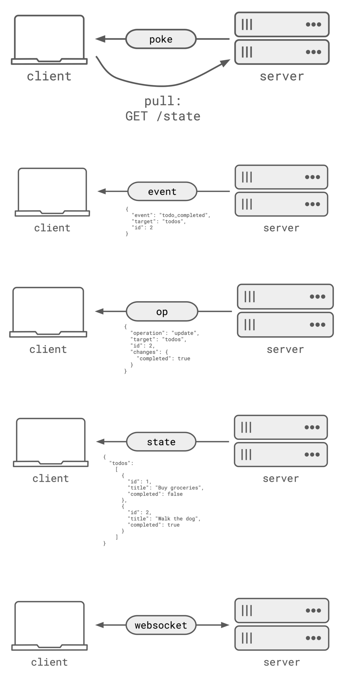

Realtime web patterns refer to the design principles and techniques used to build web applications that provide instantaneous updates and feedback to users. This knowledge base entry provides an overview of the key concepts, technologies, and best practices for building realtime web features.

## Technical Content
Building realtime web applications involves understanding several fundamental concepts, including HTTP methods, RESTful APIs, and WebSocket connections.

### HTTP Methods
HTTP methods are used to perform CRUD (Create, Read, Update, Delete) operations on resources. The most common HTTP methods include:

* **GET**: Retrieves data from the server. Example: `GET /users`
* **POST**: Creates new resources on the server. Example: `POST /users` with JSON payload `{ "name": "John Doe", "email": "john.doe@example.com" }`
* **PUT**: Updates existing resources on the server. Example: `PUT /users/1` with JSON payload `{ "name": "Jane Doe", "email": "jane.doe@example.com" }`
* **DELETE**: Deletes resources from the server. Example: `DELETE /users/1`

### RESTful APIs
RESTful APIs are an architectural style for designing networked applications. Key characteristics of RESTful APIs include:

* Resources are identified using URIs (Uniform Resource Identifiers). Example: `/users`, `/products`, etc.
* HTTP methods are used to perform CRUD operations on resources. Example: `GET /users` retrieves a list of users, while `POST /users` creates a new user

### WebSocket Connections
WebSocket connections establish a persistent connection between the client and server, allowing for bidirectional communication.

* Establishes a persistent connection between the client and server. Example: `ws://example.com/socket`
* Allows for bidirectional communication between the client and server. Example: Client sends message to server, server responds with updated data

## Key Takeaways and Best Practices
When building realtime web applications, consider the following key takeaways and best practices:

* Use RESTful APIs for resource-based interactions and WebSocket connections for bidirectional communication.
* Implement caching mechanisms to reduce latency and improve performance.
* Optimize database queries and schema design for efficient data retrieval and updates.
* Consider using message queues or event-driven architectures for handling high volumes of concurrent updates.

## References
For more information on building realtime web features, refer to the following resources:

* [Patterns for Building Realtime Features](https://zknill.io/posts/patterns-for-building-realtime/)
* [RESTful API Design](https://restfulapi.net/)
* [WebSocket Protocol](https://www.rfc-editor.org/rfc/rfc6455)

By understanding and applying these concepts, technologies, and best practices, developers can build scalable and efficient web applications that provide a seamless user experience.
## Source

- Original Tweet: [https://twitter.com/i/web/status/1890769143940468888](https://twitter.com/i/web/status/1890769143940468888)
- Date: 2025-02-20 17:22:27

## Media

### Media 1

**Description:** The image presents a comprehensive visual representation of various web development concepts, including HTTP methods, RESTful APIs, and WebSocket connections. The infographic is structured as a series of interconnected diagrams, each illustrating a specific concept or process.

*   **HTTP Methods**
    *   GET: Retrieves data from the server
        *   Example: `GET /users`
    *   POST: Creates new resources on the server
        *   Example: `POST /users` with JSON payload `{ "name": "John Doe", "email": "john.doe@example.com" }`
    *   PUT: Updates existing resources on the server
        *   Example: `PUT /users/1` with JSON payload `{ "name": "Jane Doe", "email": "jane.doe@example.com" }`
    *   DELETE: Deletes resources from the server
        *   Example: `DELETE /users/1`
*   **RESTful APIs**
    *   Resources are identified using URIs (Uniform Resource Identifiers)
        *   Example: `/users`, `/products`, etc.
    *   HTTP methods are used to perform CRUD operations (Create, Read, Update, Delete) on resources
        *   Example: `GET /users` retrieves a list of users, while `POST /users` creates a new user
*   **WebSocket Connections**
    *   Establishes a persistent connection between the client and server
        *   Example: `ws://example.com/socket`
    *   Allows for bidirectional communication between the client and server
        *   Example: Client sends message to server, server responds with updated data

In summary, the infographic provides a clear and concise overview of fundamental web development concepts, including HTTP methods, RESTful APIs, and WebSocket connections. By understanding these concepts, developers can build robust and efficient web applications that meet the needs of their users.

*Last updated: 2025-02-20 17:22:27*