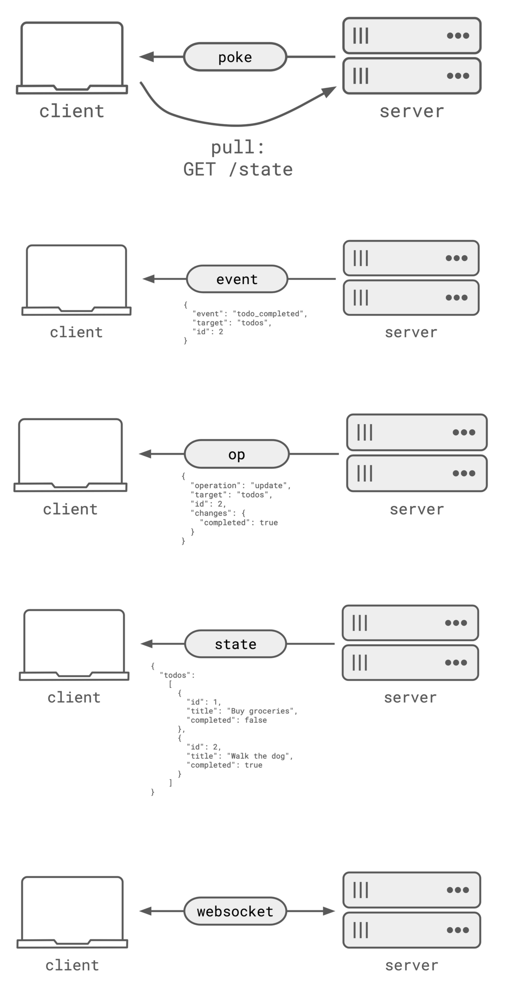

# Realtime Web Patterns

## Description
Patterns for building realtime features
https://zknill.io/posts/patterns-for-building-realtime/…...

## Content
Patterns for building realtime features
https://zknill.io/posts/patterns-for-building-realtime/…

## Category Information

- Main Category: web_development
- Sub Category: apis
- Item Name: realtime_web_patterns

## Source

- Original Tweet: [https://twitter.com/i/web/status/1890769143940468888](https://twitter.com/i/web/status/1890769143940468888)
- Date: 2025-02-20 15:36:34

## Media

### Media 1

**Description:** The image presents a comprehensive visual representation of various web development concepts, including HTTP methods, RESTful APIs, and WebSocket connections. The infographic is structured as a series of interconnected diagrams, each illustrating a specific concept or process.

*   **HTTP Methods**
    *   GET: Retrieves data from the server
        *   Example: `GET /users`
    *   POST: Creates new resources on the server
        *   Example: `POST /users` with JSON payload `{ "name": "John Doe", "email": "john.doe@example.com" }`
    *   PUT: Updates existing resources on the server
        *   Example: `PUT /users/1` with JSON payload `{ "name": "Jane Doe", "email": "jane.doe@example.com" }`
    *   DELETE: Deletes resources from the server
        *   Example: `DELETE /users/1`
*   **RESTful APIs**
    *   Resources are identified using URIs (Uniform Resource Identifiers)
        *   Example: `/users`, `/products`, etc.
    *   HTTP methods are used to perform CRUD operations (Create, Read, Update, Delete) on resources
        *   Example: `GET /users` retrieves a list of users, while `POST /users` creates a new user
*   **WebSocket Connections**
    *   Establishes a persistent connection between the client and server
        *   Example: `ws://example.com/socket`
    *   Allows for bidirectional communication between the client and server
        *   Example: Client sends message to server, server responds with updated data

In summary, the infographic provides a clear and concise overview of fundamental web development concepts, including HTTP methods, RESTful APIs, and WebSocket connections. By understanding these concepts, developers can build robust and efficient web applications that meet the needs of their users.

*Last updated: 2025-02-20 15:36:34*