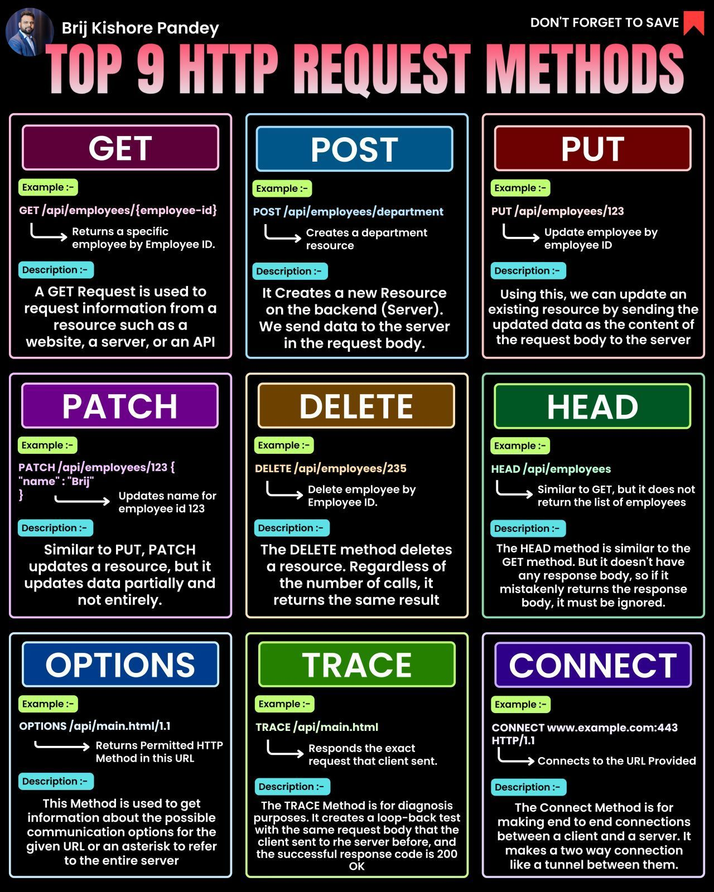

HTTP request methods are the backbone of web development, enabling communication between clients and servers. This guide provides an overview of the top 9 HTTP request methods, their purposes, and examples of how they can be used.

#### Technical Content
The following sections describe each of the top 9 HTTP request methods:

##### 1. GET Request Method
* **Purpose:** Retrieve data from a server without modifying it.
* **Description:** A GET request is used to fetch data from a server. It does not alter any data on the server and is typically used for retrieving resources such as web pages, images, or data.
* **Example:** Retrieving a user's profile information from a server.

##### 2. POST Request Method
* **Purpose:** Send data to a server to create or update resources.
* **Description:** A POST request is used to send data to a server for creation or updating of resources. This method is often used for forms, file uploads, and creating new resources.
* **Example:** Creating a new user account on a website.

##### 3. PUT Request Method
* **Purpose:** Update an existing resource on a server.
* **Description:** A PUT request is used to update an existing resource on a server by replacing it with a new version.
* **Example:** Updating a user's profile information, such as their name or email address.

##### 4. PATCH Request Method
* **Purpose:** Partially update a resource on a server.
* **Description:** A PATCH request is used to partially update a resource on a server by sending only the changes.
* **Example:** Updating a user's password without changing their other profile information.

##### 5. DELETE Request Method
* **Purpose:** Delete a resource from a server.
* **Description:** A DELETE request is used to delete a resource from a server.
* **Example:** Deleting a user account from a website.

##### 6. HEAD Request Method
* **Purpose:** Retrieve HTTP headers without the response body.
* **Description:** A HEAD request is similar to a GET request but only returns the HTTP headers and not the response body.
* **Example:** Checking if a resource has been updated since it was last accessed.

##### 7. OPTIONS Request Method
* **Purpose:** Retrieve information about the capabilities of a server.
* **Description:** An OPTIONS request is used to retrieve information about the capabilities of a server, such as the supported HTTP methods.
* **Example:** Determining which HTTP methods are supported by a server.

##### 8. CONNECT Request Method
* **Purpose:** Establish a tunnel through an HTTP proxy.
* **Description:** A CONNECT request is used to establish a tunnel through an HTTP proxy, allowing for secure communication between the client and server.
* **Example:** Creating a secure connection to a server through an HTTP proxy.

#### Key Takeaways and Best Practices
* Use the correct HTTP request method based on the action being performed (e.g., GET for retrieval, POST for creation).
* Ensure that sensitive data is transmitted securely using HTTPS.
* Use the OPTIONS method to determine which HTTP methods are supported by a server.
* Implement error handling and logging mechanisms to handle unexpected responses from servers.

#### References
* [HTTP/1.1 Specification](https://www.rfc-editor.org/rfc/rfc7231)
* [RFC 2616: Hypertext Transfer Protocol -- HTTP/1.1](https://www.rfc-editor.org/rfc/rfc2616)

Note: The infographic "TOP 9 HTTP REQUEST METHODS" provides a visual representation of the information contained in this guide and can be used as a quick reference for web developers and designers.
## Source

- Original Tweet: [https://twitter.com/i/web/status/1876192002963829042](https://twitter.com/i/web/status/1876192002963829042)
- Date: 2025-02-20 17:35:23

## Media

### Media 1

**Description:** The infographic, titled "TOP 9 HTTP REQUEST METHODS" in pink text at the top, presents a comprehensive overview of the most common HTTP request methods used in web development. The title is accompanied by a circular photo of Brij Kishore Pandey and his name in white text to the left.

Below the title, nine colorful boxes are arranged in three rows of three, each containing information about one of the top 9 HTTP request methods:

• **GET**: A GET Request is used to retrieve data from a server. It does not modify any data on the server.
• **POST**: A POST Request is used to send data to a server to create or update resources.
• **PUT**: A PUT Request is used to update an existing resource on a server.
• **PATCH**: A PATCH Request is used to partially update a resource on a server.
• **DELETE**: A DELETE Request is used to delete a resource from a server.
• **HEAD**: A HEAD Request is similar to the GET method, but it only returns the HTTP headers and not the response body.
• **OPTIONS**: An OPTIONS Request is used to retrieve information about the capabilities of a server.
• **CONNECT**: A CONNECT Request is used to establish a tunnel through an HTTP proxy.

Each box includes a brief description of the request method, its purpose, and examples of how it can be used. The background of the image is black, providing a clean and visually appealing contrast to the colorful boxes.

Overall, this infographic provides a clear and concise introduction to the most commonly used HTTP request methods, making it an excellent resource for web developers and designers looking to improve their understanding of these fundamental concepts.

*Last updated: 2025-02-20 17:35:23*