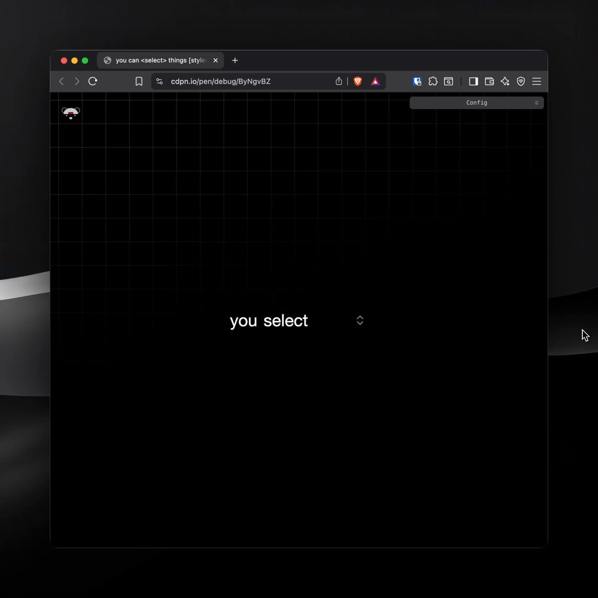

**Source:** [https://twitter.com/i/web/status/1941272674464039232](https://twitter.com/i/web/status/1941272674464039232)
**Original Post Date:** 2025-07-14 20:51:12

# Custom Select Styling with CSS: A Comprehensive Guide

## Introduction
In modern web development, the default styling of HTML `<select>` elements is often considered unappealing or inconsistent across browsers. Customizing these elements with CSS allows developers to create visually appealing and consistent user interfaces. This guide provides a comprehensive approach to styling custom select elements using CSS, covering various aspects such as basic styling, cross-browser compatibility, and advanced techniques.

## Understanding the Basics of Select Elements

The `<select>` element is used in HTML forms to create a dropdown list of options. It consists of an opening tag, one or more `<option>` elements for each item in the list, and a closing tag.

By default, browsers render select elements with their own native styling, which can vary significantly across different browsers and operating systems. This inconsistency can lead to a disjointed user experience.

- The `<select>` element requires at least one `<option>` child element.
- Attributes like `multiple`, `size`, and `disabled` can modify the behavior of the select element.
- The `value` attribute in `<option>` elements determines what data is sent to the server when the form is submitted.

> **Note/Tip:** Always include a default option with an empty value or placeholder text for better user experience.

> **Note/Tip:** Consider accessibility by ensuring keyboard navigation and screen reader compatibility.

## Basic CSS Styling Techniques

To style the `<select>` element, you can apply various CSS properties such as `color`, `background-color`, `border`, `padding`, and `font-family`. However, it's important to note that some browsers may not fully support all CSS properties for select elements.

_This CSS snippet styles the select element with a dark text color, light gray background, a thin border, and some padding for better visual appearance._

```css
select {
  color: #333;
  background-color: #f0f0f0;
  border: 1px solid #ccc;
  padding: 8px;
  font-family: Arial, sans-serif;
  width: 200px;
}
```

> **Note/Tip:** Test your styles across different browsers to ensure consistency.

> **Note/Tip:** Use vendor prefixes if necessary to support older browsers.

## Cross-Browser Compatibility

One of the main challenges in styling select elements is ensuring they look consistent across different browsers. Some browsers, like Firefox and Safari, have limited support for certain CSS properties on select elements.

To address this, you can use JavaScript libraries or polyfills that mimic native select elements but are built with standard HTML elements that can be fully styled with CSS.

- Use feature detection to provide fallbacks for browsers that do not support certain CSS properties.
- Consider using libraries like Select2 or Chosen if you need advanced styling and functionality.

## Advanced Styling Techniques

For more advanced styling, you can use pseudo-elements and pseudo-classes to style the dropdown arrow or focus states. However, this requires careful consideration of browser support and accessibility.

You can also create custom dropdown menus using absolute positioning and JavaScript to show/hide the menu when the select element is focused.

_This CSS snippet adds a focus state to the select element using a blue glow effect._

```css
select:focus {
  outline: none;
  box-shadow: 0 0 5px rgba(0, 0, 255, 0.3);
}
```

> **Note/Tip:** Always ensure that custom dropdown menus are keyboard accessible.

> **Note/Tip:** Consider using ARIA attributes to improve accessibility for screen readers.

## Testing and Debugging

After styling your select elements, it's crucial to test them across different browsers and devices. Use tools like BrowserStack or Sauce Labs to automate cross-browser testing.

Debugging can be done using browser developer tools to inspect the rendered styles and identify any inconsistencies.

- Use browser developer tools to inspect and debug styles.
- Test on various browsers and devices to ensure consistency.
- Consider using CSS reset or normalize.css to minimize cross-browser inconsistencies.

## Key Takeaways

- Understand the basic structure and attributes of the `<select>` element.
- Apply CSS properties to style select elements for better visual appearance.
- Address cross-browser compatibility issues using feature detection and libraries.
- Implement advanced styling techniques like pseudo-elements and custom dropdown menus.
- Test and debug across different browsers and devices to ensure consistency.

## Conclusion
Styling custom select elements with CSS can significantly enhance the user experience of your web applications. By understanding the basics, addressing cross-browser compatibility issues, and implementing advanced techniques, you can create visually appealing and consistent dropdown menus that work across all modern browsers.

## External References

- [MDN Web Docs on Select Element](https://developer.mozilla.org/en-US/docs/Web/HTML/Element/select)
- [CSS Tricks on Styling Select Elements](https://css-tricks.com/dropdown-default-styling-issues/)


## Media

**Image Description:** The image shows a computer screen displaying a web browser window with a dark theme. Below is a detailed description:

### **Main Subject:**
The main subject of the image is a web browser window open to a CodePen debugging interface. The content displayed is minimalistic, with a focus on a text element and a grid overlay.

#### **Browser Window:**
1. **Tabs and URL Bar:**
   - The browser has multiple tabs open, with the active tab displaying the URL: `cdpn.io/pen/debug/BygvBZ`.
   - The tab title reads: `you can <select> things [styles]`.

2. **Content Area:**
   - The main content area of the browser shows a dark background with a grid overlay. The grid lines are faint and evenly spaced, suggesting a debugging or development environment.
   - In the center of the screen, there is a text element that reads: **"you select"** in a simple, sans-serif font. The text is white, contrasting with the dark background.
   - To the right of the text, there is a small, light-colored cursor or pointer icon, indicating the user's current position on the screen.

3. **Top Toolbar:**
   - The browser's top toolbar includes standard navigation buttons (back, forward, refresh), a bookmarks icon, and other typical browser controls.
   - There are several icons on the right side of the toolbar, which are likely extensions or tools related to debugging or development. These include:
     - A shield icon (possibly for security or privacy settings).
     - A star icon (likely for bookmarks or favorites).
     - A gear icon (for settings or configuration).
     - Other icons that may represent additional browser extensions or tools.

4. **Bottom Right Corner:**
   - In the bottom-right corner of the browser window, there is a small, light-colored arrow icon, which is likely a scroll indicator or a pointer.

### **Technical Details:**
1. **Dark Theme:**
   - The browser and the CodePen interface are using a dark theme, which is common for coding and development environments to reduce eye strain.

2. **CodePen Debugging Interface:**
   - The URL indicates that this is a CodePen debugging page (`cdpn.io/pen/debug/BygvBZ`), which is a platform for creating, editing, and sharing code snippets, particularly for web development.
   - The text "you select" suggests that the CodePen snippet might involve HTML `<select>` elements or related functionality.

3. **Grid Overlay:**
   - The grid overlay is a common feature in debugging tools, used to help developers align elements, check spacing, or ensure proper layout in their designs.

4. **Cursor/Pointer:**
   - The presence of a cursor or pointer icon suggests that the user is interacting with the page, possibly testing or debugging the functionality of the `<select>` element.

### **Overall Context:**
The image appears to depict a developer or user working on a CodePen debugging page, focusing on a simple text element and possibly testing or styling a `<select>` element. The dark theme and grid overlay indicate a focus on development and design, while the browser's toolbar and extensions suggest a typical web development workflow.

This image is likely capturing a moment during web development or testing, where the user is examining or debugging a specific feature or design element.
