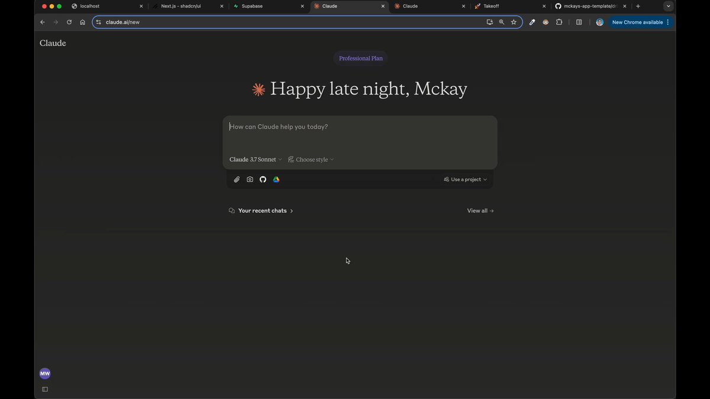

**Source:** [https://twitter.com/i/web/status/1894478230196998641](https://twitter.com/i/web/status/1894478230196998641)
**Original Post Date:** 2025-05-28 06:29:54

# Building Real-Time Channel-Based Messaging Applications with Next.js

## Introduction
Real-time messaging applications like Slack have become essential for modern communication. This article explores building a scalable channel-based messaging system using Next.js 13+, focusing on key components such as server-side rendering, WebSockets for real-time updates, and efficient state management. We'll cover architectural decisions, implementation patterns, and best practices to create a performant and maintainable application.

## Application Architecture Overview

The core architecture consists of three main layers: frontend UI components, server-side APIs, and real-time communication handlers. The Next.js app directory structure allows us to implement efficient server-rendered pages while maintaining client-side interactivity.

For data management, we use a combination of server actions for mutations and streaming responses for real-time updates. WebSockets handle live message delivery and presence indicators.

```typescript
// pages/api/websocket.ts
import { WebSocket } from 'ws';

export default function handler(req, res) {
  if (req.method !== 'GET') return;

  const ws = new WebSocket.Server({ noServer: true });
  ws.on('connection', socket => {
    console.log('Client connected');
    // Handle message broadcasting
  });
}
```

> **Note/Tip:** Use server components for data fetching to minimize client-side operations.

> **Note/Tip:** Implement proper error handling and reconnection logic in WebSocket connections.

## Real-Time Message Handling

WebSockets provide the backbone for real-time messaging. We implement a message broker that handles subscription management, presence tracking, and broadcast distribution.

The system efficiently manages message delivery by filtering updates per channel and user subscription.

```typescript
// lib/messageBroker.ts
export class MessageBroker {
  private subscribers: Map<string, WebSocket[]>;

  constructor() {
    this.subscribers = new Map();
  }

  subscribe(channel: string, socket: WebSocket) {
    if (!this.subscribers.has(channel)) {
      this.subscribers.set(channel, []);
    }
    this.subscribers.get(channel)?.push(socket);
  }
}
```

## Performance and Scalability

Optimize message delivery by implementing efficient data structures for subscriber management. Use server streaming to reduce client-server round trips.

Implement caching strategies for frequently accessed channel information and user presence states.

1. Use WebSocket compression when possible
1. Implement rate limiting for message broadcasts
1. Cache user metadata to reduce database queries

> **Note/Tip:** Monitor WebSocket connection health and implement automatic reconnection.

> **Note/Tip:** Consider using a pub/sub service like Redis for larger deployments.

## Key Takeaways

- Server components in Next.js app directory optimize data fetching and reduce client-side operations.
- WebSockets provide efficient real-time updates but require robust error handling.
- Implement proper message filtering and broadcast optimization to ensure scalability.
- Caching strategies significantly improve application performance.

## Conclusion
Building a channel-based messaging system requires careful consideration of architecture, real-time communication patterns, and performance optimizations. By following these best practices and leveraging Next.js features effectively, you can create a robust, scalable messaging platform that provides an excellent user experience.

## External References

- [Next.js Documentation - WebSockets](https://nextjs.org/docs/api-routes/websockets)
- [Real-time Communication with WebSocket](https://developer.mozilla.org/en-US/docs/Web/API/WebSocket)


## Media

**Image Description:** The image shows a screenshot of a web interface for **Claude**, an AI-powered chat platform. Below is a detailed description of the image, focusing on the main subject and relevant technical details:

### **Main Subject:**
The primary focus of the image is the Claude AI interface, which appears to be a chat-based platform designed for interacting with an AI model. The interface is clean and minimalistic, with a dark mode theme.

### **Key Elements:**
1. **Title and Greeting:**
   - At the top center of the interface, there is a welcoming message:  
     **"Happy late late night, Mckay"**  
     This suggests that the platform is personalized for a user named "Mckay."

2. **Input Field:**
   - Below the greeting, there is a prominent input field with the placeholder text:  
     **"How can Claude help you today?"**  
     This indicates that the user can type a query or prompt to interact with the AI.

3. **Model Information:**
   - Just below the input field, there is a section displaying the model being used:  
     **"Claude 3.7 Sonnet"**  
     This specifies the version of the Claude model in use, which is likely a sophisticated language model.

4. **Style Selection:**
   - To the right of the model information, there is a dropdown labeled:  
     **"Choose style"**  
     This suggests that the user can select different writing or interaction styles for the AI's responses.

5. **Additional Tools:**
   - Below the input field, there are icons for additional functionalities:
     - **Camera icon**: Likely for uploading images or using visual inputs.
     - **Microphone icon**: For voice input, allowing users to speak their queries instead of typing.
     - **Google Drive icon**: Indicates integration with Google Drive, possibly for uploading or accessing files.
     - **Project icon**: A dropdown labeled **"Use a project"**, suggesting the ability to load or reference specific projects or contexts.

6. **Recent Chats and View All:**
   - At the bottom of the interface, there are links for:
     - **"Your recent chats"**: To access past conversations.
     - **"View all"**: To see a complete history of interactions.

### **Technical Details:**
1. **Browser Environment:**
   - The interface is displayed in a web browser, as indicated by the browser tabs and URL bar at the top.
   - The URL in the address bar is:  
     **`claude.ai/new`**  
     This suggests that the user is on a new chat or session page.

2. **Tabs and Open Projects:**
   - The browser tabs at the top show multiple open tabs, including:
     - **"localhost"**: Likely a local development environment.
     - **"Next.js - shadcn/ui"**: Suggests the use of Next.js, a popular React framework, and Shadcn/ui, a UI library.
     - **"Supabase"**: Indicates the use of Supabase, a backend service.
     - **"Claude"**: Multiple tabs related to the Claude platform.
     - **"Takeoff"**: Possibly another project or tool.
     - **"mckays-app-template"**: Suggests a project or template related to the user "Mckay."

3. **Dark Mode:**
   - The interface is in dark mode, with a black background and light text, which is a common design choice for reducing eye strain and providing a modern look.

4. **Design and Layout:**
   - The layout is clean and user-friendly, with a focus on the input field and key functionalities.
   - The use of icons and dropdowns suggests an intuitive design for interacting with the AI.

### **Overall Context:**
The image depicts a user interacting with the Claude AI platform, likely for tasks such as generating text, answering questions, or performing other AI-driven tasks. The presence of multiple browser tabs indicates that the user might be working on a development project or experimenting with the AI in a technical context. The personalized greeting and available tools suggest a user-friendly and feature-rich environment. 

This interface is designed to facilitate seamless interaction with the AI, offering customization options and integrations with other tools and services.


**Video Description:** Video Content Analysis - media_seg0_item1.mp4:

The video appears to be a tutorial or demonstration focused on building a Slack clone application using modern web development technologies. The content is structured around planning, implementing, and organizing the project's features and architecture. Below is a comprehensive description of the video based on the provided key frames:

---

### **Overview of the Video**
The video guides viewers through the process of creating a Slack-like application, emphasizing key features such as communication, design, and technical implementation. It uses a combination of planning documents, code snippets, and terminal interactions to illustrate the development workflow.

---

### **Key Frames and Content Breakdown**

#### **Frame 1: Planning Document**
- **Content**: The first frame shows a detailed planning document titled "Slack Clone Request Prompt." This document outlines the desired features for the Slack clone application, categorized under sections like **Communication**, **Design Requests**, **Technical Stack**, and **Other Notes**.
- **Key Features Discussed**:
  - **Communication**: Channel-based messaging, direct messaging, message threading, search functionality, and notifications.
  - **Design Requests**: Responsive design, mobile-friendly interface, and desktop optimization.
  - **Technical Stack**: Frontend (Next.js with Tailwind CSS and shadcn UI components), Backend (Supabase), Database (PostgreSQL with Drizzle ORM).
  - **Other Notes**: Focus on core messaging experience, no authentication or file sharing in the initial version.
- **Purpose**: This frame sets the foundation for the project, outlining the scope and technical stack, ensuring clarity on what will be built.

#### **Frame 2: Database Schema Implementation**
- **Content**: The second frame focuses on implementing the database schema using TypeScript and Drizzle ORM. The code shown is for creating a `profile.ts` file, which defines the schema for user profiles.
  - **Code Snippet**: The schema includes fields like `id`, `name`, `email`, and `createdAt`.
  - **Terminal Interaction**: The terminal shows commands related to compiling the project and interacting with the database schema.
- **Purpose**: This frame demonstrates the initial setup of the database layer, crucial for managing user profiles and other data required for the application.

#### **Frame 3: Messaging Infrastructure Implementation**
- **Content**: The third frame delves into the implementation of the messaging infrastructure, specifically focusing on **Step 6: Implement Channel Service** and **Step 7: Implement Messaging Service**.
  - **Implementation Plan**: The document outlines tasks such as creating channel creation and management functionality, as well as message sending and display functionality.
  - **Files Mentioned**: Relevant files include server actions (`actions/channel.ts`), forms (`components/forms/create-channel-form.tsx`), and components for displaying channels and messages.
  - **Dependencies**: The steps are structured with dependencies, ensuring a logical flow of implementation.
- **Purpose**: This frame provides a structured approach to building the core messaging features, emphasizing the separation of concerns and modular development.

#### **Frame 4: Code and Terminal Interaction**
- **Content**: The fourth frame shows a continuation of the implementation process, with a focus on the codebase and terminal interactions.
  - **Codebase Navigation**: The file explorer highlights the project structure, including directories like `actions`, `components`, and `db`.
  - **Terminal Activity**: The terminal logs show the application being compiled and running, indicating active development and testing.
- **Purpose**: This frame bridges the gap between planning and execution, demonstrating how the codebase is organized and how the application is being built and tested in real-time.

---

### **Technical Concepts Highlighted**
1. **Database Schema Design**: Using Drizzle ORM with PostgreSQL to define and manage data structures.
2. **Frontend Development**: Leveraging Next.js, Tailwind CSS, and shadcn UI components for building a responsive and modern UI.
3. **Backend Development**: Utilizing Supabase for serverless functions and database operations.
4. **Modular Architecture**: Organizing the project into clear sections for actions, components, and forms to ensure maintainability and scalability.
5. **Real-Time Development Workflow**: Demonstrating the use of a live development server with hot-reloading for quick iterations.

---

### **Flow and Structure of the Video**
The video follows a logical progression:
1. **Planning Phase**: Outlining the project's scope, features, and technical stack.
2. **Database Setup**: Implementing the database schema to manage user profiles and other data.
3. **Core Feature Implementation**: Focusing on messaging infrastructure, including channels and messages.
4. **Development Workflow**: Showing real-time coding, compilation, and testing in the terminal.

---

### **Target Audience**
The video is aimed at developers familiar with modern web development tools and frameworks. It provides a step-by-step guide for building a Slack-like application, making it suitable for those looking to learn or practice:
- Backend and frontend development.
- Database management with ORM.
- Modular and scalable application architecture.

---

### **Conclusion**
The video is a comprehensive tutorial that combines planning, coding, and execution to build a Slack clone. It emphasizes best practices in modern web development, such as using TypeScript, Next.js, and Supabase, while maintaining a clear and structured approach to feature implementation. The combination of planning documents, code snippets, and live development workflows ensures that viewers can follow along and understand the entire development process.

Key Frames Analysis:
Frame 1: ### Description of Frame 1:

The image shows a text-based document or code editor interface with a dark theme. The content appears to be a structured list of features and requirements for a Slack clone project. Below is a detailed breakdown of the visible content:

#### **Header and Title:**
- The top of the document includes a title or heading: **"slack clone request prompt"**.
- The document is organized into sections using Markdown-style formatting.

#### **General Users Section:**
- The section is titled **"General users"**.
- It is further divided into subsections with headings and bullet points.

#### **Desired Features Section:**
- **Subheading:** **"Desired Features"**
  - **Communication:**
    - **Channel-based messaging:**
      - Create/join channels
      - View channel message history
    - **Direct messaging:**
      - Message individual users
      - View conversation history
    - **Message threading:**
      - Reply to messages in threads
      - View thread history
    - **Search functionality:**
      - Search messages across channels
      - Search within conversations
    - **Notifications:**
      - Notify users of new messages
      - Notification preferences

#### **Design Requests Section:**
- **Subheading:** **"Design Requests"**
  - **Responsive design:**
    - Mobile-friendly interface
    - Desktop optimization

#### **Technical Stack Section:**
- **Subheading:** **"Technical Stack"**
  - **Frontend:** Next.js with Tailwind CSS and shadcn UI components
  - **Backend:** Supabase
  - **Database:** PostgreSQL with Drizzle ORM

#### **Other Notes Section:**
- **Subheading:** **"Other Notes"**
  - No authentication/user profiles in the initial version
  - No real-time messaging functionality
  - No file sharing capabilities
  - Focus on core messaging experience (speedrun approach)

#### **Visual Details:**
- The text is formatted using Markdown syntax, with headings, subheadings, and bullet points.
- The interface has a dark background with syntax-highlighted text in various colors (e.g., purple for headings, blue for links, etc.).
- The document appears to be open in a code editor or text editor, as indicated by the interface elements at the top (e.g., tabs, navigation buttons).

This frame provides a detailed list of features, design requests, technical stack, and notes for a Slack clone project, emphasizing a structured and organized approach to development.
Frame 2: ### Description of Frame 2:

The image shows a development environment, likely a code editor (such as Visual Studio Code), with a focus on a project named **"slack-clone"**. Below is a detailed breakdown of the visible content:

#### **1. File Structure (Left Sidebar)**
- The project structure is displayed on the left sidebar.
- The project is named **"SLACK-CLONE"**.
- The directory structure includes:
  - `.cursor`
  - `.next`
  - `actions`
  - `app`
  - `db`
  - `lib`
  - `node_modules`
  - `public`
  - `.env.local`
  - `.gitignore`
  - `.repoignore_ignore`
  - `.repoignore`
  - `components.json`
  - `drizzle.config.json`
  - `eslint.config.mjs`
  - `package-lock.json`
  - `package.json`
  - `postcss.config.mjs`
  - `README-steps.md`
  - `README.md`
  - `READMEconfig.json`
  - `tsconfig.json`

#### **2. Opened File: `profiles.ts`**
- The main editor pane is displaying the file **`profiles.ts`** located in the path: `db/schema/profiles.ts`.
- The file contains TypeScript code for defining a database schema using **Drizzle ORM**.
- Key elements in the code:
  - **Imports**:
    ```typescript
    import { pgTable, text, timestamp, uuid } from "drizzle-orm/pg-core";
    ```
  - **Schema Definition**:
    ```typescript
    export const profiles = pgTable("profiles", {
      id: uuid("id").defaultRandom().primaryKey(),
      name: text("name").notNull(),
      imageUrl: text("image_url").notNull(),
      createdAt: timestamp("created_at").defaultNow().notNull(),
      updatedAt: timestamp("updated_at").defaultNow().notNull(),
    });
    ```
  - **Type Definitions**:
    ```typescript
    export type Profile = typeof profiles.$inferSelect;
    export type NewProfile = typeof profiles.$inferInsert;
    ```

#### **3. Terminal (Bottom Panel)**
- The terminal at the bottom shows output related to the development server:
  - The server is running, and there are logs indicating:
    - Compilation and reloads of the environment (`env.local`).
    - GET requests being handled (e.g., `/favicon.ico`).
    - Compilation times (e.g., "Compiled in 1049ms").
  - The terminal also shows the command prompt:
    ```bash
    mckaywrigley@mckay slack-clone %
    ```

#### **4. Chat Panel (Right Sidebar)**
- The right sidebar contains a chat or documentation panel, likely providing instructions or guidance for the development process.
- Key points in the chat:
  - **Directory Creation**:
    ```bash
    mkdir -p db/schema
    ```
  - **File Creation Instructions**:
    - Creating the `profiles.ts` file.
    - Creating the `channels.ts` file.
  - **Code Snippets**:
    - The chat includes snippets of code similar to the `profiles.ts` file being edited, indicating step-by-step instructions for setting up the schema.
  - **Terminal Commands**:
    - Commands for creating directories and files are shown, along with outputs confirming their execution.

#### **5. Other Editor Tabs**
- Other tabs are open in the editor, including:
  - `schema.ts`
  - `channels.ts`
  - `messages.ts`
  - `project-steps.md`
- These files are part of the project structure and are likely related to the database schema and project documentation.

#### **6. Status Bar (Bottom of the Editor)**
- The status bar at the bottom shows:
  - The current branch is **`main`**.
  - The file encoding is **UTF-8**.
  - The line endings are **LF**.
  - The file type is **TypeScript**.
  - Extensions like **Cursor Tab** and **Prettier** are enabled.

### Summary:
The frame depicts a developer working on a **"slack-clone"** project, focusing on defining database schemas using **Drizzle ORM** in TypeScript. The `profiles.ts` file is actively being edited, and the chat panel provides step-by-step instructions for setting up the schema files. The terminal shows the server running and handling requests, indicating an active development environment. The overall setup suggests a structured approach to building a database schema for the project.
Frame 3: ### Description of Frame 3:

#### **Overview:**
The image shows a development environment, likely a code editor (e.g., VS Code), with multiple panels and sections visible. The project appears to be a Slack clone, as indicated by the folder structure and file names. The editor is focused on a Markdown file named `project-steps.md`, which outlines the implementation plan for the Slack clone project. The right panel shows a chat interface, possibly an AI assistant, providing guidance or assistance with the development tasks.

---

#### **Key Sections:**

1. **File Explorer (Left Panel):**
   - The file explorer on the left shows the directory structure of the project:
     - The root folder is named `SLACK-CLONE`.
     - Subdirectories include:
       - `.cursor`
       - `actions`
       - `app`
       - `db`
       - `components`
       - `public`
       - `lib`
       - `node_modules`
       - `package-lock.json`
       - `package.json`
       - `tsconfig.json`
       - `project-steps.md`
       - `README.md`
     - The `project-steps.md` file is currently open in the editor.

2. **Editor (Main Panel):**
   - The main panel displays the content of the `project-steps.md` file, which is a Markdown document outlining the implementation plan for the Slack clone project.
   - The visible section of the document is focused on **Messaging Infrastructure**:
     - **Step 6: Implement Channel Service**
       - **Task:** Create channel creation and management functionality.
       - **Files:** Lists relevant files such as `actions/channel.ts`, `components/forms/create-channel-form.tsx`, and `components/forms/channel/channel-list.tsx`.
       - **Step Dependencies:** Step 5.
       - **User Instructions:** None.
     - **Step 7: Implement Messaging Service**
       - **Task:** Create message sending and display functionality.
       - **Files:** Lists relevant files such as `actions/message.ts`, `components/message/message-item.tsx`, and `components/forms/send-message-list-form.tsx`.
       - **Step Dependencies:** Step 6.
       - **User Instructions:** None.

3. **Chat Panel (Right Panel):**
   - The chat panel on the right shows an AI assistant (likely an LLM-based tool) interacting with the developer.
   - The assistant is providing guidance on implementing steps 6–9 of the messaging infrastructure:
     - It suggests exploring the current codebase and database schema to understand the structure.
     - It lists specific files and directories to review, such as `actions/channel.ts`, `db/schema`, and `profile.ts`.
     - The assistant is actively generating and providing instructions, indicating a step-by-step approach to implementing the messaging service.

4. **Terminal (Bottom Panel):**
   - The terminal at the bottom shows logs from a running development server:
     - The logs indicate that the project is being compiled successfully (e.g., "Compiled in 35ms").
     - There are multiple GET and POST requests logged, suggesting that the server is handling requests, likely for testing or development purposes.
     - The favicon requests (`GET /favicon.ico`) are typical for web applications.

5. **Status Bar (Bottom):**
   - The status bar at the bottom provides information about the current file, line number, column, and other details:
     - The file is `project-steps.md`.
     - The cursor is at line 82, column 32.
     - The file is in Markdown format.
     - The encoding is UTF-8, and the line endings are LF.

6. **AI Assistant Details (Bottom Right):**
   - The bottom right corner shows details about the AI assistant:
     - The assistant is named "Agent KI" and is using "Claude 3.7-sonnet" as the model.
     - There is a "Send" button, indicating that the user can send messages or commands to the assistant.

---

#### **Summary:**
The frame depicts a developer working on implementing the messaging infrastructure for a Slack clone project. The `project-steps.md` file outlines the tasks and dependencies for steps 6 and 7, focusing on channel and message services. The AI assistant in the chat panel is actively guiding the developer through the implementation process by suggesting code reviews, database schema exploration, and providing step-by-step instructions. The terminal shows that the development server is running smoothly, with compilation and request logs indicating active development. 

This setup highlights a collaborative workflow between the developer and an AI assistant, leveraging modern tools for efficient project management and implementation.
Frame 4: ### Description of Frame 4:

The image shows a development environment, likely a code editor (such as Visual Studio Code), with multiple panels and files open. Below is a detailed breakdown of the visible content:

#### **1. Main Editor Area:**
- The central area displays a Markdown file named `project-steps.md`, which outlines an **Implementation Plan for Slack Clone**. The content is structured in a hierarchical format with headings and subheadings.
- The current section being viewed is titled **"Page Creation"** (Step 10), which focuses on creating the main application pages.
  - **Task:** "Create the main pages for the application."
  - **Files:** Lists several `.tsx` files that need to be updated or created, such as:
    - `page.tsx`: Update homepage with profile selection.
    - `layout.tsx`: Main app layout with sidebar.
    - `dashboard.tsx`: Dashboard page for the main sidebar view.
    - `channel.tsx`: Channel page.
    - `direct.tsx`: Direct message page.
    - `thread.tsx`: Thread page.
  - **Step Dependencies:** Lists dependencies on previous steps (Steps 4, 6, 7, 8, 9).
  - **User Instructions:** Indicates no specific instructions.

#### **2. Right Panel:**
- The right panel shows a **Terminal** output with some errors and logs:
  - An error is highlighted in red: 
    ```
    ./lib/profile.ts:3:1
    Ecmascript file had an error
    ```
  - The terminal also shows a command being executed:
    ```
    GET / 500 in 23ms
    ```
    This indicates a server error (HTTP 500) during a request.

#### **3. Bottom Panel:**
- The bottom panel shows a **Problems** section with several errors:
  - One error is highlighted:
    ```
    ./lib/profile.ts:3:1
    Ecmascript file had an error
    ```
  - Another error is related to a file named `cookies.ts`:
    ```
    import { cookies } from "next/headers";
    ```
    This suggests an issue with importing or using the `next/headers` module.

#### **4. Sidebar (Left Panel):**
- The **Source Control** section on the left shows changes in the repository:
  - Files like `page.tsx`, `app/main`, `profile.ts`, and `server-utils.ts` are marked with changes (indicated by `U` for updated).
  - There is a commit button at the top, indicating that changes can be committed.

#### **5. Chat Panel (Top Right):**
- The chat panel shows a conversation related to the development process:
  - The conversation discusses issues with type mismatches and missing properties in the code.
  - It mentions fixing the direct message page to match expected props and creating a thread page.

#### **6. Open Files:**
- The top bar shows multiple open files:
  - `project-steps.md`: The main implementation plan file.
  - `page.tsx`: A TypeScript file related to the homepage.
  - `server-utils.ts`: Likely a utility file for server-side operations.

#### **7. Other Details:**
- The editor theme is dark mode.
- The cursor is positioned in the `project-steps.md` file, highlighting the "Page Creation" section.
- The terminal and problems panels indicate ongoing development and debugging activities.

### Summary:
This frame depicts a developer working on implementing the main pages for a Slack clone application. The developer is navigating through a detailed implementation plan in a Markdown file, while simultaneously addressing errors in the codebase, particularly in the `profile.ts` and `cookies.ts` files. The terminal and problems panels show active debugging and error resolution, indicating a focus on resolving server-side and import-related issues. The chat panel suggests collaboration or self-guidance in fixing type mismatches and aligning props.
Frame 5: ### Description of Frame 5:

The image shows a web-based application that resembles a Slack clone, running on a local development server (`localhost:3000`). Below is a detailed breakdown of the visible content:

#### **Left Sidebar:**
- The sidebar is dark-themed and contains navigation options for the application.
- The options listed are:
  1. **Home**: Represented by a home icon.
  2. **Channels**: Represented by a hashtag (`#`) icon.
  3. **Direct Messages**: Represented by a direct message icon.
  4. **Profiles**: Represented by a user profile icon.
  5. **Settings**: Represented by a gear icon.
- At the bottom of the sidebar, there is a button labeled **"Create Channel"** with a plus (`+`) icon.

#### **Main Content Area:**
- The main content area is light-themed and displays a channel interface.
- The channel name is **"#General"**, indicating that the user is currently viewing the general channel.
- The top of the channel interface includes a search bar labeled **"Search..."**.

#### **Channel Messages:**
- The messages in the channel are displayed in a chronological order, with user avatars, names, timestamps, and message content.
  1. **John Doe**:
     - **Message 1**: "Welcome to the General channel!"
     - **Timestamp**: 2/25/2025, 2:30:37 AM
     - Options: Reply, Edit, Delete (the "Delete" option is highlighted in red).
  2. **Jane Smith**:
     - **Message**: "Hey everyone, how's it going?"
     - **Timestamp**: 2/25/2025, 2:30:37 AM
     - Options: Reply.
  3. **Bob Johnson**:
     - **Message**: "Just checking in. This app is looking great!"
     - **Timestamp**: 2/25/2025, 2:30:37 AM
     - Options: Reply.
  4. **John Doe**:
     - **Message 1**: "hello"
     - **Timestamp**: 2/25/2025, 2:31:26 AM
     - Options: Reply, Edit, Delete (the "Delete" option is highlighted in red).
     - **Message 2**: "hello"
     - **Timestamp**: 2/25/2025, 2:31:26 AM
     - Options: Reply, Edit, Delete (the "Delete" option is highlighted in red).

#### **Bottom Input Field:**
- At the bottom of the main content area, there is a text input field labeled **"Type a message..."**.
- A small instruction below the input field indicates that pressing **Ctrl + Enter** will send the message.

#### **Browser Tabs:**
- The browser tabs at the top indicate that multiple tabs are open, including:
  - "Slack Clone"
  - "Next.js | Slack Clone - shadcn/ui"
  - "Slack | Takeoff Projects"
  - "Detailed Implementation Plan"
  - "mckays-app-template/cursor"
  - "mckaywrigley/slack-clone"

#### **Additional Notes:**
- The interface is clean and resembles the layout of Slack, with user avatars, timestamps, and message options.
- The timestamps suggest that the messages were sent on **February 25, 2025**, which is a fictional date.
- The overall design is modern and user-friendly, with clear separation between the sidebar and the main content area.

This frame effectively showcases a functional prototype of a Slack-like application, highlighting key features such as channels, message interactions, and user navigation.
