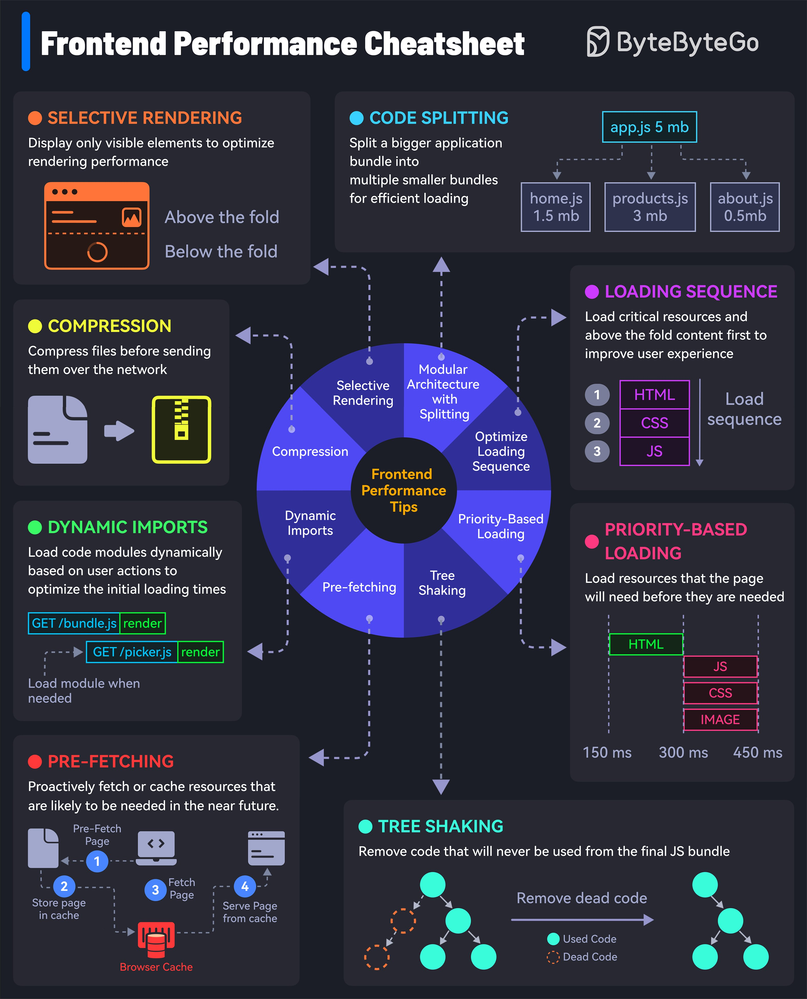

**Source:** [https://twitter.com/i/web/status/1876132847385534848](https://twitter.com/i/web/status/1876132847385534848)
**Original Post Date:** 2025-05-28 00:10:44

# Optimizing Frontend Performance: Eight Essential Techniques

## Introduction
Frontend performance is critical for user experience and business success. This guide presents eight proven techniques to optimize your web applications: selective rendering of visible content, modular code splitting, efficient compression, lazy-loaded dynamic imports, resource pre-fetching, dead-code elimination via tree shaking, priority-based loading sequences, and strategic resource scheduling.

## Selective Rendering

Focus on rendering only visible content (above the fold) to reduce initial load times. This technique prioritizes user-perceived performance by deferring off-screen elements until they become necessary.

- Identify and render only 'above-the-fold' content initially
- Defer rendering of below-the-fold content until visible

> **Note/Tip:** Implement virtual scrolling for long lists to enhance performance

## Code Splitting

Break monolithic bundles into smaller, focused modules. This reduces initial load time by loading only necessary code.

Example: A 5MB app.js can be split into specialized bundles (home.js:1.5MB, products.js:3MB, about.js:0.5MB)

```javascript
// Split route-based bundles
const HomeModule = import('./components/Home');
const ProductModule = import('./components/Products');
```

> **Note/Tip:** Use Webpack or similar tools to automate code splitting

## Compression

Apply Gzip/Brotli compression at the server level to reduce file sizes. This minimizes network transfer time and bandwidth usage.

```nginx
gzip on;
gzip_types text/plain application/javascript application/json;
```

## Dynamic Imports

Load code modules lazily based on user actions. This defers non-essential code loading until required.

```javascript
// Load component dynamically
import('./heavyComponent').then(module => {
  const Heavy = module.default;
  ReactDOM.render(<Heavy />, document.getElementById('root'))
});
```

## Pre-fetching

Proactively cache resources likely to be needed soon. This improves perceived performance by reducing load times for subsequent requests.

```javascript
// Pre-fetch next page resources
<link rel="prefetch" href="/next-page.html">
```

## Tree Shaking

Eliminate unused code from your application bundle. This process removes dead code to produce smaller, more efficient production files.

```javascript
// Export and use only what's needed
export function criticalFeature() { /*...*/ }
// Unused functions are automatically removed in production builds
```

## Priority-Based Loading

Load resources based on their importance to page rendering. Critical assets (HTML, CSS, JS) load first to ensure fast initial display.

```html
<link rel="preload" href="critical.css" as="style">
<link rel="preload" href="main.js" as="script">
```

## Loading Sequence

Optimize the timing of resource loading to ensure smooth user experience. Critical resources load first, followed by non-critical assets.

1. 150ms: HTML loads
1. 300ms: JavaScript executes
1. 450ms: CSS and images load

## Key Takeaways

- Selective rendering significantly improves initial page load times by focusing on visible content.
- Code splitting reduces bundle size, enabling faster initial loads through lazy loading.
- Compression and tree shaking minimize file sizes without impacting functionality.
- Priority-based loading ensures critical resources arrive first for optimal user experience.

## Conclusion
Implementing these eight techniques systematically can dramatically improve your frontend application's performance. Start with selective rendering and code splitting, then progress to compression and dynamic imports. Use pre-fetching strategically for anticipated navigation paths, and ensure proper prioritization of resource loading through tree shaking and sequence optimization.

## External References

- [Web Fundamentals: Performance](https://developers.google.com/web/fundamentals/performance/)
- [MDN Web Docs - Loading Priorities](https://developer.mozilla.org/en-US/docs/Web/HTML/Element/link#Loading_priorities)


## Media

**Image Description:** ### Description of the Image: Frontend Performance Cheatsheet

The image is a comprehensive infographic titled **"Frontend Performance Performance Cheatsheet"** by **ByteByteByteGoGo**. It provides a detailed overview of various techniques and strategies to optimize frontend performance. The infographic is visually organized into several sections, each highlighting a specific technique with accompanying explanations, diagrams, and examples. Below is a detailed breakdown of the main subjects and technical details:

---

#### **1. Main Title and Layout**
- **Title**: "Frontend Performance Performance Cheatsheet"
- **Brand**: The infographic is created by **ByteByteByteGoGo**, as indicated in the top-right corner.
- **Structure**: The infographic is circular, with a central theme of **"Frontend Performance Tips"**. Surrounding this central theme are eight key techniques, each explained in detail with icons, diagrams, and text.

---

#### **2. Central Theme: Frontend Performance Tips**
The central theme is a circular diagram labeled **"Frontend Performance Tips"**, which lists the following techniques:
- **Selective Rendering**
- **Code Splitting**
- **Compression**
- **Dynamic Imports**
- **Pre-fetching**
- **Tree Shaking**
- **Priority-Based Loading**
- **Loading Sequence**

Each technique is connected to its respective section in the infographic, providing a clear visual flow.

---

#### **3. Detailed Sections**

##### **(a) Selective Rendering**
- **Objective**: Display only visible elements (above the fold) to optimize rendering performance.
- **Explanation**: Focus on rendering only the parts of the page that are immediately visible to the user, improving initial load times.
- **Diagram**: 
  - A browser window is divided into two sections: **Above the fold** (visible) and **Below the fold** (hidden).
  - The visible section is highlighted, emphasizing the importance of optimizing this area.

##### **(b) Code Splitting**
- **Objective**: Split a large application bundle into smaller, modular bundles.
- **Explanation**: Break down a large JavaScript file (e.g., `app.js` at 5 MB) into smaller, more manageable files (e.g., `home.js`, `products.js`, `about.js`).
- **Diagram**:
  - A large file (`app.js`) is split into smaller files:
    - `home.js` (1.5 MB)
    - `products.js` (3 MB)
    - `about.js` (0.5 MB)
  - This reduces initial load times and allows for more efficient loading of specific modules.

##### **(c) Compression**
- **Objective**: Compress files before sending them over the network.
- **Explanation**: Use compression techniques (e.g., Gzip) to reduce the size of files, improving download speeds.
- **Diagram**:
  - A file is shown being compressed from its original size to a smaller, compressed version.

##### **(d) Dynamic Imports**
- **Objective**: Load code modules dynamically based on user actions.
- **Explanation**: Use JavaScript's `import()` function to load modules only when needed, reducing initial load times.
- **Diagram**:
  - Example code:
    ```javascript
    import('./bundle.js').then((module) => {
      module.render();
    });
    ```
  - Another example:
    ```javascript
    import('./picker.js').then((module) => {
      module.render();
    });
    ```
  - This ensures that only necessary modules are loaded when required.

##### **(e) Pre-fetching**
- **Objective**: Proactively fetch or cache resources likely to be needed in the near future.
- **Explanation**: Use browser caching and pre-fetching to load resources before they are requested, improving perceived performance.
- **Diagram**:
  - A sequence of steps:
    1. **Pre-fetch Page**: Resources are fetched in advance.
    2. **Store Page in Cache**: Resources are cached for future use.
    3. **Fetch Page**: When the user navigates, the page is fetched.
    4. **Serve Page from Cache**: Cached resources are served, reducing load times.

##### **(f) Tree Shaking**
- **Objective**: Remove unused code from the final JavaScript bundle.
- **Explanation**: Eliminate dead code (code that will never be used) to reduce the size of the final bundle.
- **Diagram**:
  - A tree structure is shown, with:
    - **Used Code** (green nodes): Code that is actively used.
    - **Dead Code** (orange nodes): Code that is unused and can be removed.
  - The process of removing dead code is visually represented.

##### **(g) Priority-Based Loading**
- **Objective**: Load resources based on their priority.
- **Explanation**: Prioritize loading critical resources first (e.g., HTML, CSS, JS) to improve the initial rendering experience.
- **Diagram**:
  - Resources are prioritized:
    1. **HTML**
    2. **CSS**
    3. **JS**
  - This ensures that the page renders as quickly as possible, even if some non-critical resources load later.

##### **(h) Loading Sequence**
- **Objective**: Optimize the sequence in which resources are loaded.
- **Explanation**: Load critical resources first (HTML, CSS, JS) to improve the initial rendering experience, followed by images and other non-critical assets.
- **Diagram**:
  - A timeline showing the loading sequence:
    - **150 ms**: HTML
    - **300 ms**: JS
    - **450 ms**: CSS, Images
  - This ensures a smooth and fast user experience.

---

#### **4. Visual and Color Coding**
- **Colors**: Each technique is color-coded for easy differentiation:
  - **Selective Rendering**: Orange
  - **Code Splitting**: Blue
  - **Compression**: Yellow
  - **Dynamic Imports**: Green
  - **Pre-fetching**: Red
  - **Tree Shaking**: Cyan
  - **Priority-Based Loading**: Pink
  - **Loading Sequence**: Purple
- **Icons and Diagrams**: Each section includes relevant icons and diagrams to illustrate the concept, such as browser windows, file compression, and code trees.

---

#### **5. Overall Design**
- **Dark Theme**: The background is dark, with bright colors for text and diagrams, ensuring high contrast and readability.
- **Circular Layout**: The circular layout around the central theme provides a cohesive and organized structure, making it easy to navigate.

---

### Summary
The infographic is a comprehensive guide to optimizing frontend performance, covering eight key techniques:
1. **Selective Rendering**
2. **Code Splitting**
3. **Compression**
4. **Dynamic Imports**
5. **Pre-fetching**
6. **Tree Shaking**
7. **Priority-Based Loading**
8. **Loading Sequence**

Each technique is explained with clear visuals, diagrams, and examples, making it an effective resource for developers looking to improve the performance of their frontend applications.
