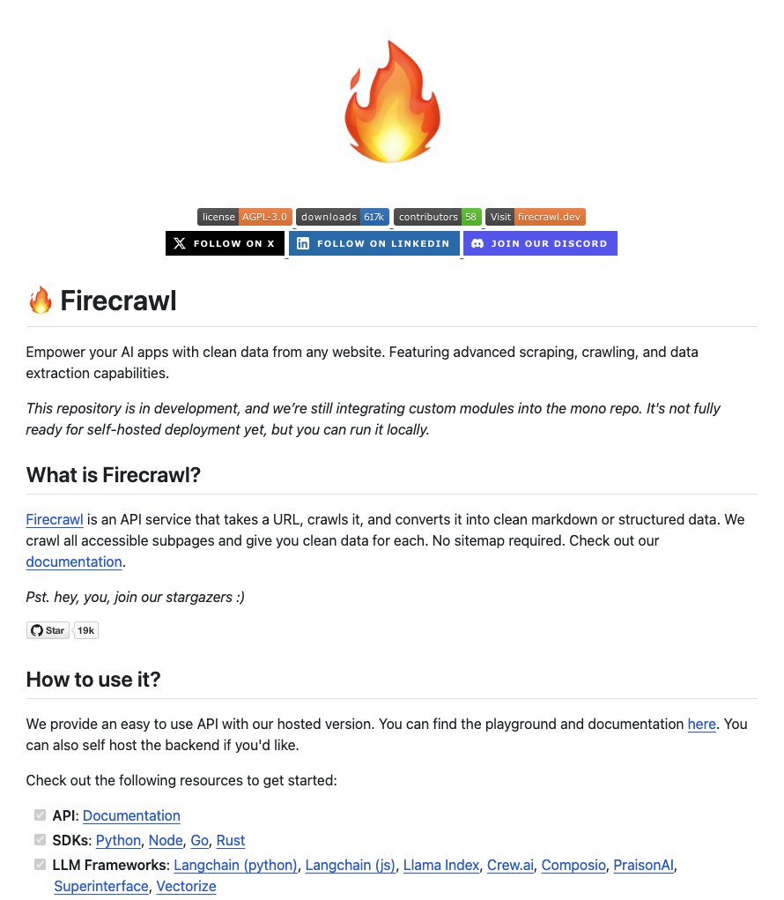

**Source:** [https://twitter.com/i/web/status/1868635172842918323](https://twitter.com/i/web/status/1868635172842918323)
**Original Post Date:** 2025-05-27 18:02:33

# Firecraw: A Web Scraping API Service for Clean Data Extraction in AI Applications

## Introduction
Firecraw represents a significant advancement in web scraping technology for AI applications. This AGPL-3.0 licensed service offers a powerful API that transforms raw web content into clean, structured data formats suitable for machine learning pipelines. With support for multiple programming languages and integration capabilities with leading LLM frameworks, Firecraw provides developers with the tools needed to efficiently extract high-quality training data from websites.

## Core Features and Functionality

Firecraw's primary function is to crawl entire website substructures and convert content into clean markdown or structured formats without requiring sitemaps. This capability is particularly valuable for AI applications that require consistent, well-formatted data.

The service offers both hosted API access through a playground interface and self-hosting options, providing flexibility in deployment scenarios.

- Crawls all accessible subpages of websites automatically
- Converts content to clean markdown or structured data formats
- Provides API endpoint for URL-based crawling
- Supports both hosted and self-hosted deployment options

## Technical Implementation and Integration

Firecraw's architecture supports multiple programming languages through dedicated SDKs. This modular design allows developers to integrate the service seamlessly into existing projects regardless of their primary technology stack.

The API provides comprehensive error handling and rate limiting, ensuring robust performance in production environments.

- Supported SDKs: Python, Node.js, Go, Rust
- Integration with LLM frameworks: Langchain (Python/JS), Llama Index, Crew.ai
- Real-time error reporting and monitoring capabilities

> **Note/Tip:** Always implement rate limiting in production deployments to avoid resource exhaustion.

> **Note/Tip:** Consider self-hosting for sensitive data processing requirements.

## Conclusion
Firecraw stands out as a comprehensive web scraping solution that bridges the gap between raw website content and structured, AI-ready data. Its AGPL-3.0 license ensures transparency while its diverse integration options make it adaptable to various development workflows.

## External References

- [Official Firecraw Documentation](https://docs.firecrawl.dev)
- [Firecraw GitHub Repository](https://github.com/firecrawl/firecraw)

## Media

**Image Description:** The image is a screenshot of a GitHub repository page for a project called **Firecraw**. Below is a detailed description of the image, focusing on the main subject and relevant technical details:

### **Main Subject: Firecraw**
- **Title**: The repository is titled **Firecraw**, which is prominently displayed at the top of the page.
- **Logo**: A stylized flame icon is used as the logo for the project, symbolizing speed, energy, or intensity, which aligns with the theme of web crawling and data extraction.
- **Description**: The project is described as an API service designed to empower AI applications with clean data from any website. It features advanced scraping, crawling, and data extraction capabilities.

### **Key Sections and Details**
1. **Header Section**:
   - **License**: The project is licensed under the **AGPL-3.0** license, as indicated by the badge.
   - **Downloads**: The repository has **61k downloads**, suggesting it is popular and widely used.
   - **Contributors**: There are **58 contributors**, indicating a collaborative effort.
   - **Visit Website**: A link to the project's website, **firecrawl.dev**, is provided for more information.

2. **Social Media and Community Links**:
   - **Follow on GitHub**: A button to follow the project on GitHub.
   - **Follow on LinkedIn**: A button to follow the project on LinkedIn.
   - **Join Discord**: A button to join the project's Discord server for community engagement.

3. **Project Overview**:
   - **Purpose**: The project aims to empower AI applications by providing clean data from websites. It uses advanced scraping, crawling, and data extraction techniques.
   - **Status**: The repository is noted to be **in development**, with ongoing integration of custom modules into a mono repository. It is not yet fully ready for self-hosted deployment but can be run locally.

4. **What is Firecraw?**
   - **Definition**: Firecraw is an API service that takes a URL, crawls it, and converts the content into clean markdown or structured data.
   - **Features**:
     - Crawls all accessible subpages of a website.
     - Provides clean data for each page without requiring a sitemap.
   - **Documentation**: A link to the project's documentation is provided for further details.

5. **How to Use It?**
   - **API Usage**: The project offers an easy-to-use API with a hosted version. Users can access a playground and documentation.
   - **Self-Hosting**: Users can also self-host the backend API if desired.
   - **Resources**: A list of resources is provided to help users get started:
     - **API Documentation**: Links to detailed API documentation.
     - **SDKs**: Supported SDKs include **Python**, **Node.js**, **Go**, and **Rust**.
     - **LLM Frameworks**: Compatibility with popular LLM frameworks such as **Langchain (Python)**, **Langchain (JS)**, **Llama Index**, **Crew.ai**, **Composio**, **PraisonAI**, **Superinterface**, and **Vectorize**.

6. **Additional Information**:
   - **Stargazers**: The repository has **19k stars**, indicating its popularity and engagement.
   - **Playground and Documentation**: Links to the playground and documentation are provided for hands-on experimentation and learning.

### **Visual Layout**:
- The page is well-organized with clear sections for description, usage, and resources.
- Badges and buttons are prominently displayed for quick access to important features like licensing, downloads, and community engagement.
- The use of links and bullet points ensures that the information is easy to navigate and understand.

### **Technical Details**:
- **License**: AGPL-3.0, which is a copyleft license requiring derivative works to be open-source.
- **Development Status**: The project is actively in development, with ongoing integration of custom modules.
- **Compatibility**: Supports multiple programming languages (Python, Node.js, Go, Rust) and integrates with popular LLM frameworks.

### **Overall Impression**:
The repository page is well-structured, providing comprehensive information about the project's purpose, usage, and community engagement. The inclusion of badges, links, and detailed documentation makes it user-friendly for both developers and potential contributors. The project appears to be a robust tool for web scraping and data extraction, catering to AI and machine learning applications.
