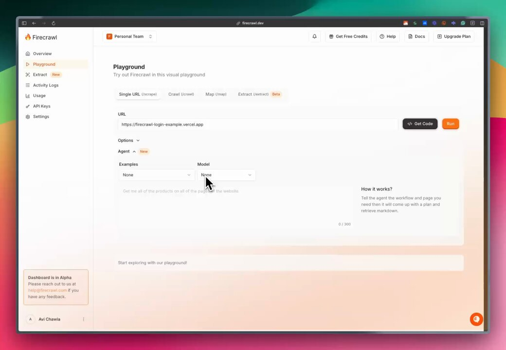

**Source:** [https://twitter.com/i/web/status/1912758276481228916](https://twitter.com/i/web/status/1912758276481228916)
**Original Post Date:** 2025-05-28 02:45:02

# Firecrawl Playground: A Comprehensive Guide to Web Scraping Interface

## Introduction
The Firecrawl Playground represents a modern approach to web scraping automation, providing an intuitive visual interface for developers. This comprehensive guide explores the tool's architecture, components, and operational workflows, highlighting its capabilities in single URL scraping, crawling multiple pages, and AI-driven data extraction.

## Interface Architecture

The Playground interface is divided into three main sections: Sidebar, Main Content Area, and Footer. The sidebar provides navigation with key features like Overview, Extract (Beta), Activity Logs, and API management tools.

The Main Content Area serves as the primary workspace for scraping tasks, offering tabs for Single URL scrape, Crawl operations, Mapping capabilities, and Beta-level extraction features.

- Navigation menu items are vertically aligned with clear visual hierarchy
- Selected Playground tab is highlighted in orange to indicate current section

## Workflow Components and Data Input

The workflow begins with URL input, followed by Agent selection. The interface includes an instruction field where users can provide specific scraping commands up to 300 characters.

Users have access to three key dropdown menus: Options, Agent (with 'New' default), and Model/Examples (both defaulted to 'None').

1. URL input field accepts any valid web address for scraping operations
1. Instruction text box supports specific data extraction commands
1. Agent selection influences the scraping approach and behavior

## Execution and Output Management

The interface provides two primary action buttons: Get Code (black) for generating code snippets, and Run (orange) to execute scraping tasks.

The process follows a clear workflow where users define the task through instructions, select appropriate agents, and initiate execution.

## Key Takeaways

- Firecrawl Playground combines visual interface with programmatic controls for flexible web scraping
- Agent selection enables customization of scraping behavior and data extraction strategies
- Beta features indicate ongoing development in advanced data mapping and extraction capabilities

## Conclusion
The Firecrawl Playground demonstrates a balanced approach to web scraping, combining user-friendly interfaces with powerful automation tools. Its modular design allows for both simple URL scraping and complex multi-page crawling operations, making it suitable for various technical use cases.

## External References

- [Official Documentation](https://firecrawl.io/docs)
- [Support Contact](mailto:help@firecrawl.com)

## Media

**Image Description:** The image shows a web-based interface for a tool called **Firecrawl**, which appears to be a platform for web scraping, data extraction, and automation. The main subject of the image is the **Playground** section of the Firecrawl dashboard, where users can experiment with various scraping and extraction functionalities. Below is a detailed description of the image:

### **Main Interface Components:**

#### **1. Sidebar (Left Panel):**
- **Firecrawl Logo:** At the top-left corner, the Firecrawl logo is prominently displayed.
- **Navigation Menu:** The sidebar contains a vertical menu with the following options:
  - **Overview:** Likely provides a summary or dashboard view of the user's activities.
  - **Playground:** The currently selected section, highlighted in orange.
  - **Extract (New):** Indicates a new feature or section for data extraction.
  - **Activity Logs:** For tracking user activities and logs.
  - **Usage:** Likely shows usage statistics or quotas.
  - **API Keys:** For managing API keys associated with the account.
  - **Settings:** For configuring account settings.

#### **2. Main Content Area:**
- **Header:**
  - The header displays the title **"Playground"** with a subtitle: *"Try out Firecrawl in this visual playground."*
  - Below the title, there are tabs for different functionalities:
    - **Single URL (scrape):** For scraping a single URL.
    - **Crawl (crawl):** For crawling multiple pages.
    - **Map (map):** Likely for mapping data structures.
    - **Extract (extract):** For extracting data (marked as **Beta**).
- **URL Input Field:**
  - A text box labeled **"URL"** is present, where users can input a URL for scraping.
  - The example URL provided is: `[https://firecrawl-login-example.vercel.app`.](https://firecrawl-login-example.vercel.app`.)
- **Options Section:**
  - A dropdown labeled **"Options"** is available, though its contents are not expanded in the image.
- **Agent Section:**
  - A dropdown labeled **"Agent"** is present, with the option **"New"** selected.
  - Below the Agent dropdown, there are two additional dropdowns:
    - **Model:** Currently set to **"None"**.
    - **Examples:** Currently set to **"None"**.
- **Instruction Input Field:**
  - A text box is provided for users to input instructions or tasks for the scraping agent. The placeholder text reads:
    - *"Get me all of the products on all of the pages of the website."*
  - The text box has a character limit indicator: **0 / 300**.

#### **3. Action Buttons:**
- **Get Code:** A black button with a code icon, likely for generating code snippets related to the scraping task.
- **Run:** An orange button labeled **"Run"**, used to execute the scraping task.

#### **4. How It Works Section:**
- A brief explanation of how the scraping process works is provided:
  - Users tell the agent the workflow and pages they need.
  - The agent then comes up with a plan to retrieve and extract the required data in markdown format.

#### **5. Footer Section:**
- A note at the bottom indicates that the **Dashboard is in Alpha** and provides a contact email (`help@firecrawl.com`) for feedback or support.

#### **6. User Information:**
- At the bottom-left corner, there is a small profile section with the initials **"A"** and the name **"Avi Chawla"**, indicating the logged-in user.

### **Design and Layout:**
- The interface is clean and modern, with a light background and a mix of white, orange, and black text.
- The layout is organized, with clear sections for navigation, input, and execution.
- The use of dropdown menus and input fields suggests a user-friendly, interactive experience.

### **Technical Details:**
- **URL Handling:** The interface allows users to input a URL for scraping, indicating support for web scraping tasks.
- **Agent and Model Selection:** The presence of dropdowns for **Agent** and **Model** suggests customizable scraping agents and models, possibly leveraging AI or machine learning for advanced scraping tasks.
- **Instruction-Based Workflow:** The text box for instructions implies that users can provide task-specific commands, making the tool flexible for various scraping needs.
- **Beta Feature:** The **Extract (Beta)** tab indicates that some features are still in development or testing.

### **Overall Purpose:**
The Firecrawl Playground is designed to allow users to experiment with web scraping and data extraction in a controlled environment. It provides tools for inputting URLs, selecting scraping agents and models, and executing tasks with clear instructions. The interface is user-friendly and appears to cater to both beginners and advanced users by offering customization options and detailed instructions.
