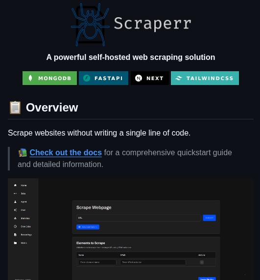

**Source:** [https://twitter.com/i/web/status/1941079132961488906](https://twitter.com/i/web/status/1941079132961488906)
**Original Post Date:** 2025-07-14 20:27:15

# Scraperr: A Comprehensive Guide to a Powerful Self-Hosted Web Scraping Solution

## Introduction
Web scraping is a crucial task for data extraction from websites, often requiring technical expertise in writing code. However, Scraperr offers a powerful solution that allows users to scrape websites without writing a single line of code. This guide provides an in-depth look at Scraperr's features, technology stack, and user interface, making it accessible for both technical and non-technical users.

## Overview

Scraperr is a self-hosted web scraping tool designed to simplify the process of data extraction from websites. It leverages modern technologies such as MongoDB, FastAPI, Next.js, and Tailwind CSS to provide a robust and user-friendly experience.

The core functionality of Scraperr is to enable users to scrape websites without writing any code. This makes it an ideal tool for individuals or organizations that require data extraction but lack the technical expertise to develop custom scraping solutions.

- Scrape websites without writing a single line of code.
- User-friendly interface with a dark theme and clean design.
- Comprehensive documentation for quickstart guides and detailed information.

> **Note/Tip:** Ensure you have the necessary server resources to host Scraperr efficiently.

> **Note/Tip:** Regularly update your deployment to benefit from new features and security patches.

## Technology Stack

Scraperr is built using a modern technology stack that ensures performance, scalability, and ease of use. The key technologies include MongoDB for data storage, FastAPI for building APIs, Next.js for server-side rendering, and Tailwind CSS for styling the user interface.

MongoDB is chosen for its flexibility in handling unstructured data, which is often encountered in web scraping tasks. FastAPI provides a high-performance backend with asynchronous support, making it ideal for I/O-bound operations like web scraping.

- MongoDB: A NoSQL database for storing scraped data.
- FastAPI: A modern, high-performance web framework for building APIs.
- Next.js: A React framework for building server-side rendered web applications.
- Tailwind CSS: A utility-first CSS framework for styling the UI.

> **Note/Tip:** Consider using Docker to simplify the deployment and management of Scraperr on your server.

> **Note/Tip:** Monitor resource usage to optimize performance, especially during large scraping jobs.

## User Interface

The user interface of Scraperr is designed with a dark theme for better readability and visual appeal. It features a vertical navigation menu on the left side with icons and labels for different sections, including Home, Scrape, Scrape Jobs, Scrape Logs, and Media.

The main content area displays a form for scraping webpages, where users can enter the URL of the webpage they want to scrape and specify which elements to extract. The interface also includes action buttons for managing the scraping configuration.

- Navigation menu with sections: Home, Scrape, Scrape Jobs, Scrape Logs, Media.
- Form fields for URL input and scraping configuration.
- Elements to scrape section with fields for Name, Selector, Type, and Action.

> **Note/Tip:** Take advantage of the 'Scrape Job' button to initiate scraping tasks efficiently.

> **Note/Tip:** Customize the UI further by exploring Tailwind CSS classes for additional styling options.

## Purpose and Target Audience

Scraperr is aimed at users who need to scrape websites but do not have the technical expertise to write code. It provides a user-friendly interface that simplifies the scraping process, making it accessible for both technical and non-technical users.

The tool is particularly useful for data analysts, researchers, and businesses that require data extraction from websites for various purposes such as market research, competitive analysis, or content aggregation.

- Non-technical users who need to scrape websites.
- Data analysts and researchers requiring data extraction.
- Businesses needing market research or competitive analysis.

> **Note/Tip:** Consider integrating Scraperr with other tools in your data pipeline for enhanced functionality.

> **Note/Tip:** Explore the documentation for advanced features and customization options to maximize the tool's potential.

## Conclusion

Scraperr offers a powerful and user-friendly solution for web scraping without requiring coding expertise. Its modern technology stack, clean design, and comprehensive documentation make it an ideal choice for both technical and non-technical users.

By leveraging Scraperr, users can efficiently extract data from websites, saving time and resources while gaining valuable insights.

## Key Takeaways

- Scraperr is a self-hosted web scraping tool that requires no coding expertise.
- It uses MongoDB for data storage, FastAPI for APIs, Next.js for server-side rendering, and Tailwind CSS for styling.
- The user interface is intuitive with a dark theme and comprehensive navigation.
- Target audience includes non-technical users, data analysts, researchers, and businesses.
- Scraperr simplifies the scraping process, making it accessible for various use cases.

## External References

- [Scraperr GitHub Repository](https://github.com/username/scraperr)
- [FastAPI Documentation](https://fastapi.tiangolo.com/)

## Media

**Image Description:** The image shows a screenshot of a webpage for a software project called **Scraperr**, which is described as a "powerful self-hosted web scraping solution." Below is a detailed breakdown of the image:

### **Main Subject:**
The main subject of the image is the **Scraperr** project, which is a tool designed for web scraping. The project's logo, a stylized spider icon, is prominently displayed at the top left, accompanied by the text "Scraperr" in a clean, modern font.

### **Header Section:**
- **Title:** The title "Scraperr" is displayed prominently at the top of the page.
- **Tagline:** Below the title, there is a tagline that reads:  
  *"A powerful self-hosted web scraping solution"*
- **Technology Stack:** A row of colored badges indicates the technologies used in the project:
  - **MongoDB** (green badge)
  - **FastAPI** (teal badge)
  - **Next.js** (black badge)
  - **Tailwind CSS** (light blue badge)

### **Overview Section:**
- **Heading:** The section is titled "Overview," with an icon of a notebook to the left of the text.
- **Description:** The text explains the core functionality of Scraperr:
  - *"Scrape websites without writing a single line of code."*
- **Call to Action:** A link is provided to the documentation:
  - *"Check out the docs for a comprehensive quickstart guide and detailed information."*
  - The link is styled as a clickable text in blue.

### **User Interface Preview:**
- **Screenshot of the Scraperr UI:** Below the overview, there is a screenshot of the Scraperr user interface, showcasing its functionality.
  - **Header:** The UI has a dark theme with a clean, modern design.
  - **Navigation Menu:** On the left side, there is a vertical navigation menu with icons and labels for different sections:
    - **Home**
    - **Scrape**
    - **Scrape Jobs**
    - **Scrape Logs**
    - **Media**
  - **Main Content Area:** The main section shows a form for scraping a webpage:
    - **Form Title:** "Scrape Webpage"
    - **Input Fields:**
      - **URL:** A text input field labeled "URL" where users can enter the URL of the webpage they want to scrape.
      - **Scrape Job:** A button labeled "Scrape Job" to initiate the scraping process.
    - **Elements to Scrape:** Below the form, there is a section titled "Elements to Scrape," which appears to allow users to specify which elements they want to extract from the webpage. This section includes fields for:
      - **Name**
      - **Selector**
      - **Type**
      - **Action**
  - **Action Buttons:** There are buttons labeled "Add" and "Save" for managing the scraping configuration.

### **Design and Styling:**
- **Color Scheme:** The design uses a dark theme with white and light text, making it visually appealing and easy to read.
- **Typography:** The text is clean and modern, with a mix of bold and regular fonts for emphasis.
- **Icons:** Icons are used for navigation and actions, enhancing usability and visual appeal.

### **Technical Details:**
- **Self-Hosted:** The project is described as "self-hosted," meaning users can deploy and run the tool on their own servers or infrastructure.
- **No Coding Required:** The tool is designed to be user-friendly, allowing users to scrape websites without writing code.
- **Technology Stack:** The project leverages several popular technologies:
  - **MongoDB:** A NoSQL database for storing scraped data.
  - **FastAPI:** A modern, high-performance web framework for building APIs.
  - **Next.js:** A React framework for building server-side rendered web applications.
  - **Tailwind CSS:** A utility-first CSS framework for styling the UI.

### **Purpose and Target Audience:**
The project is aimed at users who want to scrape websites but do not have the technical expertise to write code. It provides a user-friendly interface for configuring and executing scraping tasks.

### **Overall Impression:**
The image effectively communicates the purpose and key features of Scraperr, highlighting its ease of use and the robust technology stack behind it. The clean design and clear navigation make it appealing to both technical and non-technical users. The inclusion of a UI preview gives potential users a good sense of how the tool works in practice.
