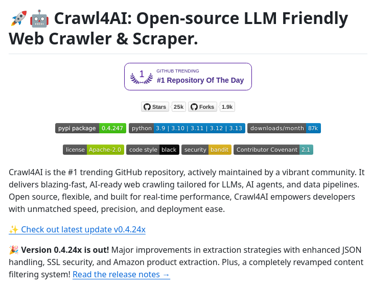

**Source:** [https://twitter.com/i/web/status/1880504404555514011](https://twitter.com/i/web/status/1880504404555514011)
**Original Post Date:** 2025-05-28 01:44:45

# Crawl4AI Web Crawler: Open-Source Tool for AI-Friendly Data Extraction

## Introduction
Crawl4AI represents a significant advancement in web scraping technology, specifically designed to serve Large Language Models (LLMs), AI agents, and modern data pipelines. With its open-source nature, Apache-2.0 license, and support for Python versions 3.9 through 3.13, this trending GitHub repository provides developers with a robust solution for fast, precise web data extraction. This knowledge base item explores its technical architecture, features, and implementation considerations.

## Overview and Key Features

Crawl4AI is the #1 trending GitHub repository of the day, boasting 25k stars and 87k monthly downloads. Its primary value lies in delivering blazing-fast web crawling capabilities tailored for AI applications, with enhanced extraction strategies and improved JavaScript handling.

The tool's architecture emphasizes flexibility and real-time performance, making it ideal for developers building LLM-driven applications or maintaining data pipelines that require frequent updates.

```python
pip install crawl4ai==0.4.24
from crawl4ai import Crawler
crawler = Crawler()
data = crawler.scrape('https://example.com')
```

## Technical Implementation Details

The project leverages Python's versatility and includes security measures through automated checks via Bandit. The Apache-2.0 license ensures permissive usage, while the Contributor Covenant promotes a welcoming development community.

- Python 3.9-3.13 compatibility
- Apache-2.0 licensing
- Security via Bandit checks
- Active community support

## Recent Enhancements (v0.4.24)

The latest version includes major improvements in extraction strategies, JavaScript handling, and SSL security. A completely revamped content filtering system ensures better data quality for AI applications.

1. Enhanced JavaScript processing
1. Improved SSL security implementation
1. Revamped content filtering engine
1. Optimized Amazon product extraction

## Key Takeaways

- Crawl4AI provides high-performance web crawling specifically optimized for LLMs and AI-driven applications
- The tool's architecture ensures flexibility with Python compatibility, security features, and open-source accessibility
- Version 0.4.24 introduces significant improvements in extraction strategies and JavaScript handling

## Conclusion
Crawl4AI stands out as a comprehensive solution for web scraping needs in AI applications. Its active community support, frequent updates, and optimization for LLM workflows make it an essential tool for developers working on modern data pipeline projects.

## External References

- [GitHub Repository](https://github.com/Crawl4AI)
- [PyPI Package](https://pypi.org/project/crawl4ai/)


## Media

**Image Description:** The image is a screenshot of a GitHub repository page for a project called **Crawl4AI**, which is an open-source tool designed for web crawling and scraping. Below is a detailed description of the image, focusing on the main subject and relevant technical details:

### **Header Section**
1. **Title and Description**:
   - The title reads: **"Crawl4AI: Open-source LLM Friendly Web Crawler & Scraper"**.
   - The title is accompanied by two icons: a rocket ship and a robot, symbolizing innovation and automation.
   - The description emphasizes that Crawl4AI is an open-source, AI-friendly web crawler and scraper tailored for Large Language Models (LLMs), AI agents, and data pipelines.

2. **GitHub Trending Badge**:
   - The repository is marked as the **#1 trending repository of the day** on GitHub, indicating its popularity and active engagement.

### **Key Metrics**
1. **Stars, Forks, and Downloads**:
   - **Stars**: 25k (indicating a high level of interest and adoption).
   - **Forks**: 4.9k (indicating active contributions and derivations of the project).
   - **Downloads per Month**: 87k (indicating frequent usage).

2. **Version Information**:
   - The current version of the project is **v0.4.24**, as indicated in the PyPI package section.

### **Technical Details**
1. **Dependencies and Compatibility**:
   - The project is built using **Python**, with support for versions **3.9, 3.10, 3.11, 3.12, and 3.13**.
   - The PyPI package version is **0.4.24**, which is prominently displayed.

2. **License**:
   - The project is licensed under the **Apache-2.0** license, ensuring permissiveness and open-source compliance.

3. **Security and Quality Assurance**:
   - The repository includes badges for **security** and **code style**, indicating adherence to best practices.
   - The **bandit** badge suggests the use of automated security checks to identify potential vulnerabilities.
   - The **Contributor Covenant** badge indicates a commitment to a welcoming and inclusive community.

### **Main Content**
1. **Project Overview**:
   - **Crawl4AI** is described as the **#1 trending GitHub repository**, actively maintained by a vibrant community.
   - It delivers **blazing-fast, AI-ready web crawling** tailored for LLMs, AI agents, and data pipelines.
   - The project is **open-source, flexible, and built for real-time performance**, emphasizing speed, precision, and ease of deployment.

2. **Key Features**:
   - The project is designed to empower developers with unmatched speed, precision, and deployment ease.
   - It is particularly suited for LLMs and AI-driven applications.

### **Recent Updates**
1. **Latest Update (v0.4.24)**:
   - A link is provided to **check out the latest update (v0.4.24)**, indicating recent improvements and enhancements.
   - The update highlights **major improvements in extraction strategies**, enhanced handling of JavaScript, SSL security, and Amazon product extraction.
   - A completely revamped content filtering system is also mentioned.

2. **Release Notes**:
   - A link to **read the release notes** is provided, directing users to detailed information about the changes and improvements in the latest version.

### **Visual Layout**
- The page is well-organized, with clear sections for metrics, technical details, and project highlights.
- Badges and links are strategically placed to draw attention to key features and recent updates.
- The use of color coding (e.g., green for PyPI package version, blue for Python versions, etc.) enhances readability and visual appeal.

### **Overall Impression**
The image effectively communicates the popularity, technical capabilities, and community-driven nature of the **Crawl4AI** project. It highlights its suitability for modern AI and LLM applications, emphasizing speed, flexibility, and security. The inclusion of badges and links to updates and release notes ensures transparency and encourages user engagement.
