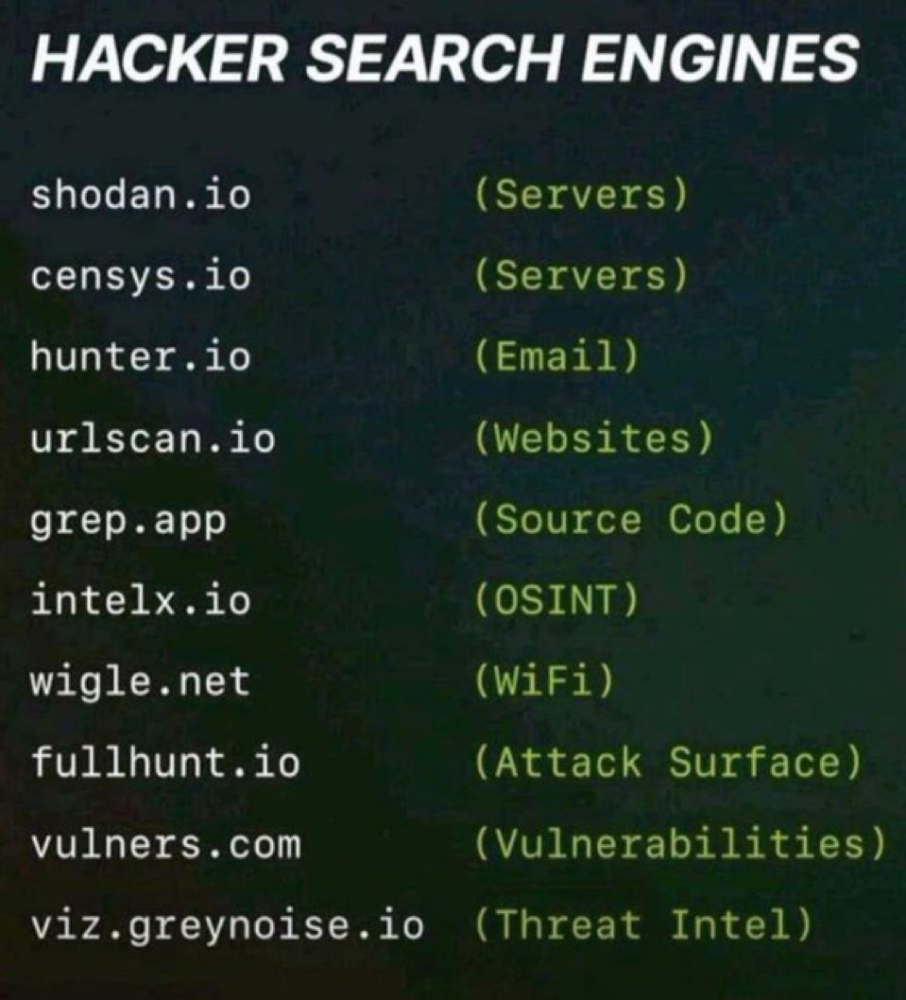

**Source:** [https://twitter.com/i/web/status/1878002570192368073](https://twitter.com/i/web/status/1878002570192368073)
**Original Post Date:** 2025-05-27 15:51:35

# Hacker Search Engines & OSINT Tools: Comprehensive Guide to Cybersecurity Reconnaissance

## Introduction
In the realm of cybersecurity, specialized search engines play a crucial role in digital reconnaissance. This guide explores key hacker search engines and OSINT (Open Source Intelligence) tools that are fundamental to ethical hacking, penetration testing, and security research. Understanding these tools is essential for identifying vulnerabilities, mapping attack surfaces, and conducting thorough security assessments.

## Understanding Hacker Search Engines

Hacker search engines go beyond traditional web searches by indexing specific types of internet-connected resources and data. They are designed to uncover information that may not be easily accessible through standard search methods.

These tools serve as essential reconnaissance aids for security professionals, helping them identify potential vulnerabilities, map digital footprints, and gather intelligence about target systems.

## Tool Categories and Purposes

1. Server Discovery: shodan.io, censys.io - Identify connected devices and infrastructure.
1. Email Intelligence: hunter.io - Gather contact information through domain analysis.
1. Website Analysis: urlscan.io - Examine site structure and potential security issues.
1. Source Code Search: grep.app - Find specific code patterns across repositories.
1. OSINT Aggregation: intelx.io - Compile diverse data sources for comprehensive intelligence.

> **Note/Tip:** Always ensure legal compliance when using these tools in professional contexts.

> **Note/Tip:** Consider combining multiple tools for comprehensive reconnaissance coverage.

## Advanced Reconnaissance Techniques

Effective use of hacker search engines requires understanding their specific strengths. For example, Shodan's strength lies in IoT and server discovery, while URLScan.io excels at website analysis.

Combining tools strategically can provide a more complete picture of the target environment.

## Key Takeaways

- Hacker search engines serve specialized purposes beyond traditional web searches
- Each tool has unique capabilities suited to different aspects of security assessment
- Professional use requires ethical considerations and legal compliance

## Conclusion
These hacker search engines are powerful tools in the cybersecurity toolkit. When used responsibly, they enable thorough reconnaissance and vulnerability identification. Understanding their specific applications and limitations is crucial for effective security assessments.

## External References

- [Shodan Documentation](https://www.shodan.io/docs)
- [Censys Technical Details](https://censys.io/faq)

## Media

**Image Description:** The image is a text-based graphic listing various "hacker search engines" or tools that are commonly used for reconnaissance and information gathering in cybersecurity. The text is presented in a dark background with white and green font, emphasizing the names of the tools and their purposes. Below is a detailed breakdown:

### **Main Subject**
The main subject of the image is a list of "hacker search engines" or specialized tools used for gathering intelligence on systems, networks, and vulnerabilities. These tools are often used by ethical hackers, penetration testers, and security researchers to identify potential weaknesses or to understand the digital footprint of a target.

### **Technical Details and Breakdown**
1. **Title:**
   - The title at the top reads: **"HACKER SEARCH SEARCH SEARCH ENGINES ENGINES ENGINES ENGINES"**.
   - The repetition of "SEARCH" and "ENGINES" emphasizes the theme of the image, highlighting the focus on search tools.

2. **List of Tools:**
   - The list is organized in two columns:
     - **Left Column:** Contains the names of the tools.
     - **Right Column:** Contains the purpose or type of information each tool is used for, enclosed in parentheses.

3. **Individual Tools and Their Descriptions:**
   - **shodan.io**
     - Purpose: **(Servers)**
     - Shodan is a well-known search engine that indexes internet-connected devices, including servers, routers, and IoT devices.
   - **censys.io**
     - Purpose: **(Servers)**
     - Censys is another search engine that scans the internet to discover and catalog devices, focusing on servers and network infrastructure.
   - **hunter.io**
     - Purpose: **(Email)**
     - Hunter.io is a tool used for finding email addresses and other contact information associated with a domain.
   - **urlscan.io**
     - Purpose: **(Websites)**
     - URLScan.io is a service that scans websites and provides detailed reports on their content, structure, and potential vulnerabilities.
   - **grep.app**
     - Purpose: **(Source Code)**
     - Grep.app is a tool for searching through source code repositories (e.g., GitHub) to find specific code snippets or vulnerabilities.
   - **intelx.io**
     - Purpose: **(OSINT)**
     - Intelx.io is an Open Source Intelligence (OSINT) tool that aggregates data from various sources to provide insights into individuals, organizations, and digital footprints.
   - **wigle.net**
     - Purpose: **(WiFi)**
     - Wigle.net is a database of Wi-Fi networks, allowing users to search for and map wireless access points.
   - **fullhunt.io**
     - Purpose: **(Attack Surface)**
     - FullHunt is a tool for identifying and mapping an organization's digital attack surface, including exposed assets and vulnerabilities.
   - **vulner.com**
     - Purpose: **(Vulnerabilities)**
     - Vulner.com is a platform that aggregates and provides information on software vulnerabilities, helping users identify and mitigate risks.
   - **viz.greynoise.io**
     - Purpose: **(Threat)**
     - GreyNoise is a service that provides threat intelligence by analyzing internet traffic and identifying malicious activity.

4. **Font and Formatting:**
   - The names of the tools are written in **white text**.
   - The purposes of the tools are written in **green text** and enclosed in parentheses.
   - The repetition of certain words (e.g., "SEARCH," "ENGINES," "Vulnerabilities") in the purposes emphasizes their significance.

5. **Background:**
   - The background is **dark**, likely black or a very dark shade, which contrasts with the bright text, making it highly readable.

### **Overall Theme**
The image humorously exaggerates the concept of "hacker search engines" by repeating certain words and emphasizing the tools' purposes. It serves as a quick reference guide for individuals interested in cybersecurity, penetration testing, or ethical hacking, highlighting the tools commonly used for reconnaissance and vulnerability assessment.

### **Purpose**
The image is likely intended for educational or informational purposes, providing a concise overview of tools that can be used for various aspects of cybersecurity research and threat intelligence. It is presented in a visually engaging manner to capture attention and convey the information effectively.
