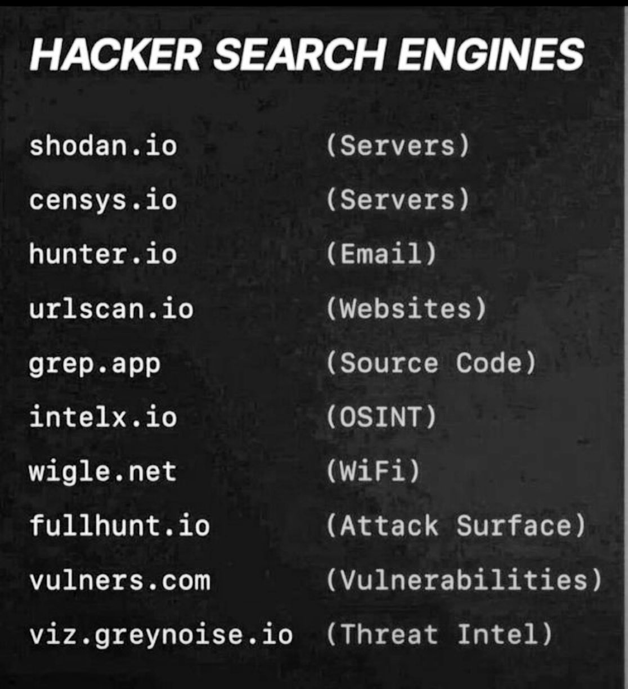

**Source:** [https://twitter.com/i/web/status/1908781591914049617](https://twitter.com/i/web/status/1908781591914049617)
**Original Post Date:** 2025-05-27 16:05:16

# Hacker Search Engines: Specialized Tools for Cybersecurity Intelligence

## Introduction
Specialized search engines have become essential tools in the cybersecurity toolkit, enabling professionals to gather critical intelligence during various stages of security operations. These platforms serve specific purposes ranging from server discovery to email harvesting and vulnerability assessment, offering targeted capabilities that general-purpose search engines cannot match. This guide explores key specialized search engines and their distinct roles in cybersecurity workflows.

## Server Discovery Search Engines

Shodan.io and Censys.io are foundational tools for discovering internet-connected systems, focusing on identifying exposed servers, routers, and IoT devices. These engines provide comprehensive data about network infrastructure and can reveal critical security gaps in system configurations.

1. Identify vulnerable server configurations using Shodan's advanced filtering options
1. Use Censys' detailed network mapping for comprehensive infrastructure assessment
1. Combine both tools to validate security posture across multiple attack vectors

> **Note/Tip:** Always verify discovered systems are within your authorized scope of testing.

## Intelligence Gathering Tools

Tools like Hunter.io, URLScan.io, and Grepx offer focused capabilities for gathering specific types of intelligence. Hunter.io specializes in email discovery, while URLScan provides detailed web security analysis, and Grepx enables source code pattern searching across repositories.

- Use Hunter.io for ethical social engineering testing
- Leverage URLScan for rapid website vulnerability assessment
- Employ Grepx to identify potential security patterns in public code

## Advanced Threat Intelligence Platforms

Platforms like GreyNoise and FullHunt provide comprehensive threat intelligence by analyzing internet traffic and mapping attack surfaces. These tools are invaluable for understanding broader security landscapes and identifying potential threats to an organization.

> **Note/Tip:** Integrate these tools into automated alerting systems for proactive threat detection.

> **Note/Tip:** Use multiple platforms in conjunction to build a complete picture of your threat landscape

## Key Takeaways

- Specialized search engines serve distinct purposes and should be selected based on specific intelligence requirements
- Combining multiple tools provides a more comprehensive view of security posture than any single tool alone
- Always maintain ethical boundaries when using these tools for reconnaissance or assessment

## Conclusion
These specialized search engines represent powerful capabilities in the cybersecurity arsenal. Their effective use requires understanding their specific strengths and limitations, as well as maintaining appropriate authorization and ethical standards during operations.

## External References

- [Shodan.io Official Documentation](https://www.shodan.io/docs)
- [Censys API Reference](https://search.censys.io/api/v2)

## Media

**Image Description:** The image is a text-based list titled **"HACKER SEARCH SEARCH ENGINES"**. It appears to be a compilation of specialized search engines used by hackers or cybersecurity professionals for various purposes, such as identifying vulnerabilities, gathering intelligence, or performing reconnaissance. The list is presented in a simple, black-and-white format with a dark background and white text. Below is a detailed breakdown of the content:

### **Title**
- The title is prominently displayed at the top in all capital letters: **"HACKER SEARCH SEARCH ENGINES"**.
- The repetition of the word "SEARCH" emphasizes the theme of search engines.

### **List of Search Engines**
The list is organized into two columns:
1. **Left Column**: Contains the names of the search engines.
2. **Right Column**: Contains the purpose or type of information each search engine is used for, enclosed in parentheses.

#### **Search Engines and Their Descriptions**
1. **shodan.io**
   - Purpose: **(Servers)**  
   - Description: Shodan is a well-known search engine that indexes internet-connected devices, including servers, routers, and IoT devices. It is often used for reconnaissance and identifying exposed systems.

2. **censys.io**
   - Purpose: **(Servers)**  
   - Description: Censys is another search engine that scans the internet to discover and catalog devices, services, and infrastructure. It is used for network reconnaissance and security research.

3. **hunter.io**
   - Purpose: **(Email)**  
   - Description: Hunter.io is a search engine designed to find email addresses and related information. It is often used for social engineering or gathering contact details.

4. **urlscan.io**
   - Purpose: **(Websites)**  
   - Description: URLScan.io is a search engine that scans websites and provides insights into their security posture, including vulnerabilities and misconfigurations.

5. **grep.app**
   - Purpose: **(Source Code)**  
   - Description: Grep.app is a search engine that allows users to search for code snippets across public repositories. It is useful for finding vulnerabilities or code patterns.

6. **intelx.io**
   - Purpose: **(OSINT)**  
   - Description: Intelx.io is an open-source intelligence (OSINT) tool that aggregates data from various sources to provide insights into individuals, organizations, and infrastructure.

7. **wigle.net**
   - Purpose: **(WiFi)**  
   - Description: Wigle.net is a search engine for WiFi networks. It allows users to search for and map WiFi access points, often used for reconnaissance or identifying unsecured networks.

8. **fullhunt.io**
   - Purpose: **(Attack Surface)**  
   - Description: FullHunt is a search engine that identifies and maps an organization's attack surface, including exposed systems and services.

9. **vulners.com**
   - Purpose: **(Vulnerabilities)**  
   - Description: Vulners is a search engine for vulnerabilities. It provides information on CVEs (Common Vulnerabilities and Exposures) and other security issues, helping users identify and mitigate risks.

10. **viz.greynoise.io**
    - Purpose: **(Threat Intelligence)**  
    - Description: Viz.GreyNoise.io is a search engine that provides threat intelligence by analyzing internet traffic and identifying malicious activity.

### **Formatting and Style**
- The text is presented in a monospace font, giving it a technical and minimalist appearance.
- The repetition of certain words (e.g., "SEARCH" in the title, "Servers" for Shodan and Censys) emphasizes their importance.
- The use of parentheses to describe the purpose of each search engine makes the list easy to scan and understand.

### **Purpose**
The list appears to be a resource for cybersecurity professionals, ethical hackers, or individuals interested in learning about tools used for reconnaissance, vulnerability assessment, and threat intelligence. Each search engine listed serves a specific purpose, catering to different aspects of cybersecurity and information gathering.

### **Overall Impression**
The image is straightforward and functional, focusing on providing a concise list of tools without any additional graphical elements or distractions. It is designed to be informative and useful for those familiar with cybersecurity concepts.
