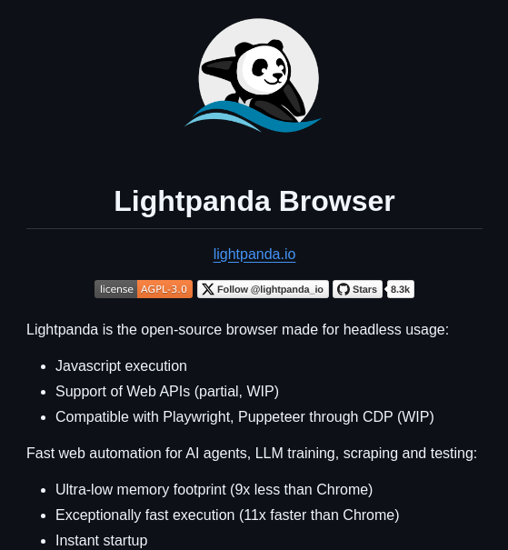

**Source:** [https://twitter.com/i/web/status/1914009647939281206](https://twitter.com/i/web/status/1914009647939281206)
**Original Post Date:** 2025-07-14 22:14:36

# Lightpanda Browser: A High-Performance Headless Browser for Web Automation

## Introduction
The Lightpanda Browser is an open-source project designed specifically for headless usage, making it ideal for web automation tasks such as scraping, testing, and training AI agents. This browser stands out due to its ultra-low memory footprint and exceptionally fast execution, which are critical factors in modern web development and data extraction processes.

## Project Overview

The Lightpanda Browser is an open-source project hosted on GitHub. It is designed for headless usage, meaning it operates without a graphical user interface, making it perfect for automation tasks such as web scraping and testing.

The browser is licensed under AGPL-3.0, which ensures that any derivative works must also be shared under the same open-source license.

- Open-source browser designed for headless usage.
- Licensed under AGPL-3.0.
- Compatible with automation frameworks like Playwright and Puppeteer through CDP (Chrome DevTools Protocol).

> **Note/Tip:** The project is actively maintained, as indicated by the 8.3k stars on GitHub.

## Key Features

Lightpanda Browser supports JavaScript execution and provides partial support for Web APIs, which are essential for interacting with modern web content.

The browser is designed to be compatible with popular automation frameworks such as Playwright and Puppeteer through the Chrome DevTools Protocol (CDP).

- JavaScript execution support.
- Partial Web API support (marked as WIP - Work in Progress).
- Compatibility with Playwright and Puppeteer through CDP.

> **Note/Tip:** The browser's Web API support is still a work in progress, indicating ongoing development and potential future enhancements.

## Performance Highlights

One of the standout features of Lightpanda Browser is its ultra-low memory footprint. It consumes 9x less memory than Chrome, making it highly efficient for resource-intensive tasks.

The browser boasts exceptionally fast execution, being 11x faster than Chrome. This speed advantage is crucial for automation tasks where performance is a critical factor.

- Ultra-low memory footprint: 9x less memory consumption compared to Chrome.
- Exceptionally fast execution: 11x faster than Chrome.
- Fast startup with near-instant startup times.

> **Note/Tip:** The combination of low memory usage and high speed makes Lightpanda Browser an ideal choice for web scraping, testing, and AI-related projects.

## Use Cases

Lightpanda Browser is particularly well-suited for fast web automation tasks. Its performance advantages make it ideal for automating repetitive tasks on the web.

The browser's efficiency in scraping and testing makes it a valuable tool for developers involved in data extraction and quality assurance processes.

- Fast web automation for tasks like scraping, testing, and training AI agents.
- Efficient scraping and testing of web content.

> **Note/Tip:** The browser's design focuses on speed and efficiency, making it a powerful tool for developers working on large-scale web projects.

## Design and Layout

The GitHub repository page for Lightpanda Browser is displayed in dark mode, which is typical for modern developer tools and repositories.

The information is organized into bullet points, making it easy to read and understand the key features and benefits of the browser.

- Dark mode interface on GitHub.
- Clear structure with bullet points for easy reading.

> **Note/Tip:** The dark mode and clear structure enhance readability and user experience, which is beneficial for developers navigating the repository.

## Overall Impression

Lightpanda Browser is positioned as a lightweight, high-performance open-source browser designed specifically for headless automation tasks.

Its focus on speed, low memory usage, and compatibility with popular automation tools makes it an attractive option for developers working on web scraping, testing, and AI-related projects.

- Lightweight and high-performance browser.
- Designed for headless automation tasks.
- Focus on speed, low memory usage, and compatibility with popular automation tools.

> **Note/Tip:** The project appears to be actively maintained, as indicated by the star count and ongoing work on Web API support and compatibility.

## Key Takeaways

- Lightpanda Browser is an open-source headless browser optimized for web automation tasks.
- It has an ultra-low memory footprint and exceptionally fast execution compared to Chrome.
- The browser supports JavaScript execution and partial Web API support, with ongoing development marked as WIP.
- It is compatible with popular automation frameworks like Playwright and Puppeteer through CDP.
- Lightpanda Browser is ideal for fast web automation, scraping, testing, and AI-related projects.

## Conclusion
In summary, Lightpanda Browser stands out as a high-performance, low-memory headless browser designed for efficient web automation. Its compatibility with popular automation frameworks and ongoing development make it a valuable tool for developers involved in web scraping, testing, and AI training tasks.

## External References

- [GitHub Repository for Lightpanda Browser](https://github.com/lightpanda-io/browser)
- [AGPL-3.0 License Information](https://www.gnu.org/licenses/agpl-3.0.html)

## Media

**Image Description:** The image is a screenshot of a GitHub repository page for a project called **Lightpanda Browser**. Below is a detailed description of the image, focusing on the main subject and relevant technical details:

### **Main Subject: Lightpanda Browser**
- **Name**: The project is named **Lightpanda Browser**.
- **Logo**: The logo features a stylized panda character with a blue wave-like design underneath, suggesting a theme of speed or fluidity.
- **Description**: The project is described as an **open-source browser** designed for **headless usage**. Headless browsers are typically used for automation, testing, and other non-interactive tasks.

### **Technical Details**
1. **Repository Information**:
   - **Repository URL**: The repository is hosted on GitHub, and the URL is provided as `lightpanda.io`.
   - **License**: The project is licensed under **AGPL-3.0**, which is a copyleft license that requires derivative works to be shared under the same terms.

2. **Key Features**:
   - **JavaScript Execution**: The browser supports JavaScript execution, which is essential for interacting with modern web content.
   - **Web API Support**: It provides partial support for Web APIs, indicating that it can interact with various web functionalities, though not all features are fully implemented yet (marked as **WIP** - Work in Progress).
   - **Compatibility**: The browser is compatible with automation frameworks like **Playwright** and **Puppeteer** through the **CDP (Chrome DevTools Protocol)**. This compatibility is also marked as **WIP**, suggesting ongoing development.

3. **Use Cases**:
   - **Fast Web Automation**: Suitable for automating tasks, such as scraping, testing, and training AI agents or LLMs (Large Language Models).
   - **Scraping and Testing**: The browser is designed for efficient scraping and testing of web content.

4. **Performance Highlights**:
   - **Low Memory Footprint**: The browser has an **ultra-low memory footprint**, consuming **9x less memory** than Chrome.
   - **Fast Execution**: It boasts **exceptionally fast execution**, being **11x faster** than Chrome.

5. **Startup Speed**:
   - **Fast Startup**: The browser starts up quickly, which is crucial for automation tasks.
   - **Instant Startup**: It emphasizes near-instant startup times, further enhancing its efficiency.

### **Additional Information**
- **Stars**: The repository has **8.3k stars**, indicating its popularity and active interest from the developer community.
- **Follow Button**: There is a button to follow the repository (`@lightpanda.io`), suggesting that the project is actively maintained and updated.

### **Design and Layout**
- **Dark Mode**: The GitHub page is displayed in dark mode, with a black background and white text, which is typical for modern developer tools and repositories.
- **Clear Structure**: The information is organized into bullet points, making it easy to read and understand the key features and benefits of the browser.

### **Overall Impression**
The **Lightpanda Browser** is positioned as a lightweight, high-performance, open-source browser designed for headless automation tasks. Its focus on speed, low memory usage, and compatibility with popular automation tools makes it an attractive option for developers working on web scraping, testing, and AI-related projects. The project appears to be actively maintained, as indicated by the star count and ongoing work on Web API support and compatibility.
