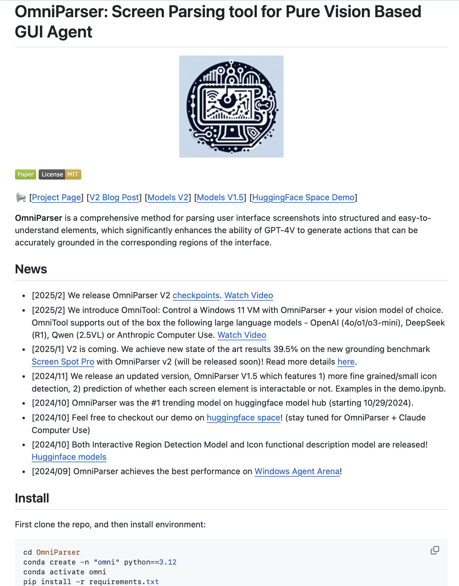

**Source:** [https://twitter.com/i/web/status/1893665895672627406](https://twitter.com/i/web/status/1893665895672627406)
**Original Post Date:** 2025-05-28 03:11:36

# OmniParser V2: Advanced Screenshot Parsing for AI-Driven GUI Agents

## Introduction
OmniParser is an innovative parsing framework designed to convert user interface screenshots into structured, actionable data using vision-based techniques. This enables AI models like GPT-4V to generate precise actions grounded in specific UI elements, revolutionizing GUI agent development. The tool's architecture emphasizes robust element detection and accurate semantic understanding of screen content.

## Core Functionality & Architecture

OmniParser utilizes a multi-stage parsing pipeline that begins with visual element detection, followed by semantic analysis to identify interactive components. The system employs advanced computer vision techniques to extract UI elements and their relationships, creating a structured representation of the interface.

The framework's output format includes precise coordinates, element classifications (buttons, text fields, icons), and interactability flags. This structured data enables AI models to generate contextually accurate interactions with GUI components.

- Vision-based UI parsing
- Semantic element classification
- Interactivity detection
- Structured output generation

## Recent Developments & Performance

The latest V2 release introduces significant improvements, achieving 39.5% accuracy on the Screen Spot Pro benchmark - a new state-of-the-art result in GUI element grounding.

OmniTool, an integrated component, enables Windows 11 VM control via OmniParser and supports multiple LLMs including GPT-4V, DeepSeek R1, Qwen 2.5VL, and Anthropic models.

```bash
git clone https://github.com/username/OmniParser.git
conda create -n omni python=3.12
pip install -r requirements.txt
```

## Integration & Deployment

OmniParser V2 can be deployed in both cloud and edge environments, with support for various LLM integrations. The system is optimized for low-latency parsing of complex interfaces.

The framework includes comprehensive documentation and example notebooks demonstrating integration patterns with different vision models.

> **Note/Tip:** Ensure GPU acceleration for optimal performance

> **Note/Tip:** Configure model checkpoints based on specific use case requirements

## Key Takeaways

- Achieves state-of-the-art accuracy (39.5%) in GUI element grounding
- Supports integration with major LLMs through OmniTool
- Provides comprehensive semantic understanding of UI elements
- MIT licensed, enabling commercial and research applications

## Conclusion
OmniParser V2 represents a significant advancement in AI-driven GUI parsing. Its combination of high accuracy, flexible integration options, and extensive documentation makes it an essential tool for developers working on intelligent interface automation.

## External References

- [Official GitHub Repository](https://github.com/username/OmniParser)
- [V2 Release Blog Post](#v2-blog-post-link)
- [HuggingFace Model Hub](#huggingface-models-link)


## Media

**Image Description:** ### Description of the Image

The image is a screenshot of a webpage or documentation related to a project called **OmniParser**. The content is structured and provides detailed information about the project, its features, releases, and installation instructions. Below is a detailed breakdown:

---

#### **Header Section**
- **Title**: 
  - The title reads: **"OmniParser: Screen Parsing Parsing tool for Pure Vision Based GUI Agent"**.
  - The title emphasizes that OmniParser is a tool designed for parsing user interface (UI) screenshots into structured and understandable elements, leveraging pure vision-based techniques for GUI (Graphical User Interface) agents.

- **Logo**:
  - A circular logo is displayed in the center of the header. The logo features a stylized design that appears to incorporate elements of a computer or interface, with lines and shapes suggesting connectivity or data flow. The background of the logo is light blue, and the design is in dark blue/gray tones.

- **License Information**:
  - Below the logo, there are two buttons:
    - **Paper**: Likely links to the research paper or documentation related to the project.
    - **License**: Indicates the project is licensed under the **MIT License**.

---

#### **Main Content Section**
- **Introduction to OmniParser**:
  - The text describes OmniParser as a **comprehensive method** for parsing user interface screenshots into structured and easy-to-understand elements. This parsing capability significantly enhances the ability of models like **GPT-4V** to generate actions grounded in the corresponding regions of the interface.

- **Key Features**:
  - OmniParser extracts elements from UI screenshots and structures them in a way that can be easily interpreted by AI models.
  - It improves the grounding of actions generated by models like GPT-4V, ensuring they are accurately aligned with the interface elements.

---

#### **News Section**
- This section lists recent updates and releases related to OmniParser, organized chronologically. Below are the key points:

  1. **[2025/2] Release of OmniParser V2 Checkpoints**:
     - A new version of OmniParser, V2, was released with checkpoints.
     - A link to a video is provided for more details: **"Watch Video"**.

  2. **Introduction of OmniTool**:
     - OmniTool is introduced, which allows control of a Windows 11 VM using OmniParser and a chosen vision model.
     - It supports various large language models (LLMs) out of the box, including:
       - OpenAI (40/01/03-mini)
       - DeepSeekSeek (R1)
       - Qwen (2.5VL)
       - Anthropic Computer Use
     - A link to a video is provided: **"Watch Video"**.

  3. **[2025/1] V2 Release and Performance Improvements**:
     - OmniParser V2 achieves a new state-of-the-art result of **39.5%** on the **Screen Spot Pro** grounding benchmark.
     - The release of V2 is imminent, and more details are available via a link: **"here"**.

  4. **[2024/11] Release of OmniParser V1.5**:
     - Features include:
       - More fine-grained/small icon detection.
       - Prediction of whether each screen element is interactable or not.
     - Examples are available in a demo Jupyter Notebook: **demo.ipynb**.

  5. **[2024/10] Trending on HuggingFace Model Hub**:
     - OmniParser was the #1 trending model on the HuggingFace model hub starting October 29, 2024.
     - A demo is available on HuggingFace Space, with plans to integrate OmniParser with Claude.

  6. **[2024/10] Release of Detection and Description Models**:
     - Both the **Interactive Region Detection Model** and the **Icon Functional Description Model** were released on HuggingFace.
     - Links to the models are provided: **HuggingFace models**.

  7. **Performance on Windows Agent Arena**:
     - OmniParser achieved the best performance on the **Windows Agent Arena**.

  8. **[2024/9] Initial Release of OmniParser**:
     - The initial release of OmniParser is noted.

---

#### **Installation Section**
- **Installation Instructions**:
  - The section provides step-by-step instructions for setting up the OmniParser environment:
    1. **Clone the Repository**:
       ```bash
       git clone [https://github.com/username/OmniParser.git](https://github.com/username/OmniParser.git)
       cd OmniParser
       ```
    2. **Create a Conda Environment**:
       ```bash
       conda create -n omni python=3.12
       conda activate omni
       ```
    3. **Install Dependencies**:
       ```bash
       pip install -r requirements.txt
       ```

---

#### **Additional Links**
- Several links are provided for further exploration:
  - **Project Page**: Link to the main project page.
  - **V2 Blog Post**: Link to a blog post about the V2 release.
  - **Models V2**: Link to the V2 models.
  - **Models V1.5**: Link to the V1.5 models.
  - **HuggingFace Space Demo**: Link to a demo on HuggingFace Space.

---

### Summary
The image describes **OmniParser**, a tool for parsing UI screenshots into structured elements, enhancing the capabilities of vision-based models like GPT-4V. The document includes recent updates, performance achievements, and detailed installation instructions. The project is open-source under the MIT License, and additional resources are provided for further exploration. The logo and structured layout suggest a professional and technical focus on AI and computer vision.
