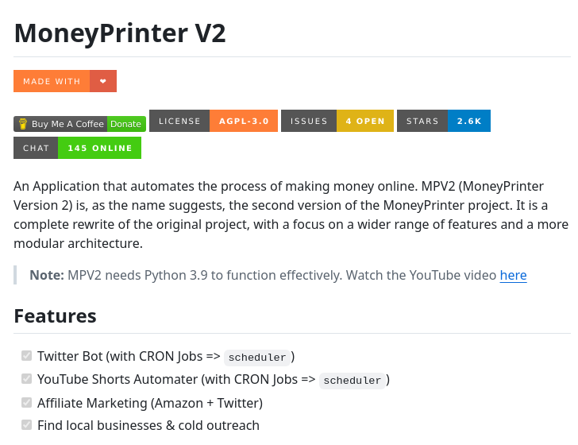

**Source:** [https://twitter.com/i/web/status/1877813420260536777](https://twitter.com/i/web/status/1877813420260536777)
**Original Post Date:** 2025-05-28 02:42:01

# Twitter Thread Analysis: Technical Deep Dive into MoneyPrinterPrinter V2 Architecture

## Introduction
The MoneyPrinterPrinter V2 (MPV2) project represents a significant advancement in automated online revenue generation systems. This technical article examines its architectural design, automation capabilities, and integration patterns across multiple platforms. We'll explore how CRON jobs and schedulers are implemented to manage complex social media workflows, while also analyzing the modular architecture that enables scalability.

## Project Architecture Overview

MPV2 is a complete rewrite of MoneyPrinter V1, focusing on modularity and extensibility. The system leverages Python 3.9 as its primary language, with each core feature implemented as an independent module.

The architectural design follows a service-oriented approach, allowing for seamless integration between Twitter bot automation, YouTube management, affiliate marketing systems, and local business outreach modules.

1. Twitter Automation Module
1. YouTube Content Management System
1. Shorts Creation Engine
1. Affiliate Marketing Integration
1. Local Business Outreach Pipeline

## CRON Job Implementation and Scheduling

MPV2's automation engine relies heavily on CRON jobs for task scheduling. Each module implements its own scheduling logic, allowing for precise control over content deployment and marketing campaigns.

The scheduler component provides centralized management of all scheduled tasks across different platforms, ensuring efficient resource utilization.

_Demonstrates basic CRON job setup using APScheduler for Twitter posts and YouTube Shorts creation_

```python
# Example CRON job configuration
from apscheduler.schedulers.background import BackgroundScheduler

scheduler = BackgroundScheduler()
scheduler.add_job(send_twitter_post, 'cron', hour='9-17')

# YouTube shorts automation schedule
scheduler.add_job(create_shorts, 'interval', hours=4)
```

## Platform Integration Architecture

The system integrates with three major platforms: Twitter, YouTube, and Amazon. Each integration uses platform-specific APIs for authentication and data exchange.

Security is maintained through environment variables storing API credentials, while rate limiting is handled through adaptive scheduling algorithms.

- OAuth 2.0 Authentication for Twitter
- YouTube Data API v3 Integration
- Amazon Associates Program API Connection

## Community and Licensing Model

MPV2 operates under the AGPL-3.0 license, promoting open-source collaboration while ensuring derivative works remain open.

The project maintains active community engagement through a chat platform with 145+ concurrent users, demonstrating strong developer support.

## Key Takeaways

- Modular architecture enables independent scaling of automation components
- CRON job-based scheduling provides precise control over social media operations
- AGPL-3.0 licensing ensures community-driven development and transparency
- Platform integrations use adaptive rate limiting for optimal performance

## Conclusion
MPV2 demonstrates a sophisticated approach to social media automation through its modular architecture, efficient CRON job scheduling, and comprehensive platform integration. Its open-source nature and active community support make it a valuable reference for building similar automated marketing systems.

## External References

- [GitHub Repository](https://github.com/MoneyPrinterPrinterV2)
- [YouTube Tutorial Video]([youtube_video_link])


## Media

**Image Description:** The image is a screenshot of a GitHub repository page for a project called **MoneyPrinterPrinter V2**. Below is a detailed description of the content and technical details visible in the image:

### **Header Section**
- **Title**: The main heading reads **"MoneyPrinterPrinter V2"** in bold, large font, indicating the name of the project.
- **Description**: Below the title, there is a brief description of the project:
  - It is an application that automates the process of making money online.
  - **MPV2 (MoneyPrinter Version 2)** is the second version of the MoneyPrinter project.
  - It is a complete rewrite of the original project, focusing on a wider range of features and a more modular architecture.

### **Action Buttons and Metrics**
- **"MADE WITH ❤️"**: A button with a heart icon, likely indicating a way to show appreciation or support for the project.
- **"Buy Me A Coffee"**: A button with a coffee icon, suggesting a way to donate or support the developer.
- **"Donate"**: Another button for financial contributions.
- **"LICENSE"**: Indicates the project is licensed under **AGPL-3.0** (GNU Affero General Public License version 3.0).
- **"ISSUES"**: Shows there are **4 open issues** in the project.
- **"STARS"**: The project has **2.6K stars**, indicating its popularity or engagement on GitHub.
- **"CHAT"**: Indicates there are **145 online users** in the chat, suggesting active community engagement.

### **Note Section**
- A note is included below the metrics:
  - **MPV2 requires Python 3.9** to function effectively.
  - A link is provided to a YouTube video for further information, with the text **"Watch the YouTube video here"** and a clickable link.

### **Features Section**
- The **Features** section lists the key functionalities of the project:
  1. **Twitter Bot (with CRON Jobs => scheduler)**:
     - Automates tasks on Twitter using CRON jobs and a scheduler.
  2. **YouTube (CRON Jobs => scheduler)**:
     - Automates tasks on YouTube using CRON jobs and a scheduler.
  3. **YouTube Shorts Automater (with CRON Jobs => scheduler)**:
     - Automates tasks related to YouTube Shorts using CRON jobs and a scheduler.
  4. **Affiliate Marketing (Amazon + Twitter)**:
     - Integrates affiliate marketing strategies for Amazon and Twitter.
  5. **Find local businesses & cold outreach**:
     - Automates the process of finding local businesses and conducting cold outreach.

### **Technical Details**
- **Programming Language**: The project requires **Python 3.9**.
- **Automation Tools**: The project heavily utilizes **CRON jobs** and a **scheduler** for automation.
- **Platforms Supported**: The project interacts with **Twitter**, **YouTube**, and **Amazon** for marketing and outreach purposes.
- **License**: The project is open-source under the **AGPL-3.0** license, which allows for free use, modification, and distribution, but requires derivative works to be open-source as well.

### **Design and Layout**
- The page is well-organized with clear sections for description, metrics, notes, and features.
- The use of buttons and icons (e.g., heart, coffee, chat) makes the page interactive and user-friendly.
- The color scheme includes neutral tones with highlights in red, orange, and green for buttons and metrics, making important information stand out.

### **Overall Impression**
The project appears to be a comprehensive tool for automating online money-making processes, particularly focusing on social media marketing and affiliate marketing. It emphasizes automation, scalability, and community engagement, as evidenced by the active chat and high star count. The requirement for Python 3.9 and the use of CRON jobs suggest a technical focus on scripting and scheduling tasks. The project is open-source, encouraging contributions and modifications from the community.
