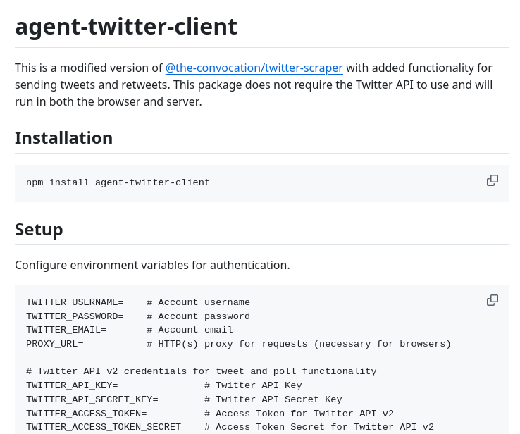

**Source:** [https://twitter.com/i/web/status/1875945721054065075](https://twitter.com/i/web/status/1875945721054065075)
**Original Post Date:** 2025-05-28 02:21:57

# Understanding agent-twitter-client: A Non-API Twitter Scraping Tool for Browser and Server Environments

## Introduction
The agent-twitter-client represents an evolution in Twitter automation tools by building upon the @the-convocation/twitter-scraper. This library introduces significant capabilities for tweeting and retweeting without requiring traditional Twitter API access, while maintaining cross-platform compatibility between browsers and servers. Understanding its architecture and configuration is crucial for developers seeking to implement robust Twitter interaction features.

## Package Overview

agent-twitter-client extends the functionality of twitter-scraper by adding tweet posting and retweeting capabilities, while maintaining browser-server compatibility. This makes it particularly valuable for applications requiring direct Twitter interaction without API dependencies.

## Installation Process

_Install the package using npm to gain access to both scraping and tweeting capabilities_

```bash
npm install agent-twitter-client
```

## Basic Authentication Setup

Authentication is configured through environment variables, providing a secure method for credential management.

- TWITTER_USERNAME - Your Twitter account username
- TWITTER_PASSWORD - Account password (required for posting)
- TWITTER_EMAIL - Associated email address

## Advanced API Integration

For enhanced functionality, the package supports Twitter API v2 integration through additional credentials.

_Configure these variables for access to advanced features like polls and scheduled tweets_

```bash
TWITTER_API_KEY=
TWITTER_API_SECRET_KEY=
TWITTER_ACCESS_TOKEN=
TWITTER_ACCESS_TOKEN_SECRET=
```

## Network Configuration

The package supports proxy configurations, essential for environments with restricted network access.

- PROXY_URL - HTTP(s) proxy endpoint for request routing

## Key Takeaways

- agent-twitter-client enables tweet posting and retweeting without Twitter API dependencies
- Supports cross-platform operation in both browser and server environments
- Authentication relies on environment variables rather than direct configuration
- Optional proxy support for restricted network environments
- Advanced features require separate Twitter API v2 credentials

## Conclusion
agent-twitter-client represents a powerful solution for developers requiring direct Twitter interaction capabilities without API restrictions. Its cross-platform support and flexible authentication options make it suitable for various automation scenarios, while optional API integration provides access to advanced features when needed.


## Media

**Image Description:** The image is a screenshot of a documentation page for a software package called **agent-twitter-client**. The content is structured in a clean, markdown-like format, with headings, code blocks, and comments. Below is a detailed description of the image:

### **Main Subject**
The main subject of the image is the **agent-twitter-client**, which is described as a modified version of another package, **@the-convocation/twitter-scraper**. This package adds functionality for sending tweets and retweets, and it does not require the Twitter API to function. It is designed to run in both browser and server environments.

### **Sections and Content**
1. **Title:**
   - The title is prominently displayed at the top: **agent-twitter-client**.
   - It is written in a large, bold font, making it the focal point of the page.

2. **Description:**
   - Below the title, there is a brief description of the package:
     - It is a modified version of **@the-convocation/twitter-scraper**.
     - It includes added functionality for sending tweets and retweets.
     - It does not require the Twitter API to use.
     - It is compatible with both browser and server environments.

3. **Installation:**
   - This section provides instructions on how to install the package.
   - The installation command is written in a code block:
     ```bash
     npm install agent-twitter-client
     ```
   - The command is highlighted in a gray background, indicating it is executable code.

4. **Setup:**
   - This section explains how to configure the package for use.
   - It focuses on setting up environment variables for authentication and optional proxy settings.

5. **Environment Variables:**
   - The setup involves configuring several environment variables, which are listed in a code block:
     ```bash
     TWITTER_USERNAME=    # Account username
     TWITTER_PASSWORD=    # Account password
     TWITTER_EMAIL=       # Account email
     PROXY_URL=           # HTTP(s) proxy for requests (necessary for browsers)
     ```
     - These variables are essential for authentication and proxy usage.

6. **Twitter API v2 Credentials:**
   - For additional functionality (e.g., tweets and polls), the package requires Twitter API v2 credentials.
   - These credentials are listed in a separate section:
     ```bash
     TWITTER_API_KEY=             # Twitter API Key
     TWITTER_API_SECRET_KEY=      # Twitter API Secret Key
     TWITTER_ACCESS_TOKEN=        # Access Token for Twitter API v2
     TWITTER_ACCESS_TOKEN_SECRET= # Access Token Secret for Twitter API v2
     ```
     - These variables are optional but necessary for advanced features.

### **Technical Details**
- **Installation Method:** The package is installed using **npm**, indicating it is a Node.js package.
- **Environment Variables:** The setup relies heavily on environment variables for configuration, which is a common practice for managing sensitive data like credentials.
- **Compatibility:** The package is designed to work in both browser and server environments, suggesting it uses a cross-platform library or framework.
- **Optional Proxy Support:** The inclusion of `PROXY_URL` indicates support for proxy configurations, which is useful for environments with restricted network access.
- **Twitter API v2 Integration:** The package supports Twitter API v2 for advanced features like tweets and polls, requiring specific API credentials.

### **Visual Elements**
- **Headings:** The document uses clear headings (`Installation`, `Setup`) to organize the content.
- **Code Blocks:** Code snippets are highlighted in gray blocks with a monospace font for readability.
- **Comments:** Each environment variable is accompanied by a comment explaining its purpose, enhancing clarity for users.

### **Purpose**
The image serves as a concise guide for developers to install and configure the **agent-twitter-client** package. It provides all necessary steps, including installation, environment variable setup, and optional API credential configuration, making it user-friendly for integration into projects.

### **Summary**
The image is a well-structured documentation page for the **agent-twitter-client** package. It emphasizes installation, setup, and configuration, with a focus on environment variables and optional Twitter API v2 credentials. The technical details are presented clearly, making it easy for developers to integrate the package into their projects.
