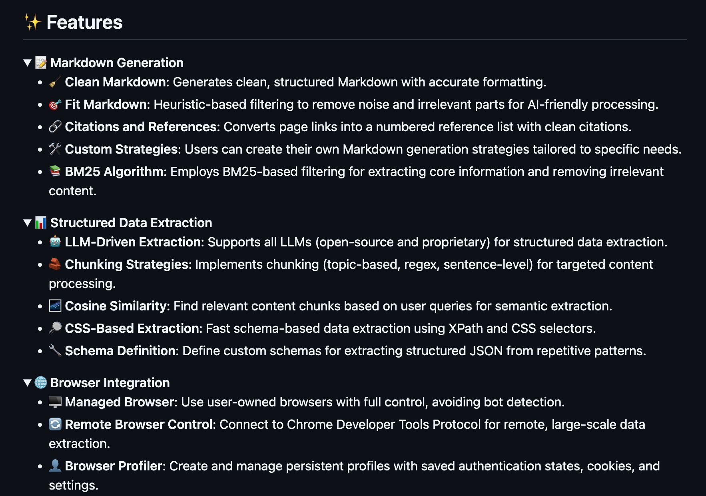

**Source:** [https://twitter.com/i/web/status/1925930945137254629](https://twitter.com/i/web/status/1925930945137254629)
**Original Post Date:** 2025-05-28 09:47:28

# Crawl4AI Web Crawler: Advanced Features for AI-Driven Data Extraction

## Introduction
The Crawl4AI Web Crawler represents a sophisticated solution for modern web scraping needs, particularly focusing on intelligent content processing. This tool combines traditional scraping techniques with cutting-edge AI technologies to deliver precise, structured data extraction. The platform offers unique features like BM25-powered markdown generation, LLM-driven semantic analysis, and advanced browser integration capabilities that set it apart in the web scraping landscape.

## Markdown Generation Capabilities

The Markdown generation module employs a sophisticated combination of heuristic-based filtering and BM25 algorithm to produce clean, AI-friendly content. This dual approach ensures that extracted content is both structured and relevant.

Users can define custom strategies for markdown generation, allowing for tailored processing based on specific project requirements. The system automatically converts page links into standardized citation formats, making it ideal for academic or research-focused scraping.

- Automatic noise removal using BM25 algorithm
- Custom markdown generation strategies
- Standardized citation formatting

> **Note/Tip:** BM25 filtering is particularly effective for academic content where precision matters.

## Structured Data Extraction Framework

The structured data extraction system supports both traditional and AI-driven approaches. Users can leverage CSS selectors and XPath for precise targeting or utilize LLM models for semantic understanding.

The platform implements various chunking strategies (topic-based, regex, sentence-level) to optimize content processing efficiency while maintaining accuracy.

1. Supports all major LLM platforms for extraction tasks
1. Implements cosine similarity for semantic matching
1. Provides schema definition capabilities for JSON output

## Browser Integration and Control

Crawl4AI's browser integration leverages Chrome Developer Tools Protocol for remote control, enabling large-scale scraping operations without triggering bot detection.

The persistent profile management system allows maintaining authentication states and cookies across sessions, making it ideal for authenticated content extraction.

- Managed browser instances with full control
- Remote control via Chrome DevTools Protocol
- Persistent profile management

## Key Takeaways

- BM25 algorithm ensures precise content filtering for markdown generation.
- Dual approach to data extraction (traditional and LLM-driven) offers flexibility.
- Robust browser integration prevents bot detection in large-scale scraping.

## Conclusion
Crawl4AI Web Crawler stands out through its combination of traditional web scraping techniques with modern AI capabilities. Its advanced features make it particularly suitable for complex data extraction tasks requiring precision and scalability, especially in research, academic, or enterprise environments.

## External References

- [BM25 Algorithm Details](https://en.wikipedia.org/wiki/Okapi_BM25)
- [Chrome DevTools Protocol Documentation](https://chromedevtools.github.io/devtools-protocol/)

## Media

**Image Description:** The image is a screenshot of a document or webpage detailing the **features** of a software or tool. The content is organized into sections with bullet points, icons, and descriptive text. Below is a detailed breakdown:

### **Main Subject**
The main subject of the image is a list of **features** provided by a tool or software. These features are categorized into several sections, each focusing on specific functionalities related to **Markdown generation**, **structured data extraction**, **LLM-driven data extraction**, and **browser integration**.

---

### **Sections and Details**

#### **1. Markdown Generation**
- **Icon**: A pencil icon.
- **Description**: This section outlines features related to generating and processing Markdown content.
  - **Clean Markdown**: Generates clean, structured Markdown with accurate formatting.
  - **Fit Markdown**: Heuristic-based filtering to remove noise and irrelevant parts for AI-friendly processing.
  - **Citations and References**: Converts page links into a numbered reference list with clean citations.
  - **Custom Strategies**: Users can create their own Markdown generation strategies tailored to specific needs.
  - **BM25 Algorithm**: Employs BM25-based filtering for extracting core information and removing irrelevant content.

#### **2. Structured Data Extraction**
- **Icon**: A bar chart icon.
- **Description**: This section focuses on extracting structured data from various sources.
  - **LLM-Driven Extraction**: Supports all LLMs (open-source and proprietary) for structured data extraction.
  - **Chunking Strategies**: Implements chunking (topic-based, regex, sentence-level) for targeted content processing.
  - **Cosine Similarity**: Finds relevant content chunks based on user queries for semantic extraction.
  - **CSS-Based Similarity**: Finds fast schema-based chunks using user queries.
  - **CSS-Based Extraction**: Fast schema-based data extraction using XPath and CSS selectors.
  - **Schema Definition**: Defines custom schemas for extracting structured JSON from repetitive patterns.

#### **3. LLM-Driven Data Extraction**
- **Icon**: A robot icon.
- **Description**: This section highlights features leveraging Large Language Models (LLMs) for data extraction.
  - **LLM-Driven Extraction**: Supports all LLMs for structured data extraction.
  - **Chunking Strategies**: Implements chunking for targeted content processing.
  - **Cosine Similarity**: Finds relevant content chunks based on user queries for semantic extraction.
  - **CSS-Based Similarity**: Finds fast schema-based chunks using user queries.
  - **CSS-Based Extraction**: Fast schema-based data extraction using XPath and CSS selectors.
  - **Schema Definition**: Defines custom schemas for extracting structured JSON from repetitive patterns.

#### **4. Browser Integration**
- **Icon**: A globe icon.
- **Description**: This section details features related to browser integration and management.
  - **Managed Browser**: Uses user-owned browsers with full control, avoiding bot detection.
  - **Remote Browser Control**: Connects to Chrome Developer Tools Protocol for remote, large-scale data extraction.
  - **Browser Profiler**: Creates and manages persistent profiles with saved authentication states, cookies, and settings.

---

### **Technical Details**
1. **Markdown Generation**:
   - **BM25 Algorithm**: A widely used information retrieval algorithm for ranking documents based on relevance. Here, it is used for filtering and extracting core information.
   - **Clean and Fit Markdown**: Focuses on generating structured and noise-free Markdown content.

2. **Structured Data Extraction**:
   - **XPath and CSS Selectors**: Used for fast and precise data extraction from web pages.
   - **Cosine Similarity**: A technique for measuring the similarity between vectors, used here for semantic extraction.
   - **Schema Definition**: Allows users to define custom schemas for extracting structured JSON data.

3. **LLM-Driven Data Extraction**:
   - **Large Language Models (LLMs)**: Leverages advanced AI models for extracting structured data.
   - **Chunking Strategies**: Implements various methods (topic-based, regex, sentence-level) for processing content.

4. **Browser Integration**:
   - **Chrome Developer Tools Protocol**: A protocol for remotely controlling Chrome browsers, enabling large-scale data extraction.
   - **Persistent Profiles**: Manages saved authentication states, cookies, and settings for seamless browser usage.

---

### **Visual Layout**
- **Header**: The word "Features" is prominently displayed at the top.
- **Sections**: Each feature section is marked with an icon and a heading.
- **Bullet Points**: Each feature is listed as a bullet point with a small icon next to it.
- **Text Formatting**: The text is well-organized, with clear headings and subheadings for easy readability.

---

### **Overall Impression**
The image provides a comprehensive overview of a tool's capabilities, focusing on advanced features for **Markdown generation**, **structured data extraction**, and **browser integration**. The use of icons and structured bullet points enhances readability, and the technical details suggest that the tool is designed for developers or data extraction tasks requiring precision and customization.
